Administration
==================================================

Create Site
--------------------------------------------------
Create site by template

Input parameters
~~~~~~~~~~~~~~~~~~~~~~~~~~~~~~~~~~~~~~~~~~~~~~~~~~
.. list-table::
    :header-rows: 1
    :widths: 10 30 20

    *  -  Parameter
       -  Description
       -  Example
    *  -  WebTitle
       -  Title of new site.
       -  Sales department
    *  -  WebUrl
       -  Part of site URL. SiteUrl defines current SharePoint site, WebUrl defines part of URL related to SiteUrl. Thus, new site will be created using following URL: SiteUrl/WebUrl.
       -  Sales_Department
    *  -  WebTemplate
       -  Title of the site template that will be used for new site.
       -  Team Site
    *  -  WebDescription
       -  Description of the web.
       -  Sales department's site
    *  -  WebLCID
       -  LCID of the new web.
       -  1033
    *  -  WebPermAsParent
       -  Use the same permissions as the parent site. Default value is Yes.
       -  Yes
    *  -  WebOnTopNav
       -  Display this site on the top link bar of the parent site. Default value is Yes.
       -  Yes
    *  -  WebOnQuickNav
       -  Display this site on the Quick Launch of the parent site. Default value is No.
       -  No
    *  -  WebSharedNav
       -  Use the top link bar from the parent site. Default value is No.
       -  No
    *  -  AdminLogin
       -  E-mail of the SharePoint administrator (for Office 365 only).
       -  :code:`admin@contoso.com`
    *  -  AdminPassword
       -  Password of the SharePoint administrator (for Office 365 only).
       -  admin’sP@ssw0rd$
    *  -  SiteUrl
       -  URL of the current SharePoint site. This property defines context of the workflow action. All actions performed by workflow action will be executed on specified SharePoint site. If this property is blank it will use current SharePoint site by default.
       -  empty
    *  -  ThrowError
       -  Detects whether workflow should be interrupted in case of error or not.
       -  Yes
    *  -  RunAsPublisher
       -  Detects whether the workflow action has to be runned under the user account who published the workflow (for SharePoint 2013 on-premise only).
       -  Yes

Example
~~~~~~~~~~~~~~~~~~~~~~~~~~~~~~~~~~~~~~~~~~~~~~~~~~
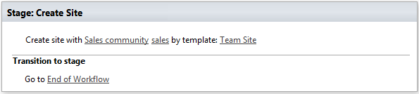

Delete Site
--------------------------------------------------
Delete Site at URL

Input parameters
~~~~~~~~~~~~~~~~~~~~~~~~~~~~~~~~~~~~~~~~~~~~~~~~~~
.. list-table::
    :header-rows: 1
    :widths: 10 30 20

    *  -  Parameter
       -  Description
       -  Example
    *  -  SiteUrl
       -  URL of the current SharePoint site. This property defines context of the workflow action. All actions performed by workflow action will be executed on specified SharePoint site. If this property is blank it will use current SharePoint site by default.
       -  empty
    *  -  AdminLogin
       -  E-mail of the SharePoint administrator (for Office 365 only).
       -  :code:`admin@contoso.com`
    *  -  AdminPassword
       -  Password of the SharePoint administrator (for Office 365 only).
       -  admin’sP@ssw0rd$
    *  -  ThrowError
       -  Detects whether workflow should be interrupted in case of error or not.
       -  Yes
    *  -  RunAsPublisher
       -  Detects whether the workflow action has to be runned under the user account who published the workflow (for SharePoint 2013 on-premise only).
       -  Yes

Example
~~~~~~~~~~~~~~~~~~~~~~~~~~~~~~~~~~~~~~~~~~~~~~~~~~
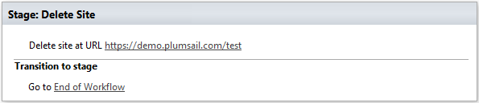

Activate Feature
--------------------------------------------------
Activate a feature with specific ID

Input parameters
~~~~~~~~~~~~~~~~~~~~~~~~~~~~~~~~~~~~~~~~~~~~~~~~~~
.. list-table::
    :header-rows: 1
    :widths: 10 30 20

    *  -  Parameter
       -  Description
       -  Example
    *  -  FeatureId
       -  Unique ID of the feature to activate
       -  ``{D7891031-E7F5-4734-8077-9189DD35551C}``
    *  -  Force?
       -  Yes to force activation of the Feature even if there are errors; otherwise, false.
       -  Yes
    *  -  Is Web Feature?
       -  Yes if this is web feature otherwise, false.
       -  Yes
    *  -  AdminLogin
       -  The login of the user who has appropriate permissions to perform operation. This parameter doesn't exist in the version for SharePoint 2013 on-premise.
       -  :code:`admin@contoso.com`
    *  -  AdminPassword
       -  The password of the user who has appropriate permissions to perform operation. This parameter doesn't exist in the version for SharePoint 2013 on-premise.
       -  admin’sP@ssw0rd$
    *  -  SiteUrl
       -  The URL of the current SharePoint site. This property defines context of the workflow action. All actions performed by workflow action will be executed on specified SharePoint site. If this property is blank it will use current SharePoint site by default.
       -  :code:`https://contoso/SiteUrl  [%Workflow Context:Current Site URL%]/subSite`
    *  -  ThrowError
       -  Detects whether workflow should be interrupted in case of error or not.
       -  Yes
    *  -  RunAsPublisher
       -  Run under user account who published workflow (for OnPremise only)
       -  Yes

Example
~~~~~~~~~~~~~~~~~~~~~~~~~~~~~~~~~~~~~~~~~~~~~~~~~~
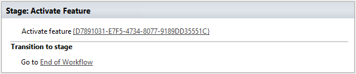

Create List or Library
--------------------------------------------------
Create list by template

Input parameters
~~~~~~~~~~~~~~~~~~~~~~~~~~~~~~~~~~~~~~~~~~~~~~~~~~
.. list-table::
    :header-rows: 1
    :widths: 10 30 20

    *  -  Parameter
       -  Description
       -  Example
    *  -  ListTitle
       -  Title of the list.
       -  Sales reports
    *  -  List Partial Url
       -  Usually, when you create a list you can't control which URL it will get. For example, if you create a document library with the name ``Some document lib`` it will get the following URL: ``Some%20doc%20lib``. But in some cases more useful to choose other URL, using this field, you can specify required value. This is an optional field you can leave it blank. By default, URL will be automatically generated.
       -  Sales_Department
    *  -  ListTemplate
       -  Title of the template that will be used for this list.
       -  Team Site
    *  -  ListDescription
       -  Description of the list.
       -  Library contains sales reports
    *  -  ListOnQuickNav
       -  Display this list on the Quick Launch.
       -  Yes
    *  -  AdminLogin
       -  E-mail of the SharePoint administrator (for Office 365 only).
       -  :code:`admin@contoso.com`
    *  -  AdminPassword
       -  Password of the SharePoint administrator (for Office 365 only).
       -  admin’sP@ssw0rd$
    *  -  SiteUrl
       -  URL of the current SharePoint site. This property defines context of the workflow action. All actions performed by workflow action will be executed on specified SharePoint site. If this property is blank it will use current SharePoint site by default.
       -  empty
    *  -  ThrowError
       -  Detects whether workflow should be interrupted in case of error or not.
       -  Yes
    *  -  RunAsPublisher
       -  Detects whether the workflow action has to be runned under the user account who published the workflow (for SharePoint 2013 on-premise only).
       -  Yes

Example
~~~~~~~~~~~~~~~~~~~~~~~~~~~~~~~~~~~~~~~~~~~~~~~~~~
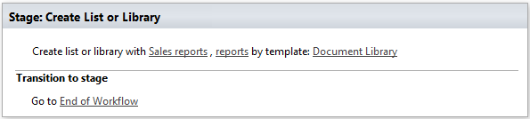

Add Content Type to List
--------------------------------------------------
Add the specified content type to list

Input parameters
~~~~~~~~~~~~~~~~~~~~~~~~~~~~~~~~~~~~~~~~~~~~~~~~~~
.. list-table::
    :header-rows: 1
    :widths: 10 30 20

    *  -  Parameter
       -  Description
       -  Example
    *  -  ContentType Name
       -  Name of the content type
       -  ``Contact``
    *  -  List Url
       -  List name, Url or Guid 
       -  ::

            Employees
            /SiteUrl/Employees
            [%Workflow Context:Current Site URL%]/SiteUrl/Employees
    *  -  MakeItDefault
       -  Make the content typedefault for the list
       -  No
    *  -  AdminLogin
       -  E-mail of the SharePoint administrator (for Office 365 only).
       -  :code:`admin@contoso.com`
    *  -  AdminPassword
       -  Password of the SharePoint administrator (for Office 365 only).
       -  admin’sP@ssw0rd$
    *  -  SiteUrl
       -  URL of the current SharePoint site. This property defines context of the workflow action. All actions performed by workflow action will be executed on specified SharePoint site. If this property is blank it will use current SharePoint site by default.
       -  empty
    *  -  ThrowError
       -  Detects whether workflow should be interrupted in case of error or not.
       -  Yes
    *  -  RunAsPublisher
       -  Detects whether the workflow action has to be runned under the user account who published the workflow (for SharePoint 2013 on-premise only).
       -  Yes

Example
~~~~~~~~~~~~~~~~~~~~~~~~~~~~~~~~~~~~~~~~~~~~~~~~~~
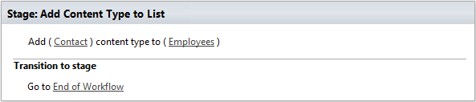

Create SharePoint Group
--------------------------------------------------

Input parameters
~~~~~~~~~~~~~~~~~~~~~~~~~~~~~~~~~~~~~~~~~~~~~~~~~~
.. list-table::
    :header-rows: 1
    :widths: 10 30 20

    *  -  Parameter
       -  Description
       -  Example
    *  -  Group name
       -  Name of group
       -  Approvers
    *  -  Group description
       -  Description of group
       -  Can approve documents
    *  -  Group owner
       -  Owner of group, can be email or user login, if empty it is current AdminLogin
       -  :code:`admin@yourdomain.com`
    *  -  AdminLogin
       -  The login of the user who has appropriate permissions to perform operation. This parameter doesn't exist in the version for SharePoint 2013 on-premise.
       -  :code:`admin@contoso.com`
    *  -  AdminPassword
       -  The password of the user who has appropriate permissions to perform operation. This parameter doesn't exist in the version for SharePoint 2013 on-premise.
       -  admin’sP@ssw0rd$
    *  -  SiteUrl
       -  The URL of the current SharePoint site. This property defines context of the workflow action. All actions performed by workflow action will be executed on specified SharePoint site. If this property is blank it will use current SharePoint site by default.
       -  :code:`https://contoso/SiteUrl  [%Workflow Context:Current Site URL%]/subSite`
    *  -  ThrowError
       -  Detects whether workflow should be interrupted in case of error or not.
       -  Yes
    *  -  RunAsPublisher
       -  Run under user account who published workflow (for OnPremise only)
       -  Yes

Example
~~~~~~~~~~~~~~~~~~~~~~~~~~~~~~~~~~~~~~~~~~~~~~~~~~
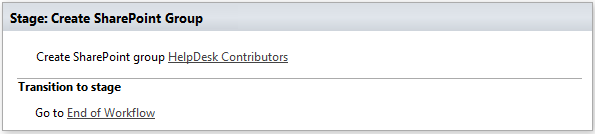

Remove SharePoint Group
--------------------------------------------------

Input parameters
~~~~~~~~~~~~~~~~~~~~~~~~~~~~~~~~~~~~~~~~~~~~~~~~~~
.. list-table::
    :header-rows: 1
    :widths: 10 30 20

    *  -  Parameter
       -  Description
       -  Example
    *  -  GroupName
       -  Name of group
       -  Approvers
    *  -  AdminLogin
       -  The login of the user who has appropriate permissions to perform operation. This parameter doesn't exist in the version for SharePoint 2013 on-premise.
       -  :code:`admin@contoso.com`
    *  -  AdminPassword
       -  The password of the user who has appropriate permissions to perform operation. This parameter doesn't exist in the version for SharePoint 2013 on-premise.
       -  admin’sP@ssw0rd$
    *  -  SiteUrl
       -  The URL of the current SharePoint site. This property defines context of the workflow action. All actions performed by workflow action will be executed on specified SharePoint site. If this property is blank it will use current SharePoint site by default.
       -  :code:`https://contoso/SiteUrl  [%Workflow Context:Current Site URL%]/subSite`
    *  -  ThrowError
       -  Detects whether workflow should be interrupted in case of error or not.
       -  Yes
    *  -  RunAsPublisher
       -  Run under user account who published workflow (for OnPremise only)
       -  Yes

Example
~~~~~~~~~~~~~~~~~~~~~~~~~~~~~~~~~~~~~~~~~~~~~~~~~~
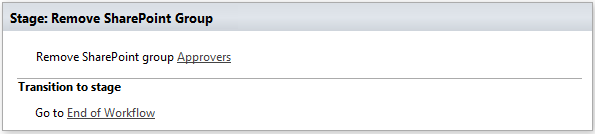

Update SharePoint Group Properties
--------------------------------------------------
It allows you to update group properties like AutoAcceptRequestToJoinLeave, AllowMembersEditMembership or other options described in MSDN

Input parameters
~~~~~~~~~~~~~~~~~~~~~~~~~~~~~~~~~~~~~~~~~~~~~~~~~~
.. list-table::
    :header-rows: 1
    :widths: 10 30 20

    *  -  Parameter
       -  Description
       -  Example
    *  -  Properties
       -  In this dictionary should be specified properties for upgrade
       -  ::

               {
                    "AutoAcceptRequestToJoinLeave": True,
                    "AllowRequestToJoinLeave": True,
                    "RequestToJoinLeaveEmailSetting": "rylov@plumsail.com"
               }

    *  -  GroupName
       -  Name of group
       -  Approvers
    *  -  AdminLogin
       -  The login of the user who has appropriate permissions to perform operation. This parameter doesn't exist in the version for SharePoint 2013 on-premise.
       -  :code:`admin@contoso.com`
    *  -  AdminPassword
       -  The password of the user who has appropriate permissions to perform operation. This parameter doesn't exist in the version for SharePoint 2013 on-premise.
       -  admin’sP@ssw0rd$
    *  -  SiteUrl
       -  The URL of the current SharePoint site. This property defines context of the workflow action. All actions performed by workflow action will be executed on specified SharePoint site. If this property is blank it will use current SharePoint site by default.
       -  :code:`https://contoso/SiteUrl  [%Workflow Context:Current Site URL%]/subSite`
    *  -  ThrowError
       -  Detects whether workflow should be interrupted in case of error or not.
       -  Yes
    *  -  RunAsPublisher
       -  Run under user account who published workflow (for OnPremise only)
       -  Yes

Example
~~~~~~~~~~~~~~~~~~~~~~~~~~~~~~~~~~~~~~~~~~~~~~~~~~
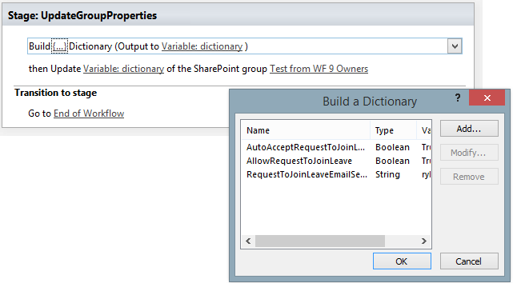

Invite External Users
--------------------------------------------------
Invite external users with specified permission on the site
More information about external users you can find from the link `Manage sharing with external users in Office 365 Small Business <https://support.office.com/en-us/article/Manage-sharing-with-external-users-in-Office-365-Small-Business-2951a85f-c970-4375-aa4f-6b0d7035fe35>`_

Input parameters
~~~~~~~~~~~~~~~~~~~~~~~~~~~~~~~~~~~~~~~~~~~~~~~~~~
.. list-table::
    :header-rows: 1
    :widths: 10 30 20

    *  -  Parameter
       -  Description
       -  Example
    *  -  Email Addresses
       -  Email addresses to send an invitation, you can specify multiple using semicolon as delimiter
       -  :code:`Chris@plumsail.com;John@plumsail.com`
    *  -  Role
       -  The permission role which will granted to the user
       -  ::

		Full Controll
		Design
		Edit
		Contribute
		Read
		ViewOnly
		Approve
		Manage Hierarchy
		Restricted Read
		Restricted Interfaces for Translation

    *  -  Email Subject
       -  The subject of the invitation email
       -  The body of the invitation email
    *  -  Email Body
       -  Body of the invitation message
       -  External Users
    *  -  AdminLogin
       -  The login of the user who has appropriate permissions to perform operation. This parameter doesn't exist in the version for SharePoint 2013 on-premise.
       -  :code:`admin@contoso.com`
    *  -  AdminPassword
       -  The password of the user who has appropriate permissions to perform operation. This parameter doesn't exist in the version for SharePoint 2013 on-premise.
       -  admin’sP@ssw0rd$
    *  -  SiteUrl
       -  The URL of the current SharePoint site. This property defines context of the workflow action. All actions performed by workflow action will be executed on specified SharePoint site. If this property is blank it will use current SharePoint site by default.
       -  :code:`https://contoso/SiteUrl [%Workflow Context:Current Site URL%]/subSite`
    *  -  ThrowError
       -  Detects whether workflow should be interrupted in case of error or not.
       -  Yes
    *  -  RunAsPublisher
       -  Run under user account who published workflow (for OnPremise only)
       -  Yes

Example
~~~~~~~~~~~~~~~~~~~~~~~~~~~~~~~~~~~~~~~~~~~~~~~~~~
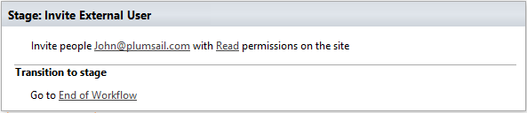

Invite External Users to Group
--------------------------------------------------
Invite external users to specific group
More information about external users you can find from the link Manage sharing with external users in Office 365 Small Business

Input parameters
~~~~~~~~~~~~~~~~~~~~~~~~~~~~~~~~~~~~~~~~~~~~~~~~~~
.. list-table::
    :header-rows: 1
    :widths: 10 30 20

    *  -  Parameter
       -  Description
       -  Example
    *  -  Email Addresses
       -  Email addresses to send an invitation, you can specify multiple using semicolon as delimiter
       -  :code:`Chris@plumsail.com;John@plumsail.com`
    *  -  Group Name
       -  Name of the group which will include invited users
       -  External Users
    *  -  Email Subject
       -  The subject of the invitation email
       -  The body of the invitation email
    *  -  Email Body
       -  Body of the invitation message
       -  External Users
    *  -  AdminLogin
       -  The login of the user who has appropriate permissions to perform operation. This parameter doesn't exist in the version for SharePoint 2013 on-premise.
       -  :code:`admin@contoso.com`
    *  -  AdminPassword
       -  The password of the user who has appropriate permissions to perform operation. This parameter doesn't exist in the version for SharePoint 2013 on-premise.
       -  admin’sP@ssw0rd$
    *  -  SiteUrl
       -  The URL of the current SharePoint site. This property defines context of the workflow action. All actions performed by workflow action will be executed on specified SharePoint site. If this property is blank it will use current SharePoint site by default.
       -  :code:`https://contoso/SiteUrl  [%Workflow Context:Current Site URL%]/subSite`
    *  -  ThrowError
       -  Detects whether workflow should be interrupted in case of error or not.
       -  Yes
    *  -  RunAsPublisher
       -  Run under user account who published workflow (for OnPremise only)
       -  Yes

Example
~~~~~~~~~~~~~~~~~~~~~~~~~~~~~~~~~~~~~~~~~~~~~~~~~~
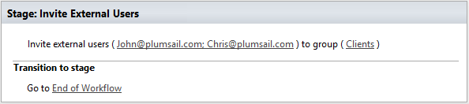

Update Site Properties
--------------------------------------------------
It allows you to update web properties like Title, Description or other string options described in at MSDN

Input parameters
~~~~~~~~~~~~~~~~~~~~~~~~~~~~~~~~~~~~~~~~~~~~~~~~~~
.. list-table::
    :header-rows: 1
    :widths: 10 30 20

    *  -  Parameter
       -  Description
       -  Example
    *  -  Properties
       -  In this dictionary should be specified properties for upgrade
       -  ::

             {
                "Title": "New web Title",
                "Description": "Web description"
             }

    *  -  AdminLogin
       -  The login of the user who has appropriate permissions to perform operation. This parameter doesn't exist in the version for SharePoint 2013 on-premise.
       -  :code:`admin@contoso.com`
    *  -  AdminPassword
       -  The password of the user who has appropriate permissions to perform operation. This parameter doesn't exist in the version for SharePoint 2013 on-premise.
       -  admin’sP@ssw0rd$
    *  -  SiteUrl
       -  The URL of the current SharePoint site. This property defines context of the workflow action. All actions performed by workflow action will be executed on specified SharePoint site. If this property is blank it will use current SharePoint site by default.
       -  :code:`https://contoso/SiteUrl  [%Workflow Context:Current Site URL%]/subSite`
    *  -  ThrowError
       -  Detects whether workflow should be interrupted in case of error or not.
       -  Yes
    *  -  RunAsPublisher
       -  Run under user account who published workflow (for OnPremise only)
       -  Yes

Example
~~~~~~~~~~~~~~~~~~~~~~~~~~~~~~~~~~~~~~~~~~~~~~~~~~
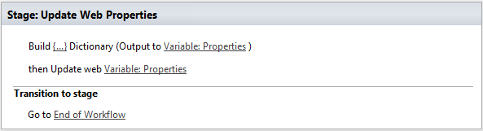

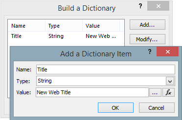

Share the Item
--------------------------------------------------
Grant to the user rights on item in the list

Input parameters
~~~~~~~~~~~~~~~~~~~~~~~~~~~~~~~~~~~~~~~~~~~~~~~~~~
.. list-table::
    :header-rows: 1
    :widths: 10 30 20

    *  -  Parameter
       -  Description
       -  Example
    *  -  Email Addresses
       -  Email addresses to send an invitation, you can specify multiple using semicolon as delimiter
       -  :code:`Chris@plumsail.com;John@plumsail.com`
    *  -  Permission Role
       -  ID of the permission role which will granted to the user
       -  1073741826
    *  -  List item or Url
       -  ID or Url of the item for which you want to grant the permission
       -  25
    *  -  List Name
       -  Name of the list which contain the item
       -  Employees
    *  -  Email Subject
       -  The subject of the invitation email
       -  The body of the invitation email
    *  -  Email Body
       -  Body of the invitation message
       -  External Users
    *  -  Require sing-in
       -  Add anonymous link to the email
       -  No
    *  -  AdminLogin
       -  The login of the user who has appropriate permissions to perform operation. This parameter doesn't exist in the version for SharePoint 2013 on-premise.
       -  :code:`admin@contoso.com`
    *  -  AdminPassword
       -  The password of the user who has appropriate permissions to perform operation. This parameter doesn't exist in the version for SharePoint 2013 on-premise.
       -  admin’sP@ssw0rd$
    *  -  SiteUrl
       -  The URL of the current SharePoint site. This property defines context of the workflow action. All actions performed by workflow action will be executed on specified SharePoint site. If this property is blank it will use current SharePoint site by default.
       -  :code:`https://contoso/SiteUrl  [%Workflow Context:Current Site URL%]/subSite`
    *  -  ThrowError
       -  Detects whether workflow should be interrupted in case of error or not.
       -  Yes
    *  -  RunAsPublisher
       -  Run under user account who published workflow (for OnPremise only)
       -  Yes

Example
~~~~~~~~~~~~~~~~~~~~~~~~~~~~~~~~~~~~~~~~~~~~~~~~~~
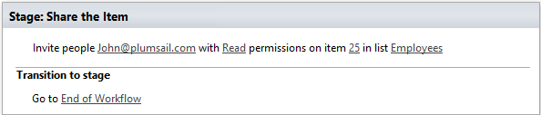

