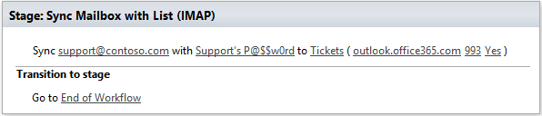

E-mail Processing
==================================================
Workflow actions to work with email, it allows you send and receive the emails.

Sync Mailbox with List (Exchange)
--------------------------------------------------
Synchronizes unread messages from a specific Exchange account with a SharePoint list.

Input parameters
~~~~~~~~~~~~~~~~~~~~~~~~~~~~~~~~~~~~~~~~~~~~~~~~~~
.. list-table::
    :header-rows: 1
    :widths: 10 30 20

    *  -  Parameter
       -  Description
       -  Example
    *  -  Email
       -  E-mail of the Exchange User
       -  :code:`support@contoso.com`
    *  -  Password
       -  Password of Exchange User
       -  Support’sP@ssw0rd$
    *  -  List
       -  SharePoint List for synchronization. 
          The following fields will be filled from e-mail automatically: 

          * **From**, **To**, **Subject** (type: Single line of text) 
          * **Body** (type: multiline of text)
       -  Tickets
    *  -  mTo
       -  Specifies mapping of 'To' filed to list item field
       -  To
    *  -  mFrom
       -  Specifies mapping of 'From' filed to list item field
       -  From
    *  -  mSubject
       -  Specifies mapping of 'Subject' filed to list item field
       -  Title
    *  -  mBody
       -  Specifies mapping of 'Body' filed to list item field
       -  Body    
    *  -  mCc
       -  Specifies mapping of 'Cc' filed to list item field
       -  Cc
    *  -  RegexTemplate
       -  Specifies regular expression template which allows to add new messages to existing discussion according to subject. This property is used for discussion boards only.
       -  ``Ticket#(? \d+)``
    *  -  SyncAttachments
       -  Synchronize e-mail messages with attachments
       -  Yes
    *  -  AdminLogin
       -  The login of the user who has appropriate permissions to perform operation. This parameter doesn’t exist in the version for SharePoint 2013 on-premise.
       -  :code:`admin@contoso.com`
    *  -  AdminPassword
       -  The password of the user who has appropriate permissions to perform operation. This parameter doesn’t exist in the version for SharePoint 2013 on-premise.
       -  admin’sP@ssw0rd$
    *  -  SiteUrl
       -  SharePoint URL, if blank will be detected automatically
       -  empty
    *  -  ThrowError
       -  Detects whether workflow should be interrupted in case of error or not.
       -  Yes
    *  -  RunAsPublisher
       -  Detects whether the workflow action has to be runned under the user account who published the workflow (for SharePoint 2013 on-premise only).
       -  Yes

Example
~~~~~~~~~~~~~~~~~~~~~~~~~~~~~~~~~~~~~~~~~~~~~~~~~~

Sync Mailbox with List (IMAP)
--------------------------------------------------
Synchronizes unread messages from a specific IMAP account with a SharePoint list.

Input parameters
~~~~~~~~~~~~~~~~~~~~~~~~~~~~~~~~~~~~~~~~~~~~~~~~~~
.. list-table::
    :header-rows: 1
    :widths: 10 30 20

    *  -  Parameter
       -  Description
       -  Example
    *  -  Email
       -  Mailbox for sync
       -  :code:`support@contoso.com`
    *  -  Password
       -  Password for Mailbox
       -  Support’sP@ssw0rd$
    *  -  List
       -  SharePoint List for synchronization. 
          The following fields will be filled from e-mail automatically: 

          * **From**, **To**, **Subject** (type: Single line of text) 
          * **Body** (type: multiline of text)
       -  Tickets
    *  -  IMAP Server
       -  IMAP Server name
       -  :code:`outlook.office365.com`
    *  -  Port
       -  IMAP Port
       -  993
    *  -  SSL
       -  Is encryption required? (SSL or TLS)
       -  Yes
    *  -  mTo
       -  Specifies mapping of 'To' filed to list item field
       -  To
    *  -  mFrom
       -  Specifies mapping of 'From' filed to list item field
       -  From
    *  -  mSubject
       -  Specifies mapping of 'Subject' filed to list item field
       -  Title
    *  -  mBody
       -  Specifies mapping of 'Body' filed to list item field
       -  Body  
    *  -  mCc
       -  Specifies mapping of 'Cc' filed to list item field
       -  Cc
    *  -  RegexTemplate
       -  Specifies regular expression template which allows to add new messages to existing discussion according to subject. This property is used for discussion boards only.
       -  ``Ticket#(? \d+)``
    *  -  SyncAttachments
       -  Synchronize e-mail messages with attachments
       -  Yes
    *  -  AdminLogin
       -  The login of the user who has appropriate permissions to perform operation. This parameter doesn’t exist in the version for SharePoint 2013 on-premise.
       -  :code:`admin@contoso.com`
    *  -  AdminPassword
       -  The password of the user who has appropriate permissions to perform operation. This parameter doesn’t exist in the version for SharePoint 2013 on-premise.
       -  admin’sP@ssw0rd$
    *  -  SiteUrl
       -  SharePoint URL, if blank will be detected automatically
       -  empty
    *  -  ThrowError
       -  Detects whether workflow should be interrupted in case of error or not.
       -  Yes
    *  -  RunAsPublisher
       -  Detects whether the workflow action has to be runned under the user account who published the workflow (for SharePoint 2013 on-premise only).
       -  Yes

Example
~~~~~~~~~~~~~~~~~~~~~~~~~~~~~~~~~~~~~~~~~~~~~~~~~~

Sync Mailbox with List (Shared Mailbox)
--------------------------------------------------
Synchronizes unread messages from the SharePoint shared mailbox with a list.
Note: This action is accessible only for SharePoint Online.

Input parameters
~~~~~~~~~~~~~~~~~~~~~~~~~~~~~~~~~~~~~~~~~~~~~~~~~~
.. list-table::
    :header-rows: 1
    :widths: 10 30 20

    *  -  Parameter
       -  Description
       -  Example
    *  -  Mailbox
       -  E-mail of the SharePoint online shared mailbox
       -  :code:`SMO-Main@plumsail.com`
    *  -  List
       -  SharePoint List for synchronization. 
          The following fields will be filled from e-mail automatically: 

          * **From**, **To**, **Subject** (type: Single line of text) 
          * **Body** (type: multiline of text)
       -  Tickets
    *  -  mTo
       -  Specifies mapping of 'To' filed to list item field
       -  To
    *  -  mFrom
       -  Specifies mapping of 'From' filed to list item field
       -  From
    *  -  mSubject
       -  Specifies mapping of 'Subject' filed to list item field
       -  Title
    *  -  mBody
       -  Specifies mapping of 'Body' filed to list item field
       -  Body  
    *  -  mCc
       -  Specifies mapping of 'Cc' filed to list item field
       -  Cc
    *  -  RegexTemplate
       -  Specifies regular expression template which allows to add new messages to existing discussion according to subject. This property is used for discussion boards only.
       -  ``Ticket#(? \d+)``
    *  -  SyncAttachments
       -  Synchronize e-mail messages with attachments
       -  Yes
    *  -  AdminLogin
       -  The login of the user who has appropriate permissions to perform operation. This parameter doesn’t exist in the version for SharePoint 2013 on-premise.
       -  :code:`admin@contoso.com`
    *  -  AdminPassword
       -  The password of the user who has appropriate permissions to perform operation. This parameter doesn’t exist in the version for SharePoint 2013 on-premise.
       -  admin’sP@ssw0rd$
    *  -  SiteUrl
       -  SharePoint URL, if blank will be detected automatically
       -  empty
    *  -  ThrowError
       -  Detects whether workflow should be interrupted in case of error or not.
       -  Yes
    *  -  RunAsPublisher
       -  Detects whether the workflow action has to be runned under the user account who published the workflow (for SharePoint 2013 on-premise only).
       -  Yes

Example
~~~~~~~~~~~~~~~~~~~~~~~~~~~~~~~~~~~~~~~~~~~~~~~~~~

Send E-Mail with Attachments
--------------------------------------------------
Send an e-mail with attachments. If the option AddItemAttachments is checked, a workflow will send attachments from the current list item or a document set. Alternatively you can turn on parsing links of documents from the message body or fill in parameter "AttachmentUrls".

.. note::
   If you use Office 365, to enable sending attachments you also need to specify AdminLogin and AdminPassword properties or setup it via `credential management page <https://plumsail.com/blog/2014/12/store-credentials-at-site/>`_.
   If you don't specify them, the workflow action will not be able to access your attachments.

Input parameters
~~~~~~~~~~~~~~~~~~~~~~~~~~~~~~~~~~~~~~~~~~~~~~~~~~
.. list-table::
    :header-rows: 1
    :widths: 10 30 20

    *  -  Parameter
       -  Description
       -  Example
    *  -  Address
       -  E-mail of the recipient
       -  :code:`SomeUser@gmail.com`
    *  -  Subject
       -  Subject of the message
       -  SharePoint notification
    *  -  Body
       -  Body of message (may contain HTML)
       -  ``<h1>Approve notification</h1> 
Dear Mr....
``
    *  -  FromDisplayName
       -  You can change a display name of the From header
       -  Plumsail notification system
    *  -  ReplyTo
       -  Address for reply
       -  :code:`no-reply@plumsail.com`
    *  -  Cc
       -  E-mail carbon copy addressee
       -  :code:`no-reply@plumsail.com`
    *  -  Bcc
       -  E-mail blind carbon copy addressee
       -  :code:`no-reply@plumsail.com`
    *  -  AttachmentUrls
       -  Urls of attachments delimited by ';'
       -  /somefolder/sometxt.txt;:code:`http://somesite.com/images/someimage.img`
    *  -  Add Item Attachments
       -  If the option is checked, a workflow will send attachments from the current list item or a document set.
       -  True
    *  -  ParseLinks
       -  Search embedded links in the message body
       -  False
    *  -  ParseImages
       -  Search for embedded images in the message body
       -  False
    *  -  From
       -  Sender email
       -  :code:`support@contoso.com`
    *  -  EXEmail
       -  E-mail that is used to connect to the SMTP server
       -  :code:`support@contoso.com`
    *  -  EXPassword
       -  Password to connect to SMTP server
       -  Support’sP@ssw0rd$
    *  -  Host
       -  SMTP Server name
       -  :code:`outlook.office365.com`
    *  -  Port
       -  SMTP Port
       -  587
    *  -  SSL
       -  Is encryption required? (SSL or TLS)
       -  Yes
    *  -  AdminLogin
       -  The login of the user who has appropriate permissions to perform operation. This parameter doesn’t exist in the version for SharePoint 2013 on-premise.
       -  :code:`admin@contoso.com`
    *  -  AdminPassword
       -  The password of the user who has appropriate permissions to perform operation. This parameter doesn’t exist in the version for SharePoint 2013 on-premise.
       -  admin’sP@ssw0rd$
    *  -  SiteUrl
       -  SharePoint URL, if blank will be detected automatically
       -  empty
    *  -  ThrowError
       -  Detects whether workflow should be interrupted in case of error or not.
       -  Yes
    *  -  RunAsPublisher
       -  Detects whether the workflow action has to be runned under the user account who published the workflow (for SharePoint 2013 on-premise only).
       -  Yes

Example
~~~~~~~~~~~~~~~~~~~~~~~~~~~~~~~~~~~~~~~~~~~~~~~~~~

