List items processing
==================================================

Get Items by Query
--------------------------------------------------
Executes a query on the list or on the document library and returns the collection of elements as dictionary variable.

Output parameters
~~~~~~~~~~~~~~~~~~~~~~~~~~~~~~~~~~~~~~~~~~~~~~~~~~
.. list-table::
    :header-rows: 1
    :widths: 10 30 20

    *  -  Parameter
       -  Description
       -  Example
    *  -  Items
       -  The output variable where the results will be saved.
       -  Variable:Items
    *  -  Count Items
       -  Contains count of items in result dictionary
       -  Variable:CountItems

Input parameters
~~~~~~~~~~~~~~~~~~~~~~~~~~~~~~~~~~~~~~~~~~~~~~~~~~
.. list-table::
    :header-rows: 1
    :widths: 10 30 20

    *  -  Parameter
       -  Description
       -  Example
    *  -  List Name
       -  List or document library name for querying. 
       -  ``Documents``
    *  -  Endpoint
       -  A service which will be used for getting items.You may use listdata.svc to access the list data and client.svc, which supports the OData interface, to access all SharePoint objects. The listdata.svc will be used by default.
       -  ::

            listdata.svc
            client.svc
        
    *  -  Select
       -  A list of comma separated columns which will be selected
       -  ``Title, FirstName, LastName, Email, Manager/Title``
    *  -  Filter
       -  The filter expression which will be applied to list items, we support the following operators:

          .. list-table::
            :header-rows: 1

            * - Numeric
              - String
              - Date Time functions
            * - Lt (less than)
              - startsWith (if starts with some string value)
              - day()
            * - Le (less than or equal)
              - substringof ( if contains any sub string)
              - month()
            * - Gt (greater than)
              - 
              - year()
            * - Ge (greater than or equal)
              - 
              - hour()
            * - Eq (equal to)
              - Eq
              - minute()
            * - Ne (not equal to)
              - Ne
              - second()

       -  ``Title eq 'Test and month(expirationDate) eq 6'``
    *  -  OrderBy
       -  The expression is used to sort items. Multiples fields are allowed separate by comma. Ascending or descending order can be specified just by appending the asc or desc keyword to query.
       -  ``Title asc, expirationDate desc``
    *  -  Top
       -  Specify how many items should be selected
       -  ``50``
    *  -  Skip
       -  Specify how many items should be skiped
       -  ``50``
    *  -  Expand
       -  The field helps to retrieve information from Lookup columns
       -  ``Manager``
    *  -  AdminLogin
       -  The login of the user who has appropriate permissions to perform operation. This parameter doesn't exist in the version for SharePoint 2013 on-premise.
       -  :code:`admin@contoso.com`
    *  -  AdminPassword
       -  The password of the user who has appropriate permissions to perform operation. This parameter doesn't exist in the version for SharePoint 2013 on-premise.
       -  admin’sP@ssw0rd$
    *  -  SiteUrl
       -  The URL of the current SharePoint site. This property defines context of the workflow action. All actions performed by workflow action will be executed on specified SharePoint site. If this property is blank it will use current SharePoint site by default.
       -  ::

            https://contoso/SiteUrl
            [%Workflow Context:Current Site URL%]subSite
        
    *  -  ThrowError
       -  Detects whether workflow should be interrupted in case of error or not.
       -  Yes
    *  -  RunAsPublisher
       -  Detects whether the workflow action has to be runned under the user account who published the workflow (for SharePoint 2013 on-premise only).
       -  Yes

Example
~~~~~~~~~~~~~~~~~~~~~~~~~~~~~~~~~~~~~~~~~~~~~~~~~~
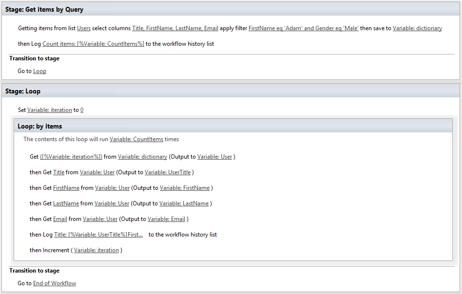

Get Items from View
--------------------------------------------------
Gets items from the specified view.

Output parameters
~~~~~~~~~~~~~~~~~~~~~~~~~~~~~~~~~~~~~~~~~~~~~~~~~~
.. list-table::
    :header-rows: 1
    :widths: 10 30 20

    *  -  Parameter
       -  Description
       -  Example
    *  -  Items
       -  The output variable where the results will be saved.
       -  Variable:Items
    *  -  Count Items
       -  Contains count of items in result dictionary
       -  Variable:CountItems

Input parameters
~~~~~~~~~~~~~~~~~~~~~~~~~~~~~~~~~~~~~~~~~~~~~~~~~~
.. list-table::
    :header-rows: 1
    :widths: 10 30 20

    *  -  Parameter
       -  Description
       -  Example
    *  -  List URL
       -  List name, Url or Guid 
       -  ::

            Employees
            /SiteUrl/Employees
            [%Workflow Context:Current Site URL%]SiteUrl/Employees
    *  -  View Name
       -  The name of the view from which items will be get
       -  ``All Items``
    *  -  AdminLogin
       -  The login of the user who has appropriate permissions to perform operation. This parameter doesn't exist in the version for SharePoint 2013 on-premise.
       -  :code:`admin@contoso.com`
    *  -  AdminPassword
       -  The password of the user who has appropriate permissions to perform operation. This parameter doesn't exist in the version for SharePoint 2013 on-premise.
       -  admin’sP@ssw0rd$
    *  -  SiteUrl
       -  The URL of the current SharePoint site. This property defines context of the workflow action. All actions performed by workflow action will be executed on specified SharePoint site. If this property is blank it will use current SharePoint site by default.
       -  ::

            https://contoso/SiteUrl
            [%Workflow Context:Current Site URL%]subSite
        
    *  -  ThrowError
       -  Detects whether workflow should be interrupted in case of error or not.
       -  Yes
    *  -  RunAsPublisher
       -  Detects whether the workflow action has to be runned under the user account who published the workflow (for SharePoint 2013 on-premise only).
       -  Yes

Example
~~~~~~~~~~~~~~~~~~~~~~~~~~~~~~~~~~~~~~~~~~~~~~~~~~
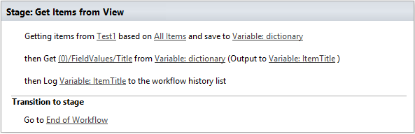

Get Items by CAML Query
--------------------------------------------------
Executes the CAML query on the list or on the document library and returns the collection of elements as dictionary variable. Read `this article <https://plumsail.com/blog/2014/08/how-to-work-with-dictionaries-in-sharepoint-2013-and-office-365-workflow/>`_ to learn how to query items using this workfow action. We would recommend to read whole article to understand how to work with dictionaries in general, but you can read only the part related to this workflow action.

Output parameters
~~~~~~~~~~~~~~~~~~~~~~~~~~~~~~~~~~~~~~~~~~~~~~~~~~
.. list-table::
    :header-rows: 1
    :widths: 10 30 20

    *  -  Parameter
       -  Description
       -  Example
    *  -  Items
       -  The output variable where the results will be saved.
       -  Variable:Items
    *  -  Count Items
       -  Contains count of items in result dictionary
       -  Variable:CountItems

Input parameters
~~~~~~~~~~~~~~~~~~~~~~~~~~~~~~~~~~~~~~~~~~~~~~~~~~
.. list-table::
    :header-rows: 1
    :widths: 10 30 20

    *  -  Parameter
       -  Description
       -  Example
    *  -  List Url
       -  List for querying. The value could be list name, guid or list url
       -  Documents
    *  -  CAML Query
       -  CAML query that will be run
       -  ::

            <View Scope="RecursiveAll">
                <Query>
                    <Where>  
                        <Contains>
                            <FieldRef Name="FileLeafRef" />
                            <Value Type="Text">Contract</Value>
                        </Contains>          
                    </Where>
                </Query>
                <ViewFields>        
                    <FieldRef Name="FileRef"/>
                    <FieldRef Name="FileLeafRef"/>
                </ViewFields>
            </View>

    *  -  Folder URL
       -  Specify the server relative URL of a list folder from which results will be returned
       -  ``/SiteUrl/Lists/ListName/Folder1/SubFolder``
    *  -  AdminLogin
       -  The login of the user who has appropriate permissions to perform operation. This parameter doesn't exist in the version for SharePoint 2013 on-premise.
       -  :code:`admin@contoso.com`
    *  -  AdminPassword
       -  The password of the user who has appropriate permissions to perform operation. This parameter doesn't exist in the version for SharePoint 2013 on-premise.
       -  admin’sP@ssw0rd$
    *  -  SiteUrl
       -  The URL of the current SharePoint site. This property defines context of the workflow action. All actions performed by workflow action will be executed on specified SharePoint site. If this property is blank it will use current SharePoint site by default.
       -  ::

  					https://contoso/SiteUrl
  					[%Workflow Context:Current Site URL%]subSite
				
    *  -  ThrowError
       -  Detects whether workflow should be interrupted in case of error or not.
       -  Yes
    *  -  RunAsPublisher
       -  Detects whether the workflow action has to be runned under the user account who published the workflow (for SharePoint 2013 on-premise only).
       -  Yes

Example
~~~~~~~~~~~~~~~~~~~~~~~~~~~~~~~~~~~~~~~~~~~~~~~~~~
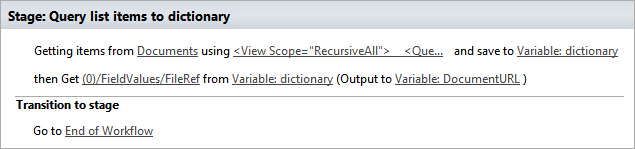

Get Items by CAML Query (Many Lists)
--------------------------------------------------
Executes the CAML query on each list with specified type. It is analog of old function `SPSiteDataQuery <https://support.office.com/en-in/article/Display-data-from-multiple-lists-with-the-Content-Query-Web-Part-d560f477-8fc1-4258-aeb2-70aa932e07da>`_. The workflow action allows you to get data from multiple lists across sites. It returns the collection of elements as dictionary variable. 

Output parameters
~~~~~~~~~~~~~~~~~~~~~~~~~~~~~~~~~~~~~~~~~~~~~~~~~~
.. list-table::
    :header-rows: 1
    :widths: 10 30 20

    *  -  Parameter
       -  Description
       -  Example
    *  -  Items
       -  The output variable where the results will be saved.
       -  Variable:Items
    *  -  CountItems
       -  Contains count of items in result dictionary
       -  Variable:CountItems

Input parameters
~~~~~~~~~~~~~~~~~~~~~~~~~~~~~~~~~~~~~~~~~~~~~~~~~~
.. list-table::
    :header-rows: 1
    :widths: 10 30 20

    *  -  Parameter
       -  Description
       -  Example
    *  -  CAML Query
       -  CAML query that will be run on each list
       -  ::
 
             <View Scope="RecursiveAll">
                <Query>
                    <Where>  
                        <Contains>
                            <FieldRef Name="FileLeafRef" />
                            <Value Type="Text">Contract</Value>
                        </Contains>          
                    </Where>
                </Query>
                <ViewFields>        
                    <FieldRef Name="FileRef"/>
                    <FieldRef Name="FileLeafRef"/>
                </ViewFields>
            </View>

    *  -  Base Template
       -  Base Template of the lists where the query will be run. 
       -  ::

            100 - GenericList
            101 - DocumentLibrary 
            107 - Tasks
				
    *  -  Web Urls
       -  By default the query will be run on current site, but you can specify from where collect data
       -  ::

            https://demo.plumsail.com/sites/Prod1; 
            https://demo.plumsail.com/sites/Workgroup2

    *  -  Sort By
       -  Field name to sort by
       -  Title
    *  -  Group By
       -  Field name to group by. Using group by you also can get unique values
       -  Title
    *  -  AdminLogin
       -  The login of the user who has appropriate permissions to perform operation. This parameter doesn't exist in the version for SharePoint 2013 on-premise.
       -  :code:`admin@contoso.com`
    *  -  AdminPassword
       -  The password of the user who has appropriate permissions to perform operation. This parameter doesn't exist in the version for SharePoint 2013 on-premise.
       -  admin’sP@ssw0rd$
    *  -  SiteUrl
       -  The URL of the current SharePoint site. This property defines context of the workflow action. All actions performed by workflow action will be executed on specified SharePoint site. If this property is blank it will use current SharePoint site by default.
       -  ::

  					https://contoso/SiteUrl
  					[%Workflow Context:Current Site URL%]subSite
				
    *  -  ThrowError
       -  Detects whether workflow should be interrupted in case of error or not.
       -  Yes
    *  -  RunAsPublisher
       -  Detects whether the workflow action has to be runned under the user account who published the workflow (for SharePoint 2013 on-premise only).
       -  Yes

Example
~~~~~~~~~~~~~~~~~~~~~~~~~~~~~~~~~~~~~~~~~~~~~~~~~~
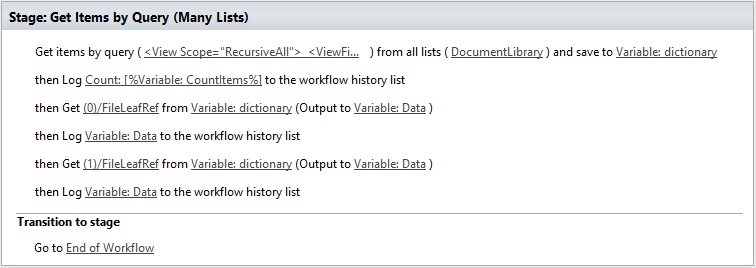

Create List Item at Any Site
--------------------------------------------------
It creates new list item and set field values

Output parameters
~~~~~~~~~~~~~~~~~~~~~~~~~~~~~~~~~~~~~~~~~~~~~~~~~~
.. list-table::
    :header-rows: 1
    :widths: 10 30 20

    *  -  Parameter
       -  Description
       -  Example
    *  -  Item ID
       -  Return integer value, ID of created item
       -  144 

Input parameters
~~~~~~~~~~~~~~~~~~~~~~~~~~~~~~~~~~~~~~~~~~~~~~~~~~
.. list-table::
    :header-rows: 1
    :widths: 10 30 20

    *  -  Parameter
       -  Description
       -  Example
    *  -  List Url
       -  The URL of the list where the folder item be updated. You can use full URL as well as domain relative URL. Also it supports list name. We would recommend to use constants from the workflow context.
       -  ::

            IssuesList 
            /SiteUrl/ListName 
            [%Workflow Context:Current Site URL%]SiteUrl/ListName
				
    *  -  Properties
       -  Dictionary contains data for setting in created item. Keys - field names Values - updated values
       -  :: 

            [ 
                { 'Title' : 'New Item' }, 
                { 'FieldName' : 'FieldValue' }
            ]

    *  -  Folder URL
       -  If you want to create new item in specific folder you can specify this parameter. It can be server relative URL to folder
       -  ``/SiteUrl/Lists/ListName/Projects``
    *  -  AdminLogin
       -  The login of the user who has appropriate permissions to perform operation. This parameter doesn't exist in the version for SharePoint 2013 on-premise.
       -  :code:`admin@contoso.com`
    *  -  AdminPassword
       -  The password of the user who has appropriate permissions to perform operation. This parameter doesn't exist in the version for SharePoint 2013 on-premise.
       -  admin’sP@ssw0rd$
    *  -  SiteUrl
       -  The URL of the current SharePoint site. This property defines context of the workflow action. All actions performed by workflow action will be executed on specified SharePoint site. If this property is blank it will use current SharePoint site by default.
       -  ::

            https://contoso/SiteUrl
            [%Workflow Context:Current Site URL%]subSite

    *  -  ThrowError
       -  Detects whether workflow should be interrupted in case of error or not.
       -  Yes
    *  -  RunAsPublisher
       -  Detects whether the workflow action has to be runned under the user account who published the workflow (for SharePoint 2013 on-premise only).
       -  Yes

Example
~~~~~~~~~~~~~~~~~~~~~~~~~~~~~~~~~~~~~~~~~~~~~~~~~~
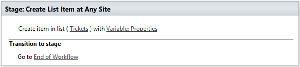

Update List Item at Any Site
--------------------------------------------------
It updates values in specific list item

Parameters
~~~~~~~~~~~~~~~~~~~~~~~~~~~~~~~~~~~~~~~~~~~~~~~~~~
.. list-table::
    :header-rows: 1
    :widths: 10 30 20

    *  -  Parameter
       -  Description
       -  Example
    *  -  Item ID
       -  ID of the item for update
       -  ::

            144 
            [%Workflow Variable:ItemID%]
	
    *  -  List Url
       -  The URL of the list where the folder item be updated. You can use full URL as well as domain relative URL. Also it supports list name. We would recommend to use constants from the workflow context.
       -  ::

            IssuesList 
            /SiteUrl/ListName 
            [%Workflow Context:Current Site URL%]SiteUrl/ListName
							
    *  -  Properties
       -  Dictionary contains data for update. Keys - field names Values - updated values
       -  ::

            [ 
                { 'Title' : 'New Item' }, 
                { 'FieldName' : 'FieldValue' }
            ]

    *  -  AdminLogin
       -  The login of the user who has appropriate permissions to perform operation. This parameter doesn't exist in the version for SharePoint 2013 on-premise.
       -  :code:`admin@contoso.com`
    *  -  AdminPassword
       -  The password of the user who has appropriate permissions to perform operation. This parameter doesn't exist in the version for SharePoint 2013 on-premise.
       -  admin’sP@ssw0rd$
    *  -  SiteUrl
       -  The URL of the current SharePoint site. This property defines context of the workflow action. All actions performed by workflow action will be executed on specified SharePoint site. If this property is blank it will use current SharePoint site by default.
       -  ::

            https://contoso/SiteUrl
            [%Workflow Context:Current Site URL%]subSite

    *  -  ThrowError
       -  Detects whether workflow should be interrupted in case of error or not.
       -  Yes
    *  -  RunAsPublisher
       -  Detects whether the workflow action has to be runned under the user account who published the workflow (for SharePoint 2013 on-premise only).
       -  Yes

Example
~~~~~~~~~~~~~~~~~~~~~~~~~~~~~~~~~~~~~~~~~~~~~~~~~~
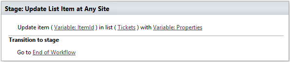

Copy List Item to List
--------------------------------------------------
Copy the specified list item to another list.

Output parameters
~~~~~~~~~~~~~~~~~~~~~~~~~~~~~~~~~~~~~~~~~~~~~~~~~~
.. list-table::
    :header-rows: 1
    :widths: 10 30 20

    *  -  Parameter
       -  Description
       -  Example
    *  -  List Item ID
       -  The ID of the copied item in the new list
       -  ``18``

Input parameters
~~~~~~~~~~~~~~~~~~~~~~~~~~~~~~~~~~~~~~~~~~~~~~~~~~
.. list-table::
    :header-rows: 1
    :widths: 10 30 20

    *  -  Parameter
       -  Description
       -  Example
    *  -  Item ID
       -  The ID of the item in source list
       -  ::

            99 
            [%Workflow Variable:ItemID%]
    *  -  List Name
       -  List name, Url or Guid 
       -  ::

            Employees
            /SiteUrl/Employees
            [%Workflow Context:Current Site URL%]SiteUrl/Employees
    *  -  Destination List Url
       -  The URL of the destination list. This list must contain same fields like in the source list  
       -  ::

	     https://siteaddress.sharepoint.com/sites/Collection/Lists/Employees2
             [%Workflow Context:Current Site URL%]Lists/Employees2
    *  -  Copy Attachments
       -  Copy the item with attached files or not
       -  No
    *  -  AdminLogin
       -  The login of the user who has appropriate permissions to perform operation. This parameter doesn't exist in the version for SharePoint 2013 on-premise.
       -  :code:`admin@contoso.com`
    *  -  AdminPassword
       -  The password of the user who has appropriate permissions to perform operation. This parameter doesn't exist in the version for SharePoint 2013 on-premise.
       -  admin’sP@ssw0rd$
    *  -  SiteUrl
       -  The URL of the current SharePoint site. This property defines context of the workflow action. All actions performed by workflow action will be executed on specified SharePoint site. If this property is blank it will use current SharePoint site by default.
       -  ::

            https://contoso/SiteUrl
            [%Workflow Context:Current Site URL%]subSite
        
    *  -  ThrowError
       -  Detects whether workflow should be interrupted in case of error or not.
       -  Yes
    *  -  RunAsPublisher
       -  Detects whether the workflow action has to be runned under the user account who published the workflow (for SharePoint 2013 on-premise only).
       -  Yes

Example
~~~~~~~~~~~~~~~~~~~~~~~~~~~~~~~~~~~~~~~~~~~~~~~~~~
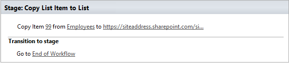

Move List Item to List
--------------------------------------------------
Move the specified list item to another list.

Output parameters
~~~~~~~~~~~~~~~~~~~~~~~~~~~~~~~~~~~~~~~~~~~~~~~~~~
.. list-table::
    :header-rows: 1
    :widths: 10 30 20

    *  -  Parameter
       -  Description
       -  Example
    *  -  List Item ID
       -  The ID of the moved item in the new list
       -  ``18``

Input parameters
~~~~~~~~~~~~~~~~~~~~~~~~~~~~~~~~~~~~~~~~~~~~~~~~~~
.. list-table::
    :header-rows: 1
    :widths: 10 30 20

    *  -  Parameter
       -  Description
       -  Example
    *  -  Item ID
       -  The ID of the item in source list
       -  ::

            99 
            [%Workflow Variable:ItemID%]
    *  -  List Name
       -  List name, Url or Guid 
       -  ::

            Employees
            /SiteUrl/Employees
            [%Workflow Context:Current Site URL%]SiteUrl/Employees
    *  -  Destination List Url
       -  The URL of the destination list. This list must contain same fields like in the source list  
       -  ::

	     https://siteaddress.sharepoint.com/sites/Collection/Lists/Employees2
             [%Workflow Context:Current Site URL%]Lists/Employees2
    *  -  Move Attachments
       -  Move the item with attached files or not
       -  Yes
    *  -  AdminLogin
       -  The login of the user who has appropriate permissions to perform operation. This parameter doesn't exist in the version for SharePoint 2013 on-premise.
       -  :code:`admin@contoso.com`
    *  -  AdminPassword
       -  The password of the user who has appropriate permissions to perform operation. This parameter doesn't exist in the version for SharePoint 2013 on-premise.
       -  admin’sP@ssw0rd$
    *  -  SiteUrl
       -  The URL of the current SharePoint site. This property defines context of the workflow action. All actions performed by workflow action will be executed on specified SharePoint site. If this property is blank it will use current SharePoint site by default.
       -  ::

            https://contoso/SiteUrl
            [%Workflow Context:Current Site URL%]subSite
        
    *  -  ThrowError
       -  Detects whether workflow should be interrupted in case of error or not.
       -  Yes
    *  -  RunAsPublisher
       -  Detects whether the workflow action has to be runned under the user account who published the workflow (for SharePoint 2013 on-premise only).
       -  Yes

Example
~~~~~~~~~~~~~~~~~~~~~~~~~~~~~~~~~~~~~~~~~~~~~~~~~~
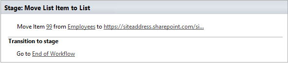

Copy Current List Item to List
--------------------------------------------------
Copy the current list item to another list.

Output parameters
~~~~~~~~~~~~~~~~~~~~~~~~~~~~~~~~~~~~~~~~~~~~~~~~~~
.. list-table::
    :header-rows: 1
    :widths: 10 30 20

    *  -  Parameter
       -  Description
       -  Example
    *  -  List Item ID
       -  The ID of the copied item in the new list
       -  ``18``

Input parameters
~~~~~~~~~~~~~~~~~~~~~~~~~~~~~~~~~~~~~~~~~~~~~~~~~~
.. list-table::
    :header-rows: 1
    :widths: 10 30 20

    *  -  Parameter
       -  Description
       -  Example
    *  -  Destination List Url
       -  The URL of the destination list. This list must contain same fields like in the source list  
       -  ::

	     https://siteaddress.sharepoint.com/sites/Collection/Lists/Employees2
             [%Workflow Context:Current Site URL%]Lists/Employees2
    *  -  Copy Attachments
       -  Copy the item with attached files or not
       -  No
    *  -  AdminLogin
       -  The login of the user who has appropriate permissions to perform operation. This parameter doesn't exist in the version for SharePoint 2013 on-premise.
       -  :code:`admin@contoso.com`
    *  -  AdminPassword
       -  The password of the user who has appropriate permissions to perform operation. This parameter doesn't exist in the version for SharePoint 2013 on-premise.
       -  admin’sP@ssw0rd$
    *  -  SiteUrl
       -  The URL of the current SharePoint site. This property defines context of the workflow action. All actions performed by workflow action will be executed on specified SharePoint site. If this property is blank it will use current SharePoint site by default.
       -  ::

            https://contoso/SiteUrl
            [%Workflow Context:Current Site URL%]subSite
        
    *  -  ThrowError
       -  Detects whether workflow should be interrupted in case of error or not.
       -  Yes
    *  -  RunAsPublisher
       -  Detects whether the workflow action has to be runned under the user account who published the workflow (for SharePoint 2013 on-premise only).
       -  Yes

Example
~~~~~~~~~~~~~~~~~~~~~~~~~~~~~~~~~~~~~~~~~~~~~~~~~~
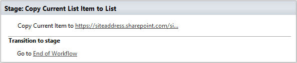

Move Current List Item to List
--------------------------------------------------
Move the current list item to another list.

Output parameters
~~~~~~~~~~~~~~~~~~~~~~~~~~~~~~~~~~~~~~~~~~~~~~~~~~
.. list-table::
    :header-rows: 1
    :widths: 10 30 20

    *  -  Parameter
       -  Description
       -  Example
    *  -  List Item ID
       -  The ID of the moved item in the new list
       -  ``18``

Input parameters
~~~~~~~~~~~~~~~~~~~~~~~~~~~~~~~~~~~~~~~~~~~~~~~~~~
.. list-table::
    :header-rows: 1
    :widths: 10 30 20

    *  -  Parameter
       -  Description
       -  Example
    *  -  Destination List Url
       -  The URL of the destination list. This list must contain same fields like in the source list  
       -  ::

	     https://siteaddress.sharepoint.com/sites/Collection/Lists/Employees2
             [%Workflow Context:Current Site URL%]Lists/Employees2
    *  -  Move Attachments
       -  Move the item with attached files or not
       -  No
    *  -  AdminLogin
       -  The login of the user who has appropriate permissions to perform operation. This parameter doesn't exist in the version for SharePoint 2013 on-premise.
       -  :code:`admin@contoso.com`
    *  -  AdminPassword
       -  The password of the user who has appropriate permissions to perform operation. This parameter doesn't exist in the version for SharePoint 2013 on-premise.
       -  admin’sP@ssw0rd$
    *  -  SiteUrl
       -  The URL of the current SharePoint site. This property defines context of the workflow action. All actions performed by workflow action will be executed on specified SharePoint site. If this property is blank it will use current SharePoint site by default.
       -  ::

            https://contoso/SiteUrl
            [%Workflow Context:Current Site URL%]subSite
        
    *  -  ThrowError
       -  Detects whether workflow should be interrupted in case of error or not.
       -  Yes
    *  -  RunAsPublisher
       -  Detects whether the workflow action has to be runned under the user account who published the workflow (for SharePoint 2013 on-premise only).
       -  Yes

Example
~~~~~~~~~~~~~~~~~~~~~~~~~~~~~~~~~~~~~~~~~~~~~~~~~~
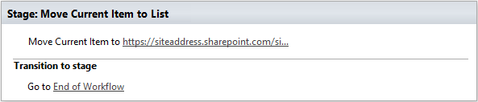

Copy Attachments to URL
--------------------------------------------------
Copies attachments from the list item to the library using the specified folder URL.

Output parameters
~~~~~~~~~~~~~~~~~~~~~~~~~~~~~~~~~~~~~~~~~~~~~~~~~~
.. list-table::
    :header-rows: 1
    :widths: 10 30 20

    *  -  Parameter
       -  Description
       -  Example
    *  -  File URLs
       -  Returns a list of copied files
       -  ::

            [ 
                'http://contoso.sharepoint.com/SharedDocuments/Document1.docx', 
                'http://contoso.sharepoint.com/SharedDocuments/Document2.docx'
            ]

Input parameters
~~~~~~~~~~~~~~~~~~~~~~~~~~~~~~~~~~~~~~~~~~~~~~~~~~
.. list-table::
    :header-rows: 1
    :widths: 10 30 20

    *  -  Parameter
       -  Description
       -  Example
    *  -  List Url
       -  The URL of the source list. You can use full URL as well as domain relative URL. We would recommend to use constants from the workflow context.
       -  ::

            https://contoso/SiteUrl/Lists/Issues
            [%Workflow Context:Current Site URL%]SiteUrl/Lists/Issues

    *  -  Item ID
       -  The ID of the source item.
       -  ::

            22
            Variable:ItemId

    *  -  Destination folder Url
       -  The URL of the folder where the attachments will be copied.
       -  ::

            https://contoso/SiteUrl/LibraryName/FolderName/
            /SiteUrl/LibraryName/FolderName/
            [%Workflow Context:Current Site URL%]SiteUrl/LibraryName/

    *  -  AdminLogin
       -  The login of the user who has appropriate permissions to perform operation. This parameter doesn't exist in the version for SharePoint 2013 on-premise.
       -  :code:`admin@contoso.com`
    *  -  AdminPassword
       -  The password of the user who has appropriate permissions to perform operation. This parameter doesn't exist in the version for SharePoint 2013 on-premise.
       -  admin’sP@ssw0rd$
    *  -  SiteUrl
       -  The URL of the current SharePoint site. This property defines context of the workflow action. All actions performed by workflow action will be executed on specified SharePoint site. If this property is blank it will use current SharePoint site by default.
       -  ::

            https://contoso/SiteUrl
            [%Workflow Context:Current Site URL%]subSite

    *  -  ThrowError
       -  Detects whether workflow should be interrupted in case of error or not.
       -  Yes
    *  -  RunAsPublisher
       -  Detects whether the workflow action has to be runned under the user account who published the workflow (for SharePoint 2013 on-premise only).
       -  Yes

Example
~~~~~~~~~~~~~~~~~~~~~~~~~~~~~~~~~~~~~~~~~~~~~~~~~~
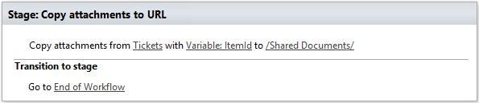

Move Attachments to URL
--------------------------------------------------
Moves attachments from the list item to the library using the specified folder URL.

Output parameters
~~~~~~~~~~~~~~~~~~~~~~~~~~~~~~~~~~~~~~~~~~~~~~~~~~
.. list-table::
    :header-rows: 1
    :widths: 10 30 20

    *  -  Parameter
       -  Description
       -  Example
    *  -  File URLs
       -  Returns a list of moved files
       -  ::

            { 
                'http://contoso.sharepoint.com/SharedDocuments/Document1.docx', 
                'http://contoso.sharepoint.com/SharedDocuments/Document2.docx'
            }

Input parameters
~~~~~~~~~~~~~~~~~~~~~~~~~~~~~~~~~~~~~~~~~~~~~~~~~~
.. list-table::
    :header-rows: 1
    :widths: 10 30 20

    *  -  Parameter
       -  Description
       -  Example
    *  -  List Url
       -  The URL of the source list. You can use full URL as well as domain relative URL. We would recommend to use constants from the workflow context.
       -  ::
            
            https://contoso/SiteUrl/Lists/Issues
            [%Workflow Context:Current Site URL%]SiteUrl/Lists/Issues
        
    *  -  Item ID
       -  The ID of the source item.
       -  :: 

            22
            Variable:ItemId
        
    *  -  Destination folder Url
       -  The URL of folder where the source documents will be moved.
       -  ::
            
            https://contoso/SiteUrl/LibraryName/FolderName/
            /SiteUrl/LibraryName/FolderName/
            [%Workflow Context:Current Site URL%]SiteUrl/LibraryName/
        
    *  -  AdminLogin
       -  The login of the user who has appropriate permissions to perform operation. This parameter doesn't exist in the version for SharePoint 2013 on-premise.
       -  :code:`admin@contoso.com`
    *  -  AdminPassword
       -  The password of the user who has appropriate permissions to perform operation. This parameter doesn't exist in the version for SharePoint 2013 on-premise.
       -  admin’sP@ssw0rd$
    *  -  SiteUrl
       -  The URL of the current SharePoint site. This property defines context of the workflow action. All actions performed by workflow action will be executed on specified SharePoint site. If this property is blank it will use current SharePoint site by default.
       -  ::

            https://contoso/SiteUrl
            [%Workflow Context:Current Site URL%]subSite
        
    *  -  ThrowError
       -  Detects whether workflow should be interrupted in case of error or not.
       -  Yes
    *  -  RunAsPublisher
       -  Detects whether the workflow action has to be runned under the user account who published the workflow (for SharePoint 2013 on-premise only).
       -  Yes

Example
~~~~~~~~~~~~~~~~~~~~~~~~~~~~~~~~~~~~~~~~~~~~~~~~~~
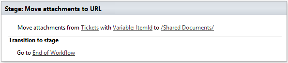

Get Attachments to Dictionary
--------------------------------------------------
Gets list of attachments from the list item and saves them as collection in dictionary variable.

Output parameters
~~~~~~~~~~~~~~~~~~~~~~~~~~~~~~~~~~~~~~~~~~~~~~~~~~
.. list-table::
    :header-rows: 1
    :widths: 10 30 20

    *  -  Parameter
       -  Description
       -  Example
    *  -  Items
       -  The output variable where the results will be saved.
       -  Variable:Items

Input parameters
~~~~~~~~~~~~~~~~~~~~~~~~~~~~~~~~~~~~~~~~~~~~~~~~~~
.. list-table::
    :header-rows: 1
    :widths: 10 30 20

    *  -  Parameter
       -  Description
       -  Example
    *  -  List Url
       -  The URL of the source list. You can use full URL as well as domain relative URL. We would recommend to use constants from the workflow context.
       -  ::

            https://contoso/SiteUrl/Lists/Issues
            [%Workflow Context:Current Site URL%]SiteUrl/Lists/Issues
        
    *  -  Item ID
       -  The ID of the source item.
       -  ::

            22
            Variable:ItemId
        
    *  -  AdminLogin
       -  The login of the user who has appropriate permissions to perform operation. This parameter doesn't exist in the version for SharePoint 2013 on-premise.
       -  :code:`admin@contoso.com`
    *  -  AdminPassword
       -  The password of the user who has appropriate permissions to perform operation. This parameter doesn't exist in the version for SharePoint 2013 on-premise.
       -  admin’sP@ssw0rd$
    *  -  SiteUrl
       -  The URL of the current SharePoint site. This property defines context of the workflow action. All actions performed by workflow action will be executed on specified SharePoint site. If this property is blank it will use current SharePoint site by default.
       -  ::

            https://contoso/SiteUrl
            [%Workflow Context:Current Site URL%]subSite
        
    *  -  ThrowError
       -  Detects whether workflow should be interrupted in case of error or not.
       -  Yes
    *  -  RunAsPublisher
       -  Detects whether the workflow action has to be runned under the user account who published the workflow (for SharePoint 2013 on-premise only).
       -  Yes

Example
~~~~~~~~~~~~~~~~~~~~~~~~~~~~~~~~~~~~~~~~~~~~~~~~~~
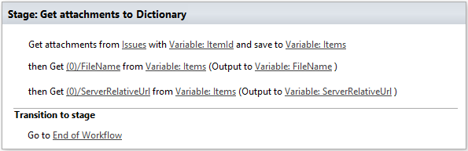

Get Versions History
--------------------------------------------------
Returns the changes history for the specific field

Output parameters
~~~~~~~~~~~~~~~~~~~~~~~~~~~~~~~~~~~~~~~~~~~~~~~~~~
.. list-table::
    :header-rows: 1
    :widths: 10 30 20

    *  -  Parameter
       -  Description
       -  Example
    *  -  Versions
       -  The output variable where the results will be saved.
       -  Variable:Versions
          The result looks like::

            [
              {
                "Editor": "10;#Roman Rylov,#i:0#.f|membership|roman@plumsail.onmicrosoft.com,#roman@plumsail.onmicrosoft.com,#roman@plumsail.onmicrosoft.com,#Roman Rylov",
                "Modified": "2016-04-15T16:48:00+00:00",
                "Value": "Test 3"
              },
              {
                "Editor": "10;#Roman Rylov,#i:0#.f|membership|roman@plumsail.onmicrosoft.com,#roman@plumsail.onmicrosoft.com,#roman@plumsail.onmicrosoft.com,#Roman Rylov",
                "Modified": "2016-04-15T16:47:12+00:00",
                "Value": "Test 2"
              },
              {
                "Editor": "10;#Roman Rylov,#i:0#.f|membership|roman@plumsail.onmicrosoft.com,#roman@plumsail.onmicrosoft.com,#roman@plumsail.onmicrosoft.com,#Roman Rylov",
                "Modified": "2016-04-15T16:46:48+00:00",
                "Value": "Test "
              }
            ]

    *  -  Count Versions
       -  Contains count of versions in result dictionary
       -  Variable:CountVersions

Input parameters
~~~~~~~~~~~~~~~~~~~~~~~~~~~~~~~~~~~~~~~~~~~~~~~~~~
.. list-table::
    :header-rows: 1
    :widths: 10 30 20

    *  -  Parameter
       -  Description
       -  Example
    *  -  Field Name
       -  Name of the field for which you want to get the version history.
       -  ``Title``
    *  -  Item ID
       -  Item ID of the item for which you want to get the version history. 
       -  ``10``
    *  -  List
       -  Title or Url of chosen list
       -  ``Documents``
    *  -  AdminLogin
       -  The login of the user who has appropriate permissions to perform operation. This parameter doesn't exist in the version for SharePoint 2013 on-premise.
       -  :code:`admin@contoso.com`
    *  -  AdminPassword
       -  The password of the user who has appropriate permissions to perform operation. This parameter doesn't exist in the version for SharePoint 2013 on-premise.
       -  admin’sP@ssw0rd$
    *  -  SiteUrl
       -  The URL of the current SharePoint site. This property defines context of the workflow action. All actions performed by workflow action will be executed on specified SharePoint site. If this property is blank it will use current SharePoint site by default.
       -  ::

            https://contoso/SiteUrl
            [%Workflow Context:Current Site URL%]subSite
        
    *  -  ThrowError
       -  Detects whether workflow should be interrupted in case of error or not.
       -  Yes
    *  -  RunAsPublisher
       -  Detects whether the workflow action has to be runned under the user account who published the workflow (for SharePoint 2013 on-premise only).
       -  Yes

Example
~~~~~~~~~~~~~~~~~~~~~~~~~~~~~~~~~~~~~~~~~~~~~~~~~~
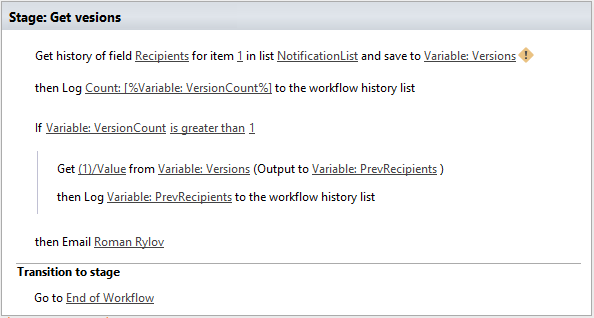

Wait for any change in fields
--------------------------------------------------
Waits for any change in the specified fields of a document or of a list item. Once any of the specified fields changed it returns the dictionary with informaiton about old values and new values of thefields.

Output parameters
~~~~~~~~~~~~~~~~~~~~~~~~~~~~~~~~~~~~~~~~~~~~~~~~~~
.. list-table::
    :header-rows: 1
    :widths: 10 30 20

    *  -  Parameter
       -  Description
       -  Example
    *  -  Changes dictionary
       -  The output variable where the result with field changes will be saved.Logical structure of the changes dictionary:
          - Colleciton of changes::

            - (0)
              - FieldInternalName
              - OldValue
              - NewValue
            - (1)
              - FieldInternalName
              - OldValue
            - NewValue
          
          Example of the changes dictionary represented as JSON:
          ::

            [
                {
                    FieldInternalName: "Status",
                    OldValue: "Active",
                    NewValue "Resolved"
                },
                {
                    FieldInternalName: "Priority",
                    OldValue: "Low",
                    NewValue "High"
                }
            ]
       -  Variable:changes dictionary

Input parameters
~~~~~~~~~~~~~~~~~~~~~~~~~~~~~~~~~~~~~~~~~~~~~~~~~~
.. list-table::
    :header-rows: 1
    :widths: 10 30 20

    *  -  Parameter
       -  Description
       -  Example
    *  -  Field names
       -  Comma separated list of internal field names to track.
       -  Status, Priority

Example
~~~~~~~~~~~~~~~~~~~~~~~~~~~~~~~~~~~~~~~~~~~~~~~~~~

  This is an example workflow which waits for changes in the fields 'Status' and 'Priority'. Then the workflow iterates through the result dictionary, extracts old and new values and logs it to the workflow history.
  
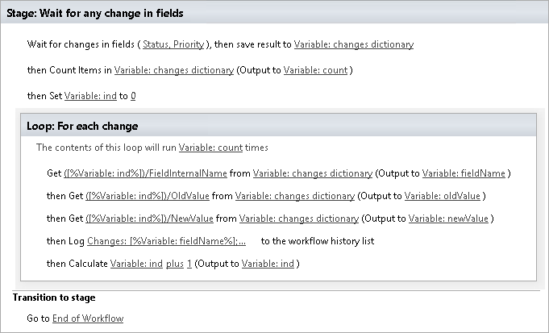

