SharePoint Utils 
==================================================

Start a List Workflow (2013)
--------------------------------------------------
Start a list level workflow and pass input parameters, if they were specified
Attention! The workflow action can run only 2013 workflows, to run 2010 workflow you can use `Coordination actions <http://blogs.msdn.com/b/sharepointdesigner/archive/2012/08/18/how-to-trigger-a-sharepoint-2010-workflow-from-a-sharepoint-2013-workflow.aspx>`_

Input parameters
~~~~~~~~~~~~~~~~~~~~~~~~~~~~~~~~~~~~~~~~~~~~~~~~~~
.. list-table::
    :header-rows: 1
    :widths: 10 30 20

    *  -  Parameter
       -  Description
       -  Example
    *  -  Workflow name
       -  Name of the workflow which will be started
       -  Send notifications
    *  -  Item ID
       -  Item ID
       -  44 or [Variable:ItemId]
    *  -  List name
       -  Title, Url or guid of list
       -  Clients
    *  -  Input parameters
       -  Dictionary that contains input parameters for workflow
       -  [Variable:InputParameters]
    *  -  AdminLogin
       -  The login of the user who has appropriate permissions to perform operation. This parameter doesn't exist in the version for SharePoint 2013 on-premise.
       -  :code:`admin@contoso.com`
    *  -  AdminPassword
       -  The password of the user who has appropriate permissions to perform operation. This parameter doesn't exist in the version for SharePoint 2013 on-premise.
       -  admin’sP@ssw0rd$
    *  -  SiteUrl
       -  The URL of the current SharePoint site. This property defines context of the workflow action. All actions performed by workflow action will be executed on specified SharePoint site. If this property is blank it will use current SharePoint site by default.
       -  :code:`https://contoso/SiteUrl`
          [%Workflow Context:Current Site URL%]subSite      
    *  -  ThrowError
       -  Detects whether workflow should be interrupted in case of error or not.
       -  Yes
    *  -  RunAsPublisher
       -  Run under user account who published workflow (for OnPremise only)
       -  Yes

Example
~~~~~~~~~~~~~~~~~~~~~~~~~~~~~~~~~~~~~~~~~~~~~~~~~~
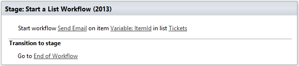

Start a Site Workflow (2013)
--------------------------------------------------
Start a site level workflow and pass input parameters, if they were specified
Attention! The workflow action can run only 2013 workflows, to run 2010 workflow you can use `Coordination actions <http://blogs.msdn.com/b/sharepointdesigner/archive/2012/08/18/how-to-trigger-a-sharepoint-2010-workflow-from-a-sharepoint-2013-workflow.aspx>`_

Input parameters
~~~~~~~~~~~~~~~~~~~~~~~~~~~~~~~~~~~~~~~~~~~~~~~~~~
.. list-table::
    :header-rows: 1
    :widths: 10 30 20

    *  -  Parameter
       -  Description
       -  Example
    *  -  Workflow name
       -  Name of the workflow which will be started
       -  Send notifications
    *  -  Input parameters
       -  Dictionary that contains input parameters for workflow
       -  [Variable:InputParameters]
    *  -  AdminLogin
       -  The login of the user who has appropriate permissions to perform operation. This parameter doesn't exist in the version for SharePoint 2013 on-premise.
       -  :code:`admin@contoso.com`
    *  -  AdminPassword
       -  The password of the user who has appropriate permissions to perform operation. This parameter doesn't exist in the version for SharePoint 2013 on-premise.
       -  admin’sP@ssw0rd$
    *  -  SiteUrl
       -  The URL of the current SharePoint site. This property defines context of the workflow action. All actions performed by workflow action will be executed on specified SharePoint site. If this property is blank it will use current SharePoint site by default.
       -  :code:`https://contoso/SiteUrl`
          [%Workflow Context:Current Site URL%]subSite
                
    *  -  ThrowError
       -  Detects whether workflow should be interrupted in case of error or not.
       -  Yes
    *  -  RunAsPublisher
       -  Run under user account who published workflow (for OnPremise only)
       -  Yes

Example
~~~~~~~~~~~~~~~~~~~~~~~~~~~~~~~~~~~~~~~~~~~~~~~~~~
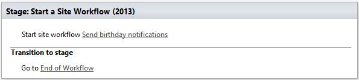

Call SharePoint REST Service
--------------------------------------------------
The action simplifies using of SharePoint REST API it automatically setup HTTP header and adds form digest. 

Output parameters
~~~~~~~~~~~~~~~~~~~~~~~~~~~~~~~~~~~~~~~~~~~~~~~~~~
.. list-table::
    :header-rows: 1
    :widths: 10 30 20

    *  -  Parameter
       -  Description
       -  Example
    *  -  Response Status Code
       -  The status code of the executed query
       -  Variable:StatusCode
    *  -  Response Content
       -  The result of the executed query
       -  Variable:ResponseContent

Input parameters
~~~~~~~~~~~~~~~~~~~~~~~~~~~~~~~~~~~~~~~~~~~~~~~~~~
.. list-table::
    :header-rows: 1
    :widths: 10 30 20

    *  -  Parameter
       -  Description
       -  Example
    *  -  Address
       -  Uri of the remote resource
       -  ``https://plumsail.sharepoint.com/sites/dev/_api/web/lists/getbytitle('Users')/Fields``
    *  -  RequestType
       -  Type of the request. The action supports the following values: GET, POST, PUT, DELETE, MERGE
       -  ``POST``
    *  -  RequestHeaders
       -  Dictionary value that will be added to request headers. Basically the action fill-in the following headers: Authorization, X-RequestDigest, Content-Type, Content-Lenght
       -  ::

            {
              "X-SomeCustomHeader": "CustomHeaderValue"
            }

    *  -  Request Content
       -  Dictionary value that will be send as JSON to the resource
       -  ::

            {
              "__metadata": {
                "type": "SP.Field"
              },
              "Title": "My New Field",
              "FieldTypeKind": 2,
              "Required": "true",
              "EnforceUniqueValues": "false",
              "StaticName": "MyNewField"
            }
    *  -  AdminLogin
       -  The login of the user who has appropriate permissions to perform operation. This parameter doesn't exist in the version for SharePoint 2013 on-premise.
       -  :code:`admin@contoso.com`
    *  -  AdminPassword
       -  The password of the user who has appropriate permissions to perform operation. This parameter doesn't exist in the version for SharePoint 2013 on-premise.
       -  admin’sP@ssw0rd$
    *  -  SiteUrl
       -  The URL of the current SharePoint site. This property defines context of the workflow action. All actions performed by workflow action will be executed on specified SharePoint site. If this property is blank it will use current SharePoint site by default.
       -  :code:`https://contoso/SiteUrl`
          [%Workflow Context:Current Site URL%]subSite
                
    *  -  ThrowError
       -  Detects whether workflow should be interrupted in case of error or not.
       -  Yes
    *  -  RunAsPublisher
       -  Run under user account who published workflow (for OnPremise only)
       -  Yes

Example
~~~~~~~~~~~~~~~~~~~~~~~~~~~~~~~~~~~~~~~~~~~~~~~~~~
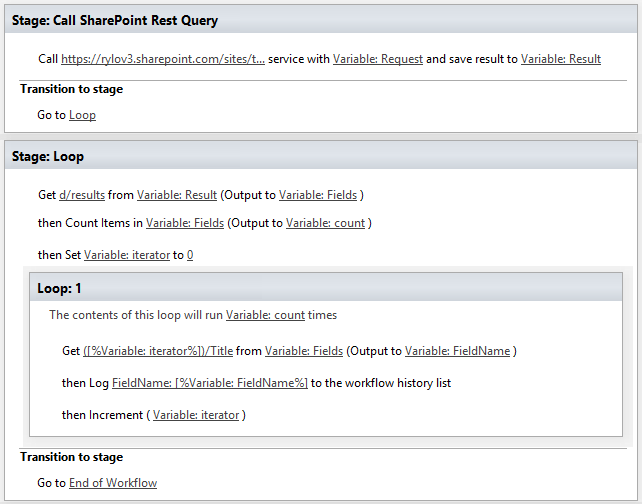

Get User Properties
--------------------------------------------------
Get User Properties to a Dictionary

Output parameters
~~~~~~~~~~~~~~~~~~~~~~~~~~~~~~~~~~~~~~~~~~~~~~~~~~
.. list-table::
    :header-rows: 1
    :widths: 10 30 20

    *  -  Parameter
       -  Description
       -  Example         
    *  -  Properties
       -  Dictionary with found user properties and their values
       -  [Variable:Properties]

Input parameters
~~~~~~~~~~~~~~~~~~~~~~~~~~~~~~~~~~~~~~~~~~~~~~~~~~
.. list-table::
    :header-rows: 1
    :widths: 10 30 20

    *  -  Parameter
       -  Description
       -  Example
    *  -  UserIdentity
       -  User ID, Email or login name
       -  :code:`roman@plumsail.onsharepoint.com`
    *  -  AdminLogin
       -  The login of the user who has appropriate permissions to perform operation. This parameter doesn't exist in the version for SharePoint 2013 on-premise.
       -  :code:`admin@contoso.com`
    *  -  AdminPassword
       -  The password of the user who has appropriate permissions to perform operation. This parameter doesn't exist in the version for SharePoint 2013 on-premise.
       -  admin’sP@ssw0rd$
    *  -  SiteUrl
       -  The URL of the current SharePoint site. This property defines context of the workflow action. All actions performed by workflow action will be executed on specified SharePoint site. If this property is blank it will use current SharePoint site by default.
       -  :code:`https://contoso/SiteUrl`
          [%Workflow Context:Current Site URL%]subSite
                
    *  -  ThrowError
       -  Detects whether workflow should be interrupted in case of error or not.
       -  Yes
    *  -  RunAsPublisher
       -  Run under user account who published workflow (for OnPremise only)
       -  Yes

Example
~~~~~~~~~~~~~~~~~~~~~~~~~~~~~~~~~~~~~~~~~~~~~~~~~~
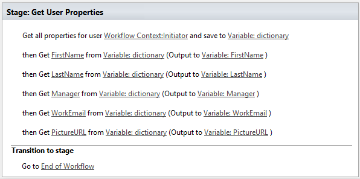

Get User Property by Name
--------------------------------------------------
Get specific user property as string value

Output parameters
~~~~~~~~~~~~~~~~~~~~~~~~~~~~~~~~~~~~~~~~~~~~~~~~~~
.. list-table::
    :header-rows: 1
    :widths: 10 30 20

    *  -  Parameter
       -  Description
       -  Example         
    *  -  Property value
       -  The string value of the property
       -  [Variable:PropertyValue]

Input parameters
~~~~~~~~~~~~~~~~~~~~~~~~~~~~~~~~~~~~~~~~~~~~~~~~~~
.. list-table::
    :header-rows: 1
    :widths: 10 30 20

    *  -  Parameter
       -  Description
       -  Example
    *  -  Property Name
       -  Name of the property
       -  WorkEmail                
    *  -  UserIdentity
       -  User ID, Email or login name
       -  :code:`roman@plumsail.onsharepoint.com`
    *  -  AdminLogin
       -  The login of the user who has appropriate permissions to perform operation. This parameter doesn't exist in the version for SharePoint 2013 on-premise.
       -  :code:`admin@contoso.com`
    *  -  AdminPassword
       -  The password of the user who has appropriate permissions to perform operation. This parameter doesn't exist in the version for SharePoint 2013 on-premise.
       -  admin’sP@ssw0rd$
    *  -  SiteUrl
       -  The URL of the current SharePoint site. This property defines context of the workflow action. All actions performed by workflow action will be executed on specified SharePoint site. If this property is blank it will use current SharePoint site by default.
       -  :code:`https://contoso/SiteUrl`
          [%Workflow Context:Current Site URL%]subSite
                
    *  -  ThrowError
       -  Detects whether workflow should be interrupted in case of error or not.
       -  Yes
    *  -  RunAsPublisher
       -  Run under user account who published workflow (for OnPremise only)
       -  Yes

Example
~~~~~~~~~~~~~~~~~~~~~~~~~~~~~~~~~~~~~~~~~~~~~~~~~~
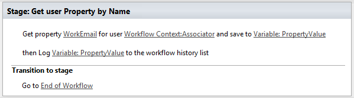

Get Site Option Value as String
--------------------------------------------------
Read string value from Site Options (Property Bag)

Output parameters
~~~~~~~~~~~~~~~~~~~~~~~~~~~~~~~~~~~~~~~~~~~~~~~~~~
.. list-table::
    :header-rows: 1
    :widths: 10 30 20

    *  -  Parameter
       -  Description
       -  Example         
    *  -  Property value
       -  The string value of the property
       -  [Variable:ResultString]

Input parameters
~~~~~~~~~~~~~~~~~~~~~~~~~~~~~~~~~~~~~~~~~~~~~~~~~~
.. list-table::
    :header-rows: 1
    :widths: 10 30 20

    *  -  Parameter
       -  Description
       -  Example
    *  -  Property Name
       -  Name of the property
       -  PortalSettings
          [Variable:SettingsKey]

Example
~~~~~~~~~~~~~~~~~~~~~~~~~~~~~~~~~~~~~~~~~~~~~~~~~~
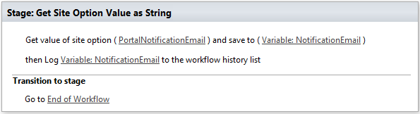

Get Site Option Value as Dictionary
--------------------------------------------------
Read json value from Site Options (Property Bag) and save it to Dictionary variable

Output parameters
~~~~~~~~~~~~~~~~~~~~~~~~~~~~~~~~~~~~~~~~~~~~~~~~~~
.. list-table::
    :header-rows: 1
    :widths: 10 30 20

    *  -  Parameter
       -  Description
       -  Example         
    *  -  Property value
       -  Dictionary with found user properties and their values
       -  [Variable:ResultDictionary]

Input parameters
~~~~~~~~~~~~~~~~~~~~~~~~~~~~~~~~~~~~~~~~~~~~~~~~~~
.. list-table::
    :header-rows: 1
    :widths: 10 30 20

    *  -  Parameter
       -  Description
       -  Example
    *  -  Property Name
       -  Name of property
       -  PortalSettings
          [Variable:SettingsKey]

Example
~~~~~~~~~~~~~~~~~~~~~~~~~~~~~~~~~~~~~~~~~~~~~~~~~~
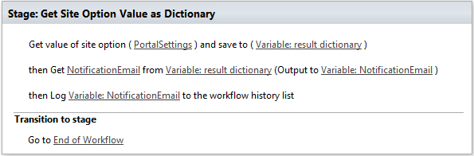

Evaluate expression
--------------------------------------------------
Evaluate mathematical expressions and save result to Dictionary with Resultas key
We use `NCalc <https://ncalc.codeplex.com/>`_ framework as mathematical expressions evaluator. You can use it to evaluate logical or arithmetical expressions. For example ``2 * 2 or if(3 % 2 = 1, true, false)``. This workflow action can help you to calculate complex formulas as well as evaluate complex logical expressions.

To get more informaiton about available operators, values and functions visit following links:

* `Operators <https://ncalc.codeplex.com/wikipage?title=operators&referringTitle=Home>`_
* `Values <https://ncalc.codeplex.com/wikipage?title=values&referringTitle=Home>`_
* `Functions <https://ncalc.codeplex.com/wikipage?title=functions&referringTitle=Home>`_

Output parameters
~~~~~~~~~~~~~~~~~~~~~~~~~~~~~~~~~~~~~~~~~~~~~~~~~~
.. list-table::
    :header-rows: 1
    :widths: 10 30 20

    *  -  Parameter
       -  Description
       -  Example         
    *  -  Result dictionary
       -  Dictionary that contains output result in "Result" key
       -  ``[Variable:ResultDictionary]``

Input parameters
~~~~~~~~~~~~~~~~~~~~~~~~~~~~~~~~~~~~~~~~~~~~~~~~~~
.. list-table::
    :header-rows: 1
    :widths: 10 30 20

    *  -  Parameter
       -  Description
       -  Example
    *  -  Expression
       -  Expression for evaluation
       -  ::

              2+2*2
              sqrt(9)
              sin(1)
              true or false = true

    *  -  ThrowError
       -  Detects whether workflow should be interrupted in case of error or not.
       -  Yes
    *  -  RunAsPublisher
       -  Run under user account who published workflow (for OnPremise only)
       -  Yes

Example
~~~~~~~~~~~~~~~~~~~~~~~~~~~~~~~~~~~~~~~~~~~~~~~~~~
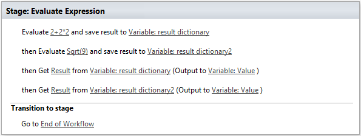

Parse XML to Dictionary
--------------------------------------------------
The workflow action receives XML string and convert it to a Dictionary. 

Output parameters
~~~~~~~~~~~~~~~~~~~~~~~~~~~~~~~~~~~~~~~~~~~~~~~~~~
.. list-table::
    :header-rows: 1
    :widths: 10 30 20

    *  -  Parameter
       -  Description
       -  Example
    *  -  Result dictionary
       -  Output dictionary value. Please check out the following article to know more.
          `How to work with dictionaries in SharePoint 2013 and Office 365 workflow <https://plumsail.com/blog/2014/08/how-to-work-with-dictionaries-in-sharepoint-2013-and-office-365-workflow/>`_
       -  ::

            {
               "recurrence":{
                  "rule":{
                     "firstDayOfWeek":"su",
                     "repeat":{
                        "daily":{
                           "@dayFrequency":"1"
                        }
                     },
                     "repeatInstances":"10"
                  }
               }
            }

Input parameters
~~~~~~~~~~~~~~~~~~~~~~~~~~~~~~~~~~~~~~~~~~~~~~~~~~
.. list-table::
    :header-rows: 1
    :widths: 10 30 20

    *  -  Parameter
       -  Description
       -  Example
    *  -  Expression 
       -  Input XML string
       -  ::

            <recurrence>
                <rule>
                    <firstDayOfWeek>su</firstDayOfWeek>
                    <repeat>
                        <daily dayFrequency="1" />
                    </repeat>
                    <repeatInstances>10</repeatInstances>
                </rule>
            </recurrence>
    *  -  ThrowError
       -  Detects whether workflow should be interrupted in case of error or not.
       -  Yes
    *  -  RunAsPublisher
       -  Run under user account who published workflow (for OnPremise only)
       -  Yes

Example
~~~~~~~~~~~~~~~~~~~~~~~~~~~~~~~~~~~~~~~~~~~~~~~~~~
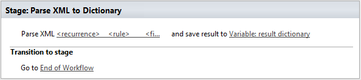

HTML Encode
--------------------------------------------------
The workflow action receives HTML string and encode it. 

Output parameters
~~~~~~~~~~~~~~~~~~~~~~~~~~~~~~~~~~~~~~~~~~~~~~~~~~
.. list-table::
    :header-rows: 1
    :widths: 10 30 20

    *  -  Parameter
       -  Description
       -  Example
    *  -  Result
       -  Output string value
       -  ::

            &lt;div&gt;
		&lt;span&gt;
			Hello!
		&lt;/span&gt;
	    &lt;/div&gt;

Input parameters
~~~~~~~~~~~~~~~~~~~~~~~~~~~~~~~~~~~~~~~~~~~~~~~~~~
.. list-table::
    :header-rows: 1
    :widths: 10 30 20

    *  -  Parameter
       -  Description
       -  Example
    *  -  HTML
       -  Input HTML string
       -  ::

            

		
		       Hello!
		
	   

    *  -  ThrowError
       -  Detects whether workflow should be interrupted in case of error or not.
       -  Yes
    *  -  RunAsPublisher
       -  Run under user account who published workflow (for OnPremise only)
       -  Yes

Example
~~~~~~~~~~~~~~~~~~~~~~~~~~~~~~~~~~~~~~~~~~~~~~~~~~
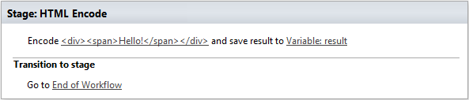

Build Dictionary from JSON string
--------------------------------------------------
The workflow action receives JSON string and convert it to a Dictionary. 

Output parameters
~~~~~~~~~~~~~~~~~~~~~~~~~~~~~~~~~~~~~~~~~~~~~~~~~~
.. list-table::
    :header-rows: 1
    :widths: 10 30 20

    *  -  Parameter
       -  Description
       -  Example
    *  -  ResultDictionary
       -  Output dictionary value. Please check out the following article to know more.
          `How to work with dictionaries in SharePoint 2013 and Office 365 workflow <https://plumsail.com/blog/2014/08/how-to-work-with-dictionaries-in-sharepoint-2013-and-office-365-workflow/>`_
       -  ::

            {
               "recurrence":{
                  "rule":{
                     "firstDayOfWeek":"su",
                     "repeat":{
                        "daily":{
                           "@dayFrequency":"1"
                        }
                     },
                     "repeatInstances":"10"
                  }
               }
            }

Input parameters
~~~~~~~~~~~~~~~~~~~~~~~~~~~~~~~~~~~~~~~~~~~~~~~~~~
.. list-table::
    :header-rows: 1
    :widths: 10 30 20

    *  -  Parameter
       -  Description
       -  Example
    *  -  JsonString 
       -  Input JSON string
       -  ::

            {
               "recurrence":{
                  "rule":{
                     "firstDayOfWeek":"su",
                     "repeat":{
                        "daily":{
                           "@dayFrequency":"1"
                        }
                     },
                     "repeatInstances":"10"
                  }
               }
            }

Example
~~~~~~~~~~~~~~~~~~~~~~~~~~~~~~~~~~~~~~~~~~~~~~~~~~
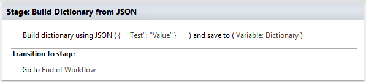

Increment
--------------------------------------------------
Increment an integer variable

Input parameters
~~~~~~~~~~~~~~~~~~~~~~~~~~~~~~~~~~~~~~~~~~~~~~~~~~
.. list-table::
    :header-rows: 1
    :widths: 10 30 20

    *  -  Parameter
       -  Description
       -  Example
    *  -  IntValue
       -  Name of an integer variable
       -  [Variable:Iterator] 

Example
~~~~~~~~~~~~~~~~~~~~~~~~~~~~~~~~~~~~~~~~~~~~~~~~~~
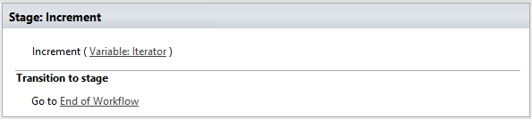

Decrement
--------------------------------------------------
Decrement an integer variable

Input parameters
~~~~~~~~~~~~~~~~~~~~~~~~~~~~~~~~~~~~~~~~~~~~~~~~~~
.. list-table::
    :header-rows: 1
    :widths: 10 30 20

    *  -  Parameter
       -  Description
       -  Example
    *  -  IntValue
       -  Name of an integer variable
       -  [Variable:Iterator] 

Example
~~~~~~~~~~~~~~~~~~~~~~~~~~~~~~~~~~~~~~~~~~~~~~~~~~
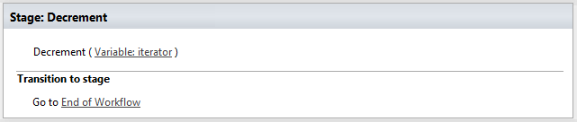