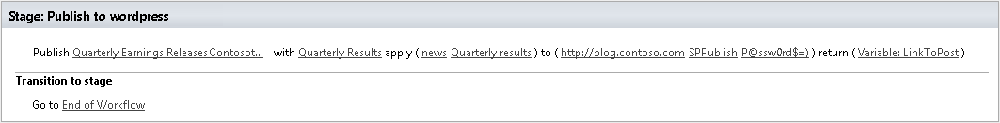
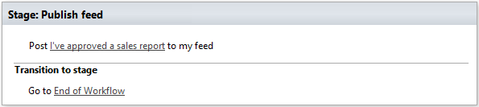
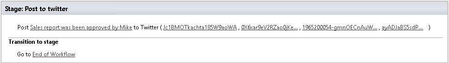

Social integration
==================================================

Publish to Wordpress
--------------------------------------------------
Publish a blog post with the given title, content, categories and tags.

Output parameters
~~~~~~~~~~~~~~~~~~~~~~~~~~~~~~~~~~~~~~~~~~~~~~~~~~
.. list-table::
    :header-rows: 1
    :widths: 10 30 20

    *  -  Parameter
       -  Description
       -  Example
    *  -  URLToPost
       -  Specify workflow variable to store blog post URL.
          type: string
       -  :code:`http://blog.contoso.com/Corpotate-news`

Input parameters
~~~~~~~~~~~~~~~~~~~~~~~~~~~~~~~~~~~~~~~~~~~~~~~~~~
.. list-table::
    :header-rows: 1
    :widths: 10 30 20

    *  -  Parameter
       -  Description
       -  Example
    *  -  WPBody
       -  Text with content of blog post (may contain HTML)
       -  <h1>Quarterly report...</h1>
    *  -  WPTitle
       -  Title of the blog post
       -  Quarterly Results
    *  -  WPCategies
       -  Comma-separated list of categories of the blog post
       -  Articles, news
    *  -  WPTags
       -  Comma-separated list of tags of the blog post
       -  Market research, our product
    *  -  WPUrl
       -  URL of the blog site or URL to xmlrpc.php
       -  :code:`http://blog.contoso.com/xmlrpc.php`
    *  -  WPLogin
       -  Wordpress username (requires permission to create new posts in blog)
       -  SPPublish
    *  -  WPPassword
       -  Wordpress password
       -  :code:`P@ssw0rd$=)`

Example
~~~~~~~~~~~~~~~~~~~~~~~~~~~~~~~~~~~~~~~~~~~~~~~~~~

Post to MicroFeed
--------------------------------------------------
Publishes specific message on user's micro feed.

Input parameters
~~~~~~~~~~~~~~~~~~~~~~~~~~~~~~~~~~~~~~~~~~~~~~~~~~
.. list-table::
    :header-rows: 1
    :widths: 10 30 20

    *  -  Parameter
       -  Description
       -  Example
    *  -  Message
       -  Text of the message
       -  I approved a sales report
    *  -  AdminLogin
       -  The login of the user who has appropriate permissions to perform operation. This parameter doesn't exist in the version for SharePoint 2013 on-premise.
       -  :code:`admin@contoso.com`
    *  -  AdminPassword
       -  The password of the user who has appropriate permissions to perform operation. This parameter doesn't exist in the version for SharePoint 2013 on-premise.
       -  admin'sP@ssw0rd$
    *  -  SiteUrl
       -  The URL of the current SharePoint site. This property defines context of the workflow action. All actions performed by workflow action will be executed on specified SharePoint site. If this property is blank it will use current SharePoint site by default.
       -  ::

            https://contoso/SiteUrl
            [%Workflow Context:Current Site URL%]/subSite
        
    *  -  ThrowError
       -  Detects whether workflow should be interrupted in case of error or not.
       -  Yes
    *  -  RunAsPublisher
       -  Detects whether the workflow action has to be runned under the user account who published the workflow (for SharePoint 2013 on-premise only).
       -  Yes

Example
~~~~~~~~~~~~~~~~~~~~~~~~~~~~~~~~~~~~~~~~~~~~~~~~~~

Post to Twitter
--------------------------------------------------
Posts message to twitter

Input parameters
~~~~~~~~~~~~~~~~~~~~~~~~~~~~~~~~~~~~~~~~~~~~~~~~~~
.. list-table::
    :header-rows: 1
    :widths: 10 30 20

    *  -  Parameter
       -  Description
       -  Example
    *  -  TweetText
       -  Text of the tweet
       -  Sales report has been approved by Mike
    *  -  ConsumerKey
       -  To obtain Twitter's keys you have to register a dev account on dev.twitter.com. You can get more information in the following  video: http://www.youtube.com/watch?v=pRrUYxn5CeYPlease, check that your application has read and write permissions.
       -  Jc1BMOTkachta185W9aoWA
    *  -  ConsumerSecret
       -
       -  Sales_Department
    *  -  AccessToken
       -
       -  ``1965200054-gmnOECnAuWkYIkWUr4vrD0Y4p3WB0E8YpRYD42q``
    *  -  AccessTokenSecret
       -
       -  ``ayADJaBS5sdPM848FqmikvRwzGTpO4udi4kVVUFg``

Example
~~~~~~~~~~~~~~~~~~~~~~~~~~~~~~~~~~~~~~~~~~~~~~~~~~

