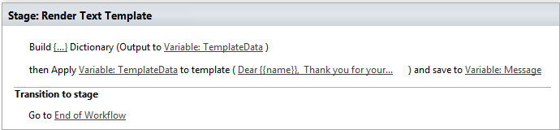
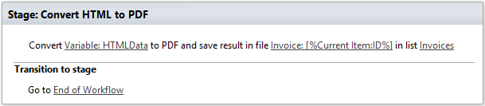
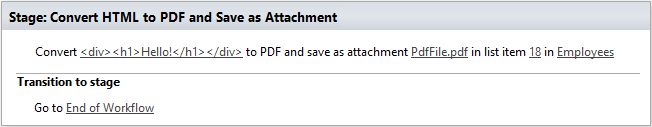
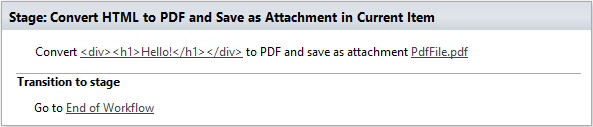
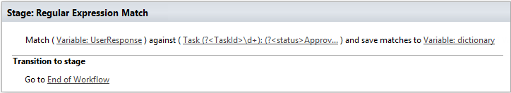
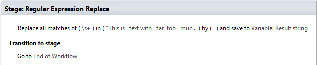
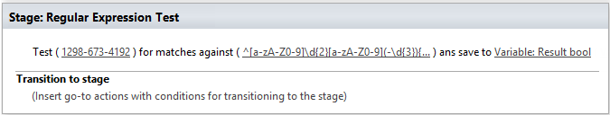

String Processing Advanced
==========================

Render Text Template
--------------------------------------------------
Renders text or HTML template using data from dictionary variable. It uses `Mustache templating engine <http://en.wikipedia.org/wiki/Mustache_%28template_system%29>`_ to render text templates and supports tokens for single values as well as iterators to render collections of elements. You can play around with sample template on `github <http://mustache.github.io/#demo>`_. You can find more information about syntax `in the documentation for Mustache <http://mustache.github.io/mustache.5.html>`_.

You can receive dictionary data from various sources, such as web services, CAML queries or build dictionary manually.
`This article <http://plumsail.com/blog/2014/09/dynamic-templates-using-workflows-sharepoint2013-office365/>`_ provides detailed explanation with use case for this workflow action.

Output parameters
~~~~~~~~~~~~~~~~~~~~~~~~~~~~~~~~~~~~~~~~~~~~~~~~~~
.. list-table::
    :header-rows: 1
    :widths: 10 30 20

    *  -  Parameter
       -  Description
       -  Example
    *  -  Result
       -  The result string generated by template.
       -  Dear John Smith, Thank you for your order.

Input parameters
~~~~~~~~~~~~~~~~~~~~~~~~~~~~~~~~~~~~~~~~~~~~~~~~~~
.. list-table::
    :header-rows: 1
    :widths: 10 30 20

    *  -  Parameter
       -  Description
       -  Example
    *  -  Template data
       -  Input dictionary data that will be used for rendering. For example it can be result of `Build Dictionary <http://plumsail.com/blog/2014/08/how-to-work-with-dictionaries-in-sharepoint-2013-and-office-365-workflow/#BuildDictionaryManually>`_ or `Get Items by Query <List%20items%20processing.html#get-items-by-query>`_ workflow actions. 
       -  ``{ "name":"John Smith" }``
    *  -  Text
       -  The input template string. You can find more information about syntax `in the documentation for Mustache <http://mustache.github.io/mustache.5.html>`_.Store your templates in the separate list and query it by name to simplify templates management.
       -  Dear ``{{name}}``, Thank you for your order.
    *  -  ThrowError
       -  Detects whether workflow should be interrupted in case of error or not.
       -  Yes

Example
~~~~~~~~~~~~~~~~~~~~~~~~~~~~~~~~~~~~~~~~~~~~~~~~~~
In this example we build dictionary manually using `Build Dictionary <http://plumsail.com/blog/2014/08/how-to-work-with-dictionaries-in-sharepoint-2013-and-office-365-workflow/#BuildDictionaryManually>`_ workflow action. Then we render it using the workflow action.

Convert HTML to PDF
--------------------------------------------------
This workflow action converts specified HTML to PDF file and uploads it to the document library.

Output parameters
~~~~~~~~~~~~~~~~~~~~~~~~~~~~~~~~~~~~~~~~~~~~~~~~~~
.. list-table::
    :header-rows: 1
    :widths: 10 30 20

    *  -  Parameter
       -  Description
       -  Example
    *  -  Result file URL
       -  In specific variable will be stored URL at file
       -  :code:`http://contoso.onmicrosoft.com/Invoices/Invoice_4.pdf`

Input parameters
~~~~~~~~~~~~~~~~~~~~~~~~~~~~~~~~~~~~~~~~~~~~~~~~~~
.. list-table::
    :header-rows: 1
    :widths: 10 30 20

    *  -  Parameter
       -  Description
       -  Example
    *  -  Input HTML
       -  Input html for convertation
       -  ::

		[Variable:InputHtml]
		

		     <h1>
			  Hello!
		     </h1>
		

    *  -  File name
       -  File name in document library, can contain path
       -  Invoice1.pdf or Folder1/Folder2/Invoice.pdf
    *  -  List
       -  Name, url or guid of the list
       -  Invoices/Invoices
    *  -  Paper Size
       -  Size of the page, it supports the `following values <http://doc.qt.io/qt-4.8/qprinter.html#PaperSize-enum>`_::

                  A0
                  A1
                  A2
                  A3
                  A4
                  A5
                  Folio
                  Ledger
                  Legal
                  Letter
                  ...
            
       -  A4
    *  -  Is landscape
       -  Page orientation
       -  No
    *  -  AdminLogin
       -  The login of the user who has appropriate permissions to perform operation. This parameter doesn't exist in the version for SharePoint 2013 on-premise.
       -  :code:`admin@contoso.com`
    *  -  AdminPassword
       -  The password of the user who has appropriate permissions to perform operation. This parameter doesn't exist in the version for SharePoint 2013 on-premise.
       -  admin’sP@ssw0rd$
    *  -  SiteUrl
       -  The URL of the current SharePoint site. This property defines context of the workflow action. All actions performed by workflow action will be executed on specified SharePoint site. If this property is blank it will use current SharePoint site by default.
       -  :code:`https://contoso/SiteUrl [%Workflow Context:Current Site URL%]subSite`
    *  -  ThrowError
       -  Detects whether workflow should be interrupted in case of error or not.
       -  Yes
    *  -  RunAsPublisher
       -  Detects whether the workflow action has to be runned under the user account who published the workflow (for SharePoint 2013 on-premise only).
       -  Yes

Example
~~~~~~~~~~~~~~~~~~~~~~~~~~~~~~~~~~~~~~~~~~~~~~~~~~

Convert HTML to PDF and Save as Attachment
--------------------------------------------------
This workflow action converts specified HTML to PDF file and save it as attachment in specified item.

Output parameters
~~~~~~~~~~~~~~~~~~~~~~~~~~~~~~~~~~~~~~~~~~~~~~~~~~
.. list-table::
    :header-rows: 1
    :widths: 10 30 20

    *  -  Parameter
       -  Description
       -  Example
    *  -  Result file URL
       -  In specific variable will be stored URL at file
       -  :code:`http://contoso.onmicrosoft.com/Invoices/Lists/Employees/Attachments/18/PdfFile.pdf`

Input parameters
~~~~~~~~~~~~~~~~~~~~~~~~~~~~~~~~~~~~~~~~~~~~~~~~~~
.. list-table::
    :header-rows: 1
    :widths: 10 30 20

    *  -  Parameter
       -  Description
       -  Example
    *  -  Input HTML
       -  Input html for convertation
       -  ::

		[Variable:InputHtml]
		

		     <h1>
			  Hello!
		     </h1>
		

    *  -  File name
       -  The Name of the result PDF file
       -  PdfFile.pdf
    *  -  Item ID
       -  The ID of the item
       -  18
    *  -  List Url
       -  Name, url or guid of the list
       -  Employees
    *  -  Paper Size
       -  Size of the page, it supports the `following values <http://doc.qt.io/qt-4.8/qprinter.html#PaperSize-enum>`_::

                  A0
                  A1
                  A2
                  A3
                  A4
                  A5
                  Folio
                  Ledger
                  Legal
                  Letter
                  ...
            
       -  A4
    *  -  Is landscape
       -  Page orientation
       -  No
    *  -  AdminLogin
       -  The login of the user who has appropriate permissions to perform operation. This parameter doesn't exist in the version for SharePoint 2013 on-premise.
       -  :code:`admin@contoso.com`
    *  -  AdminPassword
       -  The password of the user who has appropriate permissions to perform operation. This parameter doesn't exist in the version for SharePoint 2013 on-premise.
       -  admin’sP@ssw0rd$
    *  -  SiteUrl
       -  The URL of the current SharePoint site. This property defines context of the workflow action. All actions performed by workflow action will be executed on specified SharePoint site. If this property is blank it will use current SharePoint site by default.
       -  :code:`https://contoso/SiteUrl [%Workflow Context:Current Site URL%]subSite`
    *  -  ThrowError
       -  Detects whether workflow should be interrupted in case of error or not.
       -  Yes
    *  -  RunAsPublisher
       -  Detects whether the workflow action has to be runned under the user account who published the workflow (for SharePoint 2013 on-premise only).
       -  Yes

Example
~~~~~~~~~~~~~~~~~~~~~~~~~~~~~~~~~~~~~~~~~~~~~~~~~~

Convert HTML to PDF and Save as Attachment in Current Item
----------------------------------------------------------
This workflow action converts specified HTML to PDF file and save it as attachment in current item.

Output parameters
~~~~~~~~~~~~~~~~~~~~~~~~~~~~~~~~~~~~~~~~~~~~~~~~~~
.. list-table::
    :header-rows: 1
    :widths: 10 30 20

    *  -  Parameter
       -  Description
       -  Example
    *  -  Result file URL
       -  In specific variable will be stored URL at file
       -  :code:`http://contoso.onmicrosoft.com/Invoices/Lists/Employees/Attachments/18/PdfFile.pdf`

Input parameters
~~~~~~~~~~~~~~~~~~~~~~~~~~~~~~~~~~~~~~~~~~~~~~~~~~
.. list-table::
    :header-rows: 1
    :widths: 10 30 20

    *  -  Parameter
       -  Description
       -  Example
    *  -  Input HTML
       -  Input html for convertation
       -  ::

		[Variable:InputHtml]
		

		     <h1>
			  Hello!
		     </h1>
		

    *  -  File name
       -  The Name of the result PDF file
       -  PdfFile.pdf
    *  -  Paper Size
       -  Size of the page, it supports the `following values <http://doc.qt.io/qt-4.8/qprinter.html#PaperSize-enum>`_::

                  A0
                  A1
                  A2
                  A3
                  A4
                  A5
                  Folio
                  Ledger
                  Legal
                  Letter
                  ...
            
       -  A4
    *  -  Is landscape
       -  Page orientation
       -  No
    *  -  AdminLogin
       -  The login of the user who has appropriate permissions to perform operation. This parameter doesn't exist in the version for SharePoint 2013 on-premise.
       -  :code:`admin@contoso.com`
    *  -  AdminPassword
       -  The password of the user who has appropriate permissions to perform operation. This parameter doesn't exist in the version for SharePoint 2013 on-premise.
       -  admin’sP@ssw0rd$
    *  -  SiteUrl
       -  The URL of the current SharePoint site. This property defines context of the workflow action. All actions performed by workflow action will be executed on specified SharePoint site. If this property is blank it will use current SharePoint site by default.
       -  :code:`https://contoso/SiteUrl [%Workflow Context:Current Site URL%]subSite`
    *  -  ThrowError
       -  Detects whether workflow should be interrupted in case of error or not.
       -  Yes
    *  -  RunAsPublisher
       -  Detects whether the workflow action has to be runned under the user account who published the workflow (for SharePoint 2013 on-premise only).
       -  Yes

Example
~~~~~~~~~~~~~~~~~~~~~~~~~~~~~~~~~~~~~~~~~~~~~~~~~~

Regular Expression Match
--------------------------------------------------
Searches an input string for all occurrences of a regular expression and returns all the matches. We would recommend you to use Regex Hero to test your expressions. It supports the same syntax as the workflow actions.

Output parameters
~~~~~~~~~~~~~~~~~~~~~~~~~~~~~~~~~~~~~~~~~~~~~~~~~~
.. list-table::
    :header-rows: 1
    :widths: 10 30 20

    *  -  Parameter
       -  Description
       -  Example
    *  -  Result
       -  Result dictionary contains list of match groups, each match group consists of self name and match result, if you didn't define named group the name will be numeric. As you can see in the example it contains two matches with 3 groups inside each match.General structure of dictionary looks like this:- Collection of matches
          ::

              - (0)
                - GroupName1
                  - Value
                - GroupName2
                  - Value
              - (1)
                - GroupName1
                  - Value
                - GroupName2 

          | ValueYou can use the workflow action 'Get an Item from a Dictionary' to get values from matches. 
          | Read `the article <http://plumsail.com/blog/2014/08/how-to-work-with-dictionaries-in-sharepoint-2013-and-office-365-workflow/#GetValuesFromDictionary>`_ to understand how to get values from a dictionary using this workflow action. For example you can extract value from the first match and from the named group 'TaskId' using such path: `(0)/TaskId`
       -  ::

              [
                 { "0": "Taks 43:Reject" },
                 { "TaskId": "43" },
                 { "Status": "Reject" }
              ],
              [
                 { "0": "Taks 52:Approve" },
                 { "TaskId": "52" },
                 { "Status": "Approve" }
              ]

Input parameters
~~~~~~~~~~~~~~~~~~~~~~~~~~~~~~~~~~~~~~~~~~~~~~~~~~
.. list-table::
    :header-rows: 1
    :widths: 10 30 20

    *  -  Parameter
       -  Description
       -  Example
    *  -  String
       -  String to search for matches
       -  Task 43:Reject Task 52:Approve
    *  -  Expression
       -  Regular expression pattern. This pattern can contain inline options to modify behavior of the regular expression. Such options have to be placed in the beginning of the expression inside brackets with question mark: ``(?YOUR_OPTIONS)``. For example options ``(?mi)`` will allow to process multi line text with case insensitivity. 
          Example of regular expression with options:``(?mi)(?[^>]*@[^<]*)`` List of available options:
          :: 

              x - allow whitespace and comments 
              s - single line mode
              m - multi line mode 
              i - case insensitivity 
              n - only allow explicit capture

          You can find additional information about inline options in the `MSDN article <http://msdn.microsoft.com/en-us/library/yd1hzczs%28v=vs.110%29.aspx>`_.
       -  ``Task (?\d+):(?Approve|Reject)``
    *  -  ThrowError
       -  Detects whether workflow should be interrupted in case of error or not.
       -  Yes

Example
~~~~~~~~~~~~~~~~~~~~~~~~~~~~~~~~~~~~~~~~~~~~~~~~~~

Regular Expression Replace
--------------------------------------------------
In a specified input string, replaces all strings that match a regular expression pattern with a specified replacement string. We would recommend you to use `Regex Hero <http://regexhero.net/tester/>`_ to test your expressions. It supports the same syntax as the workflow actions.

Output parameters
~~~~~~~~~~~~~~~~~~~~~~~~~~~~~~~~~~~~~~~~~~~~~~~~~~
.. list-table::
    :header-rows: 1
    :widths: 10 30 20

    *  -  Parameter
       -  Description
       -  Example
    *  -  Result
       -  Result string
       -  ``Too_much_whitespace``.

Input parameters
~~~~~~~~~~~~~~~~~~~~~~~~~~~~~~~~~~~~~~~~~~~~~~~~~~
.. list-table::
    :header-rows: 1
    :widths: 10 30 20

    *  -  Parameter
       -  Description
       -  Example
    *  -  Expression
       -  Regular expression pattern. This pattern can contain inline options to modify behavior of the regular expression. Such options have to be placed in the beginning of the expression inside brackets with question mark: ``(?YOUR_OPTIONS)``. For example options ``(?mi)`` will allow to process multi line text with case insensitivity. 
          Example of regular expression with options:``(?mi)(?[^>]*@[^<]*)`` List of available options:: 

             x - allow whitespace and comments 
             s - single line mode
             m - multi line mode 
             i - case insensitivity 
             n - only allow explicit capture

          You can find additional information about inline options in the `MSDN article <http://msdn.microsoft.com/en-us/library/yd1hzczs%28v=vs.110%29.aspx>`_.
       -  ``\s+``
    *  -  String
       -  String to search for a match
       -  ``Too   much   whitespace``
    *  -  Replacement
       -  Replacement string
       -  ``_``
    *  -  ThrowError
       -  Detects whether workflow should be interrupted in case of error or not.
       -  Yes

Example
~~~~~~~~~~~~~~~~~~~~~~~~~~~~~~~~~~~~~~~~~~~~~~~~~~

Regular Expression Test
--------------------------------------------------
Indicates whether the regular expression specified in the Regex constructor finds a match in a specified input string. We would recommend you to use Regex Hero to test your expressions. It supports the same syntax as the workflow actions.

Output parameters
~~~~~~~~~~~~~~~~~~~~~~~~~~~~~~~~~~~~~~~~~~~~~~~~~~
.. list-table::
    :header-rows: 1
    :widths: 10 30 20

    *  -  Parameter
       -  Description
       -  Example
    *  -  Result
       -  Result boolean
       -  True

Input parameters
~~~~~~~~~~~~~~~~~~~~~~~~~~~~~~~~~~~~~~~~~~~~~~~~~~
.. list-table::
    :header-rows: 1
    :widths: 10 30 20

    *  -  Parameter
       -  Description
       -  Example
    *  -  String
       -  String to search for matches
       -  ``1298-673-4192``
    *  -  Expression
       -  Regular expression pattern. This pattern can contain inline options to modify behavior of the regular expression. Such options have to be placed in the beginning of the expression inside brackets with question mark: ``(?YOUR_OPTIONS)``. For example options ``(?mi)`` will allow to process multi line text with case insensitivity. 
          Example of regular expression with options:``(?mi)(?[^>]*@[^<]*)`` List of available options:: 
          
             x - allow whitespace and comments 
             s - single line mode
             m - multi line mode 
             i - case insensitivity 
             n - only allow explicit capture

          You can find additional information about inline options in the `MSDN article <http://msdn.microsoft.com/en-us/library/yd1hzczs%28v=vs.110%29.aspx>`_.
       -  ``\d{4}-\d{3}-\d{4}``
    *  -  ThrowError
       -  Detects whether workflow should be interrupted in case of error or not.
       -  Yes

Example
~~~~~~~~~~~~~~~~~~~~~~~~~~~~~~~~~~~~~~~~~~~~~~~~~~

