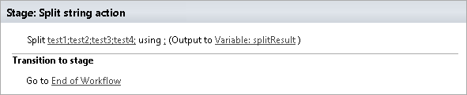
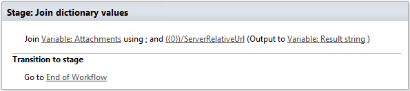
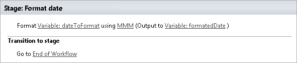
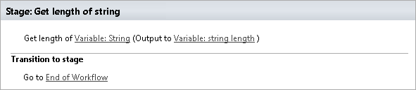
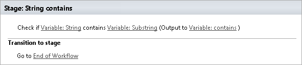
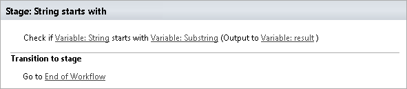
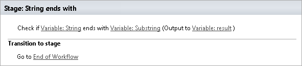
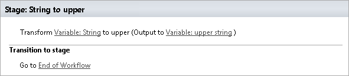

String processing (Free)
==================================================

Split string
--------------------------------------------------
The workflow action splits string into collection of substrings using separator string.

Output parameters
~~~~~~~~~~~~~~~~~~~~~~~~~~~~~~~~~~~~~~~~~~~~~~~~~~
.. list-table::
    :header-rows: 1
    :widths: 10 30 20

    *  -  Parameter
       -  Description
       -  Example
    *  -  ResultVariable
       -  Specify dictionary workflow variable to store collection of substrings.
       -  Dictionary variable with following structure::

            [
              "test1",
              "test2",
              "test3",
              "test4"
            ]                   

Input parameters
~~~~~~~~~~~~~~~~~~~~~~~~~~~~~~~~~~~~~~~~~~~~~~~~~~
.. list-table::
    :header-rows: 1
    :widths: 10 30 20

    *  -  Parameter
       -  Description
       -  Example
    *  -  SourceString
       -  Source string
       -  test1;test2;test3;test4
    *  -  SplitString
       -  Separator string
       -  ``;``

Example
~~~~~~~~~~~~~~~~~~~~~~~~~~~~~~~~~~~~~~~~~~~~~~~~~~

Join Dictionary Values
--------------------------------------------------
Concatenate the values of dictionary into single string

Output parameters
~~~~~~~~~~~~~~~~~~~~~~~~~~~~~~~~~~~~~~~~~~~~~~~~~~
.. list-table::
    :header-rows: 1
    :widths: 10 30 20

    *  -  Parameter
       -  Description
       -  Example
    *  -  Result string
       -  String value will constain result of operation
       -  ``/lib1/Order1.docx;/lib2/Order2.docx``

Input parameters
~~~~~~~~~~~~~~~~~~~~~~~~~~~~~~~~~~~~~~~~~~~~~~~~~~
.. list-table::
    :header-rows: 1
    :widths: 10 30 20

    *  -  Parameter
       -  Description
       -  Example
    *  -  Source dictionary
       -  Data source, type dictionary
       -  Variable:Attachments
    *  -  Separator
       -  Separator that will be used for string concatenation
       -  ';' or any of symbols or string
    *  -  Path
       -  Key for select or path
       -  ``({0})/ServerRelativeUrl``

Example
~~~~~~~~~~~~~~~~~~~~~~~~~~~~~~~~~~~~~~~~~~~~~~~~~~

 
Format date
--------------------------------------------------
The workflow action formats date using specified format string.

Output parameters
~~~~~~~~~~~~~~~~~~~~~~~~~~~~~~~~~~~~~~~~~~~~~~~~~~
.. list-table::
    :header-rows: 1
    :widths: 10 30 20

    *  -  Parameter
       -  Description
       -  Example
    *  -  ResultString
       -  Specify workflow variable to formatted string
       -  Friday 29 August

Input parameters
~~~~~~~~~~~~~~~~~~~~~~~~~~~~~~~~~~~~~~~~~~~~~~~~~~
.. list-table::
    :header-rows: 1
    :widths: 10 30 20

    *  -  Parameter
       -  Description
       -  Example
    *  -  SourceDate
       -  Date to format
       -  3/21/2014 7:27:10 PM
    *  -  FormatString
       -  Format string. The workflow action uses .NET method DateTime.ToString(string format), you can find possible format strings on MSDN:

          * `Standard Date and Time Format Strings <http://msdn.microsoft.com/library/az4se3k1%28v=vs.110%29.aspx>`_
          * `Custom Date and Time Format Strings <http://msdn.microsoft.com/en-us/library/8kb3ddd4%28v=vs.110%29.aspx>`_

       -  :: 

              d  
              D  
              MMM  
              d MMMM  
              ddd d MMM

Example
~~~~~~~~~~~~~~~~~~~~~~~~~~~~~~~~~~~~~~~~~~~~~~~~~~

 
Get length of string
--------------------------------------------------
The workflow action returns length of a string.

Output parameters
~~~~~~~~~~~~~~~~~~~~~~~~~~~~~~~~~~~~~~~~~~~~~~~~~~
.. list-table::
    :header-rows: 1
    :widths: 10 30 20

    *  -  Parameter
       -  Description
       -  Example
    *  -  ResultVariable
       -  Specify workflow variable to store length
       -  11

Input parameters
~~~~~~~~~~~~~~~~~~~~~~~~~~~~~~~~~~~~~~~~~~~~~~~~~~
.. list-table::
    :header-rows: 1
    :widths: 10 30 20

    *  -  Parameter
       -  Description
       -  Example
    *  -  SourceString
       -  Source string
       -  test string

Example
~~~~~~~~~~~~~~~~~~~~~~~~~~~~~~~~~~~~~~~~~~~~~~~~~~

 
String contains
--------------------------------------------------
The workflow action checks if a string contains a substring. It allows optionally ignore case of the source string and the substing.

Output parameters
~~~~~~~~~~~~~~~~~~~~~~~~~~~~~~~~~~~~~~~~~~~~~~~~~~
.. list-table::
    :header-rows: 1
    :widths: 10 30 20

    *  -  Parameter
       -  Description
       -  Example
    *  -  ResultVariable
       -  Specify workflow variable to store result.
       -  Yes

Input parameters
~~~~~~~~~~~~~~~~~~~~~~~~~~~~~~~~~~~~~~~~~~~~~~~~~~
.. list-table::
    :header-rows: 1
    :widths: 10 30 20

    *  -  Parameter
       -  Description
       -  Example
    *  -  IgnoreCase
       -  Allows to ignore case of the source string and of the substring. Default value: Yes.
       -  Yes  No
    *  -  SourceString
       -  Source string
       -  test string
    *  -  Substring
       -  Substring
       -  test

Example
~~~~~~~~~~~~~~~~~~~~~~~~~~~~~~~~~~~~~~~~~~~~~~~~~~

 
String starts with
--------------------------------------------------
The workflow action checks if a string starts with a substring. It allows optionally ignore case of the source string and the substing.

Output parameters
~~~~~~~~~~~~~~~~~~~~~~~~~~~~~~~~~~~~~~~~~~~~~~~~~~
.. list-table::
    :header-rows: 1
    :widths: 10 30 20

    *  -  Parameter
       -  Description
       -  Example
    *  -  ResultVariable
       -  Specify workflow variable to store result.
       -  Yes

Input parameters
~~~~~~~~~~~~~~~~~~~~~~~~~~~~~~~~~~~~~~~~~~~~~~~~~~
.. list-table::
    :header-rows: 1
    :widths: 10 30 20

    *  -  Parameter
       -  Description
       -  Example
    *  -  IgnoreCase
       -  Allows to ignore case of the source string and of the substring. Default value: Yes.
       -  Yes  No
    *  -  SourceString
       -  Source string
       -  test string
    *  -  Substring
       -  Substring
       -  te

Example
~~~~~~~~~~~~~~~~~~~~~~~~~~~~~~~~~~~~~~~~~~~~~~~~~~

 
String ends with
--------------------------------------------------
The workflow action checks if a string ends with a substring. It allows optionally ignore case of the source string and the substing.

Output parameters
~~~~~~~~~~~~~~~~~~~~~~~~~~~~~~~~~~~~~~~~~~~~~~~~~~
.. list-table::
    :header-rows: 1
    :widths: 10 30 20

    *  -  Parameter
       -  Description
       -  Example
    *  -  ResultVariable
       -  Specify workflow variable to store result.
       -  Yes

Input parameters
~~~~~~~~~~~~~~~~~~~~~~~~~~~~~~~~~~~~~~~~~~~~~~~~~~
.. list-table::
    :header-rows: 1
    :widths: 10 30 20

    *  -  Parameter
       -  Description
       -  Example
    *  -  IgnoreCase
       -  Allows to ignore case of the source string and of the substring. Default value: Yes.
       -  Yes  No
    *  -  SourceString
       -  Source string
       -  test string
    *  -  Substring
       -  Substring
       -  ing

Example
~~~~~~~~~~~~~~~~~~~~~~~~~~~~~~~~~~~~~~~~~~~~~~~~~~

 
String to lower
--------------------------------------------------
The workflow action transforms a string to lower case.

Output parameters
~~~~~~~~~~~~~~~~~~~~~~~~~~~~~~~~~~~~~~~~~~~~~~~~~~
.. list-table::
    :header-rows: 1
    :widths: 10 30 20

    *  -  Parameter
       -  Description
       -  Example
    *  -  ResultString
       -  Specify workflow variable to store lower string.
       -  test string

Input parameters
~~~~~~~~~~~~~~~~~~~~~~~~~~~~~~~~~~~~~~~~~~~~~~~~~~
.. list-table::
    :header-rows: 1
    :widths: 10 30 20

    *  -  Parameter
       -  Description
       -  Example
    *  -  SourceString
       -  Source string
       -  TEST STRING

Example
~~~~~~~~~~~~~~~~~~~~~~~~~~~~~~~~~~~~~~~~~~~~~~~~~~

 
String to upper
--------------------------------------------------
The workflow action transforms a string to upper case.

Output parameters
~~~~~~~~~~~~~~~~~~~~~~~~~~~~~~~~~~~~~~~~~~~~~~~~~~
.. list-table::
    :header-rows: 1
    :widths: 10 30 20

    *  -  Parameter
       -  Description
       -  Example
    *  -  ResultString
       -  Specify workflow variable to store upper string
       -  TEST STRING

Input parameters
~~~~~~~~~~~~~~~~~~~~~~~~~~~~~~~~~~~~~~~~~~~~~~~~~~
.. list-table::
    :header-rows: 1
    :widths: 10 30 20

    *  -  Parameter
       -  Description
       -  Example
    *  -  SourceString
       -  Source string
       -  test string

Example
~~~~~~~~~~~~~~~~~~~~~~~~~~~~~~~~~~~~~~~~~~~~~~~~~~

