Installation for SharePoint Online
==================================

Install
-------

Please, download `the WSP package </workflow-actions-pack/download>`_.

Go to your SharePoint Online site. At the site collection, click Site Actions, choose **Site Settings**.

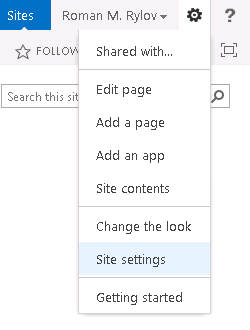

On the Site Settings page, click **Solutions** under Web Designer Galleries section.

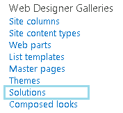

**Upload** WSP package to your Solution gallery

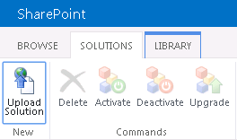

Click **Activate** button in the ribbon.

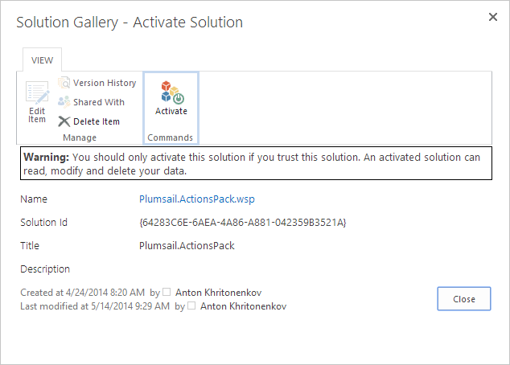

Next, you have to activate feature on your site. Go to site settings page and select **Manage site features**

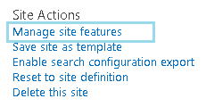

Find feature called **Plumsail Workflow Actions Pack** and click **Activate**

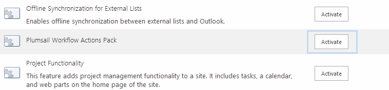

Now, you can find the following actions in SharePoint Designer under Plumsail section

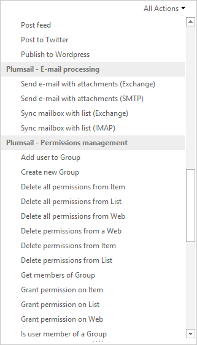

One more step is required to configure default account, which will be used to start workflows. Please open *Site Settings* and click on the link *Plumsail Workflow Actions Pack* at *Site Administration Section*. On the settings page you can configure the workflows’ credentials to know more about it please visit `the following link </blog/2014/12/store-credentials-at-site/>`_

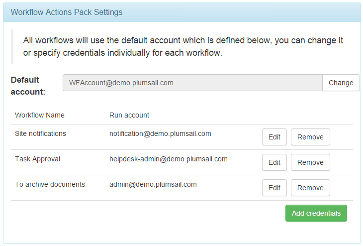

Install license
---------------

* Buy license for each domain where you are going to use **Workflow Actions Pack**. Specify them in the order details.
* After the payment your installations will be activated automatically within one day.

Uninstall
---------

Go to **Site Settings → Solutions**, select solution and click **Deactivate** from its context menu

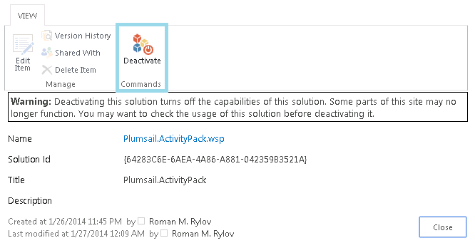

Upgrade
-------

Firstly, you have to deactivate **Plumsail Workflow Actions Pack** feature at the site level and deactivate **Plumsail.ActionsPack.wsp** solution in the solution gallery.

Then, upload a new WSP package to your Solution gallery:

Click **Activate** button in the ribbon.

Then, you have to activate the **Plumsail Workflow Actions Pack** feature on your site. Go to site settings page and select **Manage site features**

Find the feature called **Plumsail Actions Pack for SharePoint Designer** and click **Activate**

Now when the new solution is uploaded and activated we need to upgrade workflows which use Workflow Actions Pack. Navigate to **Site settings** of the SharePoint site and click **Workflow Actions Pack** in the **Site Administration** category.

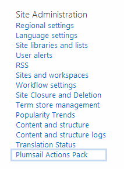

In the window fill credentials for your Office 365 account and click **Sign in**

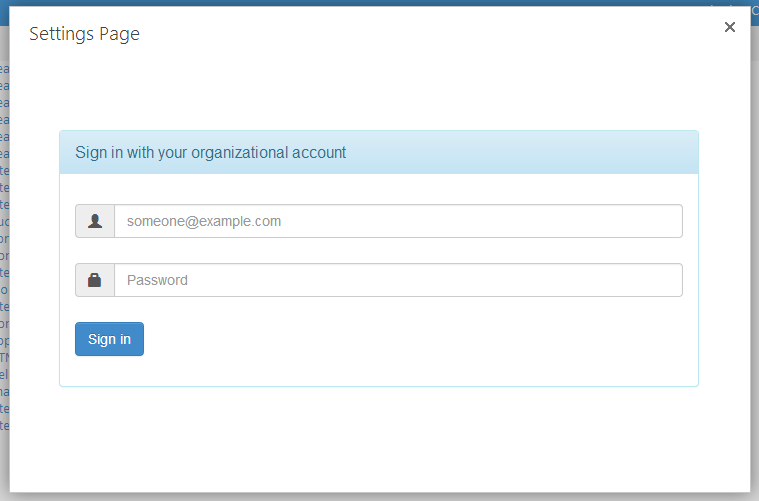

If any of workflows are required to upgrade, you should see the upgrade notification, otherwise all alright.

Then click **Upgrade** to upgrade the workflow. 
Please pay attention on `Version history <../other/Version%20History.html>`_ page in some cases you need to do additional actions.
	

Issues
------

Issue with installation to public site
~~~~~~~~~~~~~~~~~~~~~~~~~~~~~~~~~~~~~~

Installation of Workflow Actions Pack requires some additional steps. Please read this instruction:
`How to install sandbox solution to an Office 365 public site <../other/deploy-solution-to-public-site.html>`_

SharePoint Designer issues
~~~~~~~~~~~~~~~~~~~~~~~~~~

SharePoint Designer stores cached workflow actions, that is why after solution upgrade you may need to perform few actions.
You need to clear SharePoint Designer 2013 cache, otherwise it can show you the error message because it uses old cached version of workflow actions. To clear cache you need to execute following command from the command line as administrator on your PC and reopen SharePoint Designer:

::

   rmdir "%LOCALAPPDATA%\Microsoft\WebsiteCache\" /s /q
   rmdir "%APPDATA%\Microsoft\SharePoint Designer\ProxyAssemblyCache\" /s /q

Or you can `download and execute the bat file </wp-content/uploads/Files/WFActionsPack/ClearSPDesignerCache.bat>`_.

After clearing the cache and running SharePoint Designer you may need to close and open SharePoint Designer one more time, then the error should disappear.
We also recommend to install recent updates for SharePoint Designer 2013. This will help to avoid annoying error when configuring workflows.

If you use SharePoint Designer on the same server where has installed Workflow Manager and see the message *Server-side activities have been updated*, please check `the link <http://www.jrjlee.com/2014/10/server-side-activities-have-been-updated.html>`_.

We also recommend to install `recent updates for SharePoint Designer 2013 <../other/recommended-sharepoint-designer-updates.html>`_. This will help to avoid annoying error when configuring workflows.

