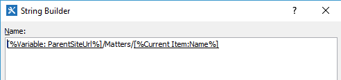

Copy document set to another library
####################################

This article will show you how to implement a simple use case using SharePoint 2013 workflows, the key features of the case will be “Copy DocumentSet” feature. `Plumsail Workflow Actions Pack <https://plumsail.com/workflow-actions-pack/>`_ has a huge amount (100+) of useful workflow actions for SharePoint Designer. Today we will closely look at the actions related to document management suite – `Documents and folders processing <https://plumsail.com/docs/workflow-actions-pack/actions/Files%20and%20Folders%20processing.html>`_ .

The business case is very simple, let’s imagine that we have a small law firm. The firm uses SharePoint Online to automate business processes. SharePoint site has a list of matters, each matter it is a DocumentSet with some metadata. Please see an example at the screenshot below

\

A lawyer creates a new Contract using predefined template (as of an example Contact for a sale of real estate), fills in all metadata and prepares all document for a matter.

 
After it, he starts approval workflow. The workflow creates approval tasks according to internal rules (in this case, it requires manager approval) and after finishing approval process, the workflow copies the whole document set to a parent site. The parent site is a storage for all approved matters.

 
In the workflow, I want to pay your attention at configuration of `Copy DocumentSet <https://plumsail.com/docs/workflow-actions-pack/Actions/Files%20and%20Folders%20processing.html#copy-documentset>`_ workflow action:\

 
I use parent site URL + list Url + Current DocumentSet name. The workflow action will copy current DocumentSet to this URL. Also, the list should have the same list fields.
