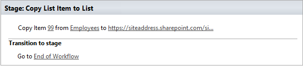
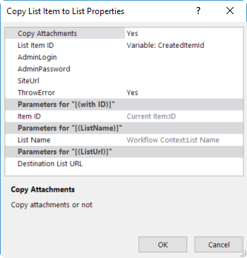

How to copy list item with attachments across site collections
##############################################################

This short post will describe `Copy List Item <https://plumsail.com/docs/workflow-actions-pack/actions/List%20items%20processing.html#copy-list-item-to-list>`_ workflow action. This action allows you to copy list item with attachments. This is much easier than creation of list items and attaching files separately. This approach works in SharePoint 2013 / 2016 as well as for SharePoint Online in Office 365.

This is an example of configured workflow action:

On the example, above you see the basic of usage the action, but you can open properties window of the action to see advanced options. To open the properties window please right click on the workflow action and select properties.

Please pay attention that the action allows you to copy the item cross-site as well, also it can copy attachments, for this, you need to turn on Copy Attachments option. Also, you can save the ID of created list item, the option can be useful if you want to send a link to the list item by email or maybe save it anywhere, for this you can use List Item ID variable.
