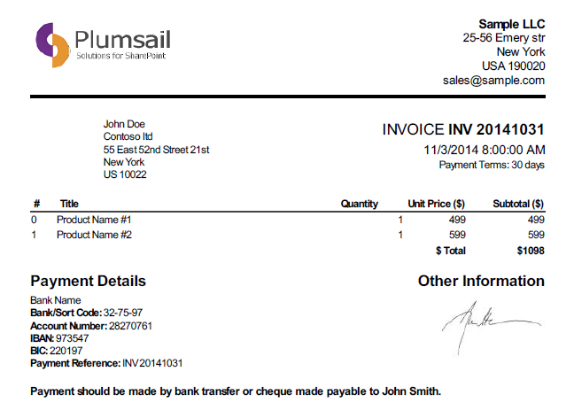
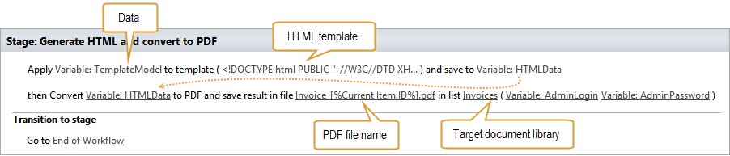
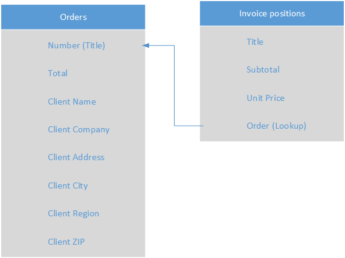
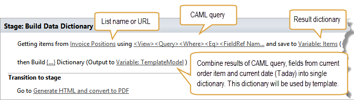
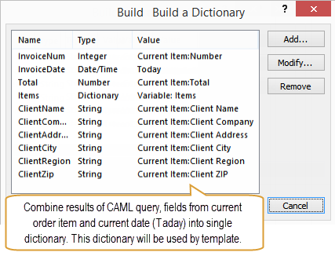
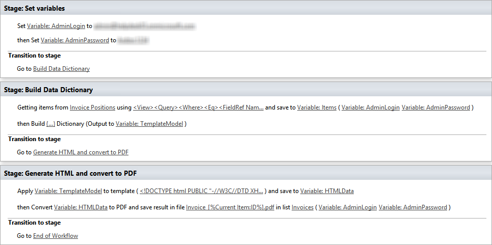

Generate PDF file from template
###############################

This article will show how to generate PDF files in SharePoint 2013 / Office 365 workflows. You will learn how to collect data and generate PDF document based on HTML template. As a proof of concept we will create simplified workflow for PDF invoice generation.

Below you can see the screenshot of generated PDF invoice:

`Click here <https://static.plumsail.com/wp-content/uploads/Blog/Local/GeneratePdfFromTemplate/Invoice.pdf>`_ to download the PDF file.

 
It was used workflow actions from `Workflow Actions Pack <http://plumsail.com/workflow-actions-pack/>`_ to generate a document. Especially `Render Text Template <http://plumsail.com/workflow-actions-pack/docs/string-processing-advanced/#RenderTextTemplate>`_ workflow action to convert template to HTML and `Convert HTML to PDF <http://plumsail.com/workflow-actions-pack/docs/string-processing-advanced/#HtmlToPdf>`_ to generate a PDF file from HTML.

At the end of this article I will describe how to embed images to PDF. For example you can embed image of a signature. You can even extend this case by using a form customized by `Forms Designer <http://spform.com/>`_ and it’s hand-written signature control. This control allows to create a hand-written note created with a tablet, a cell phone, or a mouse. For example you can sign your invoices right in your tablet and then convert it to PDF. You can find more information about hand-written notes in `this article <http://formsdesigner.blogspot.com/2014/12/capture-signature-or-hand-written-notes.html>`_ .

How does templating work?
-------------------------
‘Render Text Template’ workflow action uses Mustache templating engine to render text templates. It supports tokens for single values as well as iterators to render collections of elements. You can play around with sample template on `github <http://mustache.github.io/#demo>`_ . Mustache is quite flexible templating engine, you can use it to generate complex HTML which then can be used to convert to PDF file. In my `previous article <plumsail.com/blog/2014/09/dynamic-templates-using-workflows-sharepoint2013-office365/>`_ I described how to use it to generate email messages based on SharePoint list items. It is the same for PDF file generation, you just need to create HTML template and it will be converted to HTML.

Below you can see a part of my template which generates table with invoice positions:

.. code:: html

  <pre class = "prettyprint linenums"><table id= "invoice-amount">
  <thead\>
   <tr id = "header_row">
   <th class = "index_th">#</th>
   <th class = "left details_th">Title</th>
   <th class = "quantity_th">Quantity</th>
   <th class = "unitprice_th">Unit Price ($)</th>
   <th class = "subtotal_th">Subtotal ($)</th>
   </tr>
  </thead>
  <tfoot>
   <tr id = "total_tr">
   <td colspan = "2">&amp;nbsp;</td>
   <td colspan = "2" class = "total" id = "total_currency">$ Total </td>
   <td class = "total"> ${{Total}} </td>
   </tr>
  </tfoot>
   <tbody>
   {{#each Items}}
   {{#with FieldValues}}
   <tr class = "item"> 
    <td class = "item_l"> {{#index}} </td>
    <td class = "item_l"> {{Title}} </td>
    <td class = "item_r"> {{Quantity}} </td>
    <td class = "item_r" > {{UnitPrice}} </td>
    <td class = "item_r" > {{SubTotal}} </td>
   </tr>
   {{/with}}
   {{/each}}   
   </tbody>
   </table></pre>

Complete HTML template is more complex and contains additional CSS styles, you can `download it here <https://static.plumsail.com/wp-content/uploads/Blog/Local/GeneratePdfFromTemplate/Template.txt>`_ .

HTML generation and PDF conversion workflow actions of my workflow look like this:

 
 You can find complete workflow at the end of this article.

Where does the data come from?
------------------------------
Now, when you understand how templating works I want to describe how to put some data to templating engine.

‘Render Text Template’ workflow actions receives data within dictionary variable. SharePoint 2013 workflows allow to use ‘Dictionary’ variable type. It allows to store complex nested objects and collections of objects. But how to initialize it? There are various ways to do this. I described most of them in the separate article `How to work with dictionaries <http://plumsail.com/blog/2014/08/how-to-work-with-dictionaries-in-sharepoint-2013-and-office-365-workflow/>`_ . For example you can:

* Build dictionary manually
* Query list items to dictionary by CAML
* Split string separated by symbol to collection of values

In this article it was queried invoice positions from SharePoint list using CAML query, then I included result of the query into other dictionary with additional information like ‘Client name’, ‘Client company’, ‘Order number’, etc. I will describe it in detail below. For now let me show what my final dictionary looked like. Usually I use JSON syntax to show an example of dictionary, you can see it below. Of course you don’t see it like this in SharePoint designer, but JSON syntax is useful to show general structure:

.. code:: json

  {
  "InvoiceDate" : "10/02/2014",
  "InvoiceNum" : 1,
  "Total" : 1098,
  "ClientCompany" : "Contoso ltd.",
  "ClientName" : "John Doe",
  "ClientAddress" : "55 East 52nd Street 21st",
  "ClientCity" : "New York",
  "ClientRegion" : "US",
  "ClientZip" : "10022"
  "Items" :
  [
    {
      "FieldValues" :
      {
        "Quantity" : 1,
        "SubTotal" : 499, 
        "Title" : "Product Name #1",
        "UnitPrice" : "499" 
      }
    },
    { 
      "FieldValues" : 
      {
        "Quantity" : 1,
        "SubTotal" : 599,
        "Title" : "Product Name #2",
        "UnitPrice" : 599 
      }
    }
  ]
  }

As you can see this nested object contains all information required to generate invoice including collection of invoice positions.

For this proof of concept it was created following structure of SharePoint lists:

   
This structure is quite simplified, real life examples can be more complex, but I don’t want to confuse you with complex relationships. I used ‘Orders’ list to store information for header and footer of an invoice. The list ‘Invoice positions’ is required to store information about invoice positions. I used it to generate table in the middle of an invoice.

It was created list level workflow for ‘Orders’ list. Once it is started on order list item it collects all necessary information and generates a PDF file. You can see below the part of workflow which queries data and combines it to single dictionary:

The first workflow action is `Get Items by Query <http://plumsail.com/workflow-actions-pack/docs/documents-list-items-processing/#GetItems>`_ . I used it to query list items from ‘Invoice positions’ list. Each list item in this list is linked to specific order by lookup field ‘Order’. I used it to query items for current order only. See the CAML query:

.. code:: xml

  <View>
    <Query>
      <Where>
        <Eq>
          <FieldRef Name = "Order" LookupId = "TRUE" />
          <Value Type = "Lookup"> [%Current Item:ID%] </Value>
        </Eq>
      </Where>
    </Query>
  </View>

The second workflow action is out of the box ‘Build a Dictionary’. I used it to combine list results of CAML query and field values from current item (Client Name, Client Company, etc) into single dictionary. This dictionary is used in HTML template, see ‘Render Text Template’ workflow action which I mentioned above. This is how I configured the workflow action:

How to embed images into PDF
----------------------------
As you probably noticed the invoice contains two pictures: company logo and signature. Conversion workflow action allows to build in only two types of images:

1. Images represented as Base64 string
2. Image accessible to anonymous users

In this article it was used Base64 encoded images. There are a lot of web services which allow to convert image to Base64 string, just type “convert image to base64 string” in Google.

You can find IMG tags with Base64 strings in `complete HTML template <https://static.plumsail.com/wp-content/uploads/Blog/Local/GeneratePdfFromTemplate/Template.txt>`_ .

As described at the beginning of this article you can even extend this case by using form customized by `Forms Designer <http://spform.com/>`_ and it’s hand-written signature control. This control allows to create a hand-written note created with a tablet, a cell phone, or a mouse. You can find more information in `this article <http://formsdesigner.blogspot.com/2014/12/capture-signature-or-hand-written-notes.html>`_ . Forms Designer stores signature as Base64 string in list item field. You can access it from your workflow and include in HTML template as image.

Complete workflow
-----------------
Now there's all data required for generation of invoice. Complete workflow looks like this:

Files to download
-----------------
`HTML template <https://static.plumsail.com/wp-content/uploads/Blog/Local/GeneratePdfFromTemplate/Template.txt>`_  `Sample generated PDF <https://static.plumsail.com/wp-content/uploads/Blog/Local/GeneratePdfFromTemplate/Invoice.pdf>`_ 
