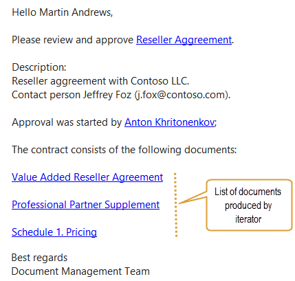
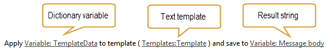
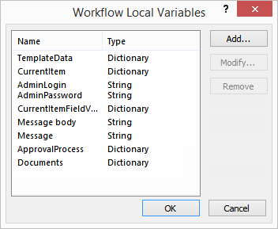
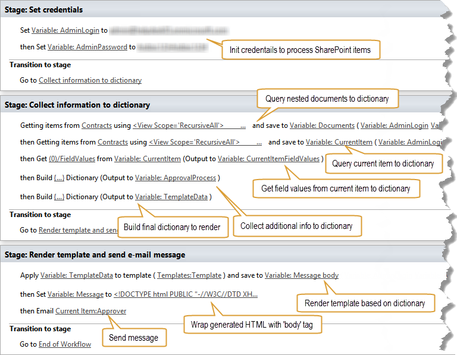
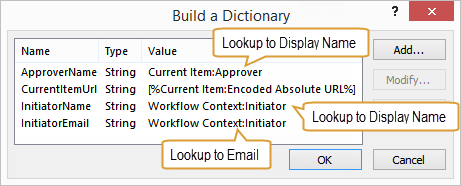
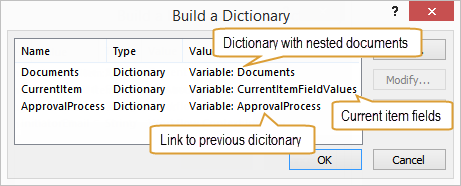
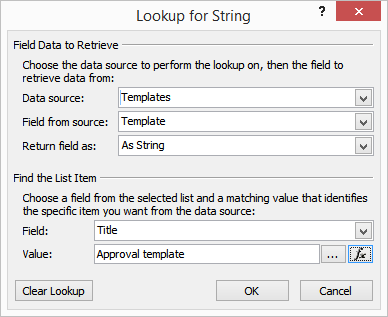

How to use dynamic text and HTML templates
##########################################

This article will show how to use SharePoint workflow to render flexible dynamic text templates. To demonstrate this functionality I will describe how to configure workflow to generate and send email messages based on a template stored in SharePoint list, but this approach can be used to render any text templates including HTML or plain text. This works for SharePoint Online in Office 365 as well as for SharePoint 2013 on-premises.

As a proof of concept it will generate email messages for contract approval notification. Approval process will be started on the document set of contract, collect information about it and documents inside document set. Then render text template based on collected data and send it to approver. The message will contain header with general information about the contract and list of documents included in the document set (contract). I used document sets because contract can contain multiple agreements and schedules. Document sets allow to store metadata about contract as well as include multiple documents.

There's need to allow users to manage email templates without modifying workflows. That is why I will store text templates in separate SharePoint list. The workflow will find a template by name and render it according to data collected from current document set.

It was used two additional workflow actions to achieve my goal. `Get Items by Query <http://plumsail.com/workflow-actions-pack/docs/documents-list-items-processing/#GetItems>`_ to query information about contract and nested documents and `Render Text Template <http://plumsail.com/workflow-actions-pack/docs/string-processing-advanced/#RenderTextTemplate>`_ to render HTML based on predefined template. Both workflow actions are included in `Workflow Actions Pack <http://plumsail.com/workflow-actions-pack/>`_ . Out of the box workflow actions don’t provide such functionality.

This article was divided into the following parts:

*  `Templating workflow action and syntax <#TemplatingWorkflowAction>`_ 
*  `Structure of templates list and contracts library <#StructureOfLists>`_ 
*  `Creating the workflow <#CreateWorkflow>`_ 
*  `Collect information to dictionary <#CollectInfoToDictionary>`_ 
*  `Render template and send email message <#RemderTemplate>`_ 

Templating workflow action and syntax
---------------------------------------------

First, how to render text templates based on data from dictionary variable. Dictionary type in SharePoint workflows allows to store complex nested objects. You can get data from various data sources, such as web services, CAML queries or build dictionary manually. The workflow action which I will describe supports rendering of such objects or even collections of items. I wrote `separate article </blog/2014/08/how-to-work-with-dictionaries-in-sharepoint-2013-and-office-365-workflow/>`_ about workflow dictionaries, you can read it to understand how to work with it.

To render text template for my email message I used `Render Text Template <http://plumsail.com/workflow-actions-pack/docs/string-processing-advanced/#RenderTextTemplate>`_ workflow action. It uses `Mustache templating engine <http://en.wikipedia.org/wiki/Mustache_%28template_system%29>`_ to render text templates. It supports tokens for single values as well as iterators to render collections of elements. You can play around with sample template on `github <http://mustache.github.io/#demo>`_ .

It was prepared HTML template for our email message. You can see it below:

.. code:: html

  Hello {{ApprovalProcess.ApproverName}},

  Please review and approve <a href = "{{ApprovalProcess.CurrentItemUrl}}"> {{CurrentItem.Title}}\</a>.

  Description:
  {{CurrentItem.DocumentSetDescription}}

  Approval was started by <a href = "mailto:{{ApprovalProcess.InitiatorEmail}}"> {{ApprovalProcess.InitiatorName}}</a>;
  The contract consists of the following documents:
  <ul>
  {{#each Documents}}
  <li> <a href = "{{ApprovalProcess.CurrentItemUrl}}/{{FieldValues.FileLeafRef}}"> {{FieldValues.Title}}</a></li>
  {{each}}
  </ul>
  Best regards
  Document Management Team

As you can see it uses multiple tokens to map single values as well as iterator to render list of documents with links.

Here are just of few of single value tokens:

.. code:: html

  {{ApprovalProcess.ApproverName}}
  {{CurrentItem.Title}}
  {{ApprovalProcess.CurrentItemUrl}}

And iterator:{{each Documents}} … {{/each}}

After rendering we will see such HTML email message:

This message is rendered based on some data. As you see on the picture below, the workflow action receives the text template, which we prepared earlier and the dictionary variable. The dictionary variable stores data to render. The workflow action stores result in the string variable.

In the template above you can see dots in expressions like this{{ApprovalProcess.ApproverName}}. It means we refer to nested object *ApproverName* . During execution of workflow I collected data from different sources and putted it into single dictionary. You can see final structure of dictionary below. I created quite complex dictionary to show flexibility of templating workflow action. I will show how I did it later in this article.

::

  Dictionary
  - ApprovalProcess
    - ApproverName
    - CurrentItemUrl
    - InitiatorName
    - InitiatorEmail
  - CurrentItem
    - Title
    - DocumentSetDescription
  - Documents
    - (0)
        - FieldValues
            - Title
            - FileLeafRef
    - (1)
        - FieldValues
            - Title
            - FileLeafRef

As you can see, the dictionary contains three nested dictionaries:

* ApprovalProcess – I collected additional contextual information to this dictionary.
* CurrentItem – I saved field values for current contract document set to this dictionary.
* Documents – I saved collection of nested to document set documents with field values.

Take a look at the HTML template in the beginning of this section one time more to understand how this structure is mapped to the HTML template.

Structure of templates list and contracts library
---------------------------------------------------------
For this proof of concept it was created *‘Templates’*  SharePoint list and *‘Contracts’*  document library. I will get template for the workflow action from templates list using SharePoint workflow. The *‘Contracts’*  document library allows to add document sets (contracts) and documents to document sets (documents related to contract).

The *‘Templates’*  list has following fields:

* Title – single line of text
* Template – multiple lines of text

The *‘Contracts’*  document library has following fields:

* Title – Single line of text
* Description – multiple lines of text
* Approver – User or Group

Creating the workflow
-----------------------------
It was created list level workflow for *‘Contracts’*  document library. It has to be started manually when contract approval is required.

To reproduce the workflow you need to know all workflow variables I used. You will see how I used it below.

And this is the workflow I which created:

It consists of three stages:

* Set credentials – here I specified credentials to work with SharePoint Online in Office 365. This stage is not required for SharePoint 2013 on-premises.
* Collect information to dictionary – this stage is required to prepare data for rendering.
* Render template and send e-mail message – this stage is required for rendering of HTML template and sending it as email message.

Collect information to dictionary
+++++++++++++++++++++++++++++++++++++++++
As mentioned above, this stage is required to collection information to render.

Describing step by step. It was named sections below as the hints on the picture of the workflow above to simplify understanding.

**Query nested documents**

It was used `Get Items by Query <http://plumsail.com/workflow-actions-pack/docs/documents-list-items-processing/#GetItems>`_ workflow action to query information about nested documents. It receives CAML query and returns collection of elements. I saved result to the *‘Documents’*  variable. It is a dictionary which stores information about collection of nested documents.

You can find the CAML query below:

.. code:: xml

  <View Scope = 'RecursiveAll'>
    <Query>
        <Where>
            <BeginsWith>
                <FieldRef Name = 'FileRef' />
                <Value Type = 'Lookup'> [%Current Item:Server Relative URL%] </Value>
            </BeginsWith>
        </Where>
    </Query>
    <ViewFields>
        <FieldRef Name = 'Title' />
        <FieldRef Name = 'FileRef' />
    </ViewFields>
  </View>

As you can see it queries documents from current folder (document set).

**Query current item to dictionary**

Here it was also used *‘Get Items by Query’*  workflow action. It was queried information about current item (contract) to dictionary. You can find the CAML query below:

.. code:: xml

  <View Scope = 'RecursiveAll'>
    <Query>
        <Where>
            <Eq>
                <FieldRef Name = 'ID' />
                <Value Type = 'Counter'>
                   [%Current Item:ID%]
                </Value></Eq></Where>
    </Query>
  </View>

As you can see it queries item by ID of current item.

**Get field values from current item to dictionary** I used *‘Get an Item from a Dictionary’*  workflow action to get only field values from dictionary with information about current item. I don’t need any other information and want to simplify final dictionary by removing nested levels.

To get field values only I used such path:

(0)/FieldValues

It's known that there's only one value in results because I queried it by list item ID. That is why I used(0)index.

**Collect additional information to dictionary**

But it is not enough to have field values from current item and collection of nested documents. I want to include some additional information to dictionary.

As you remember it had already two dictionaries. One stores information about nested document and another stores information about field values of current item. Here I added the third dictionary using *‘Build a Dictionary’*  workflow action.

You can see settings for this workflow action below:

As you see it was added four additional properties to dictionary and initialized them from current item and workflow context.

**Build final dictionary**

Finally it needs to combine all created dictionaries to single dictionary. I used another *‘Build a Dictionary’*  workflow action to do this:

I stored nested documents in *‘Documents’* , field values from current item to *‘CurrentItem’*  and additional information collected earlier to *‘ApprovalProcess’* .

Render template and send email message
++++++++++++++++++++++++++++++++++++++++++++++
This is the last stage of the workflow. I used `Render Text Template <http://plumsail.com/workflow-actions-pack/docs/string-processing-advanced/#RenderTextTemplate>`_ workflow action to render dictionary using predefined template. It receives dictionary which I created earlier and text template and returns rendered string to *‘Message body’*  variable:

Earlier mentioned that I created separate list to store templates and named it *‘Templates’* . In the rendering workflow action I just looked up the template by title directly from the list:

There's no need to store complete HTML markup within the *‘Templates’*  list, because I want to simplify management of templates. That is why I stored the template only for HTML body and wrapped it in DOCTYPE and HTML tags directly in the workflow. I saved the result to the *‘Message’*  variable:

.. code:: html

     <!DOCTYPE html PUBLIC "-//W3C//DTD XHTML 1.0 Transitional//EN" "http://www.w3.org/TR/xhtml1/DTD/xhtml1-transitional.dtd">
     <html xmlns="http://www.w3.org/1999/xhtml">
         <head>
             <meta name="viewport" content="width=device-width" />
             <meta http-equiv="Content-Type" content="text/html; charset=UTF-8" />
         </head>
         <body bgcolor="#FFFFFF">
      
             [%Variable: Message body%]
             
         </body>
     </html>

Finally it was used *‘Message’*  variable as message body and sent message to approver.

That is it. Now you know how to render complex data as HTML and send it as email message.

