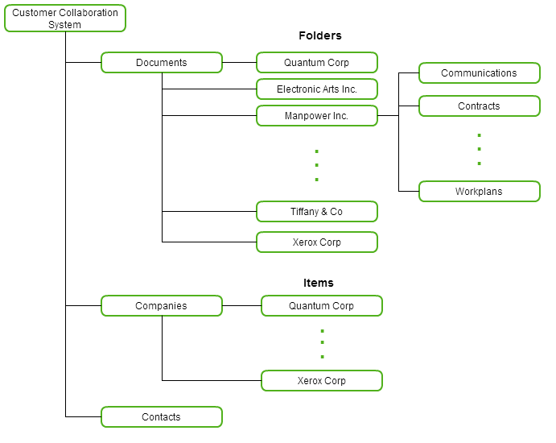
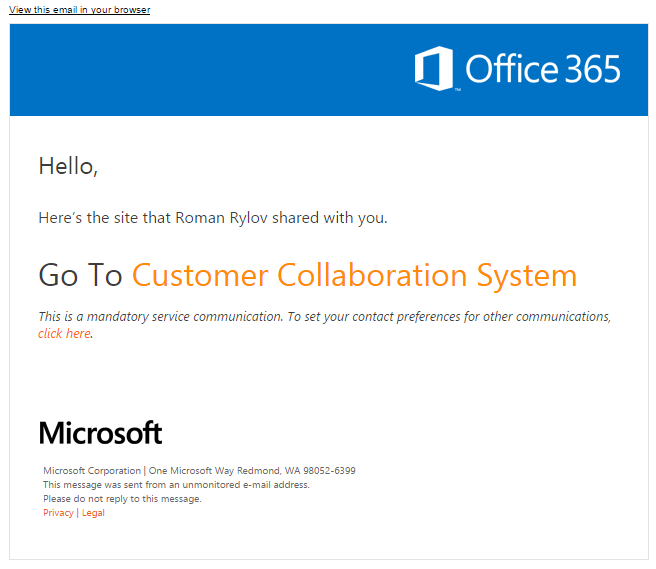
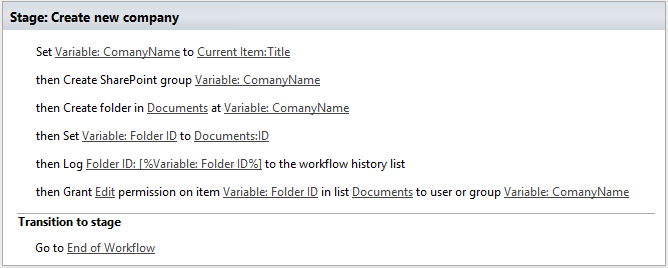
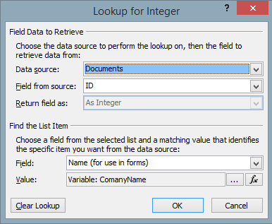
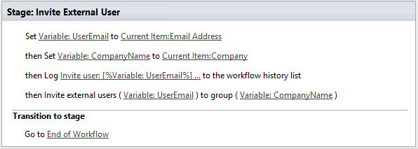

Invite external users to SharePoint Online site
###############################################

This article will review a part of Customer Collaboration System, which can be used to share documents with clients and cooperative work on common projects. This ‘proof of concept’ was build using SharePoint Online and Plumsail Workflow Actions Pack. This approach works for SharePoint 2013 workflows in SharePoint Online (Office 365).

Architecture description
************************
Core of our system is a simple document library which contains different folders, each folder matches to one of clients and contains common documents (and other folders) which will be available for a client. The permission restriction will be carried out with help of SharePoint Groups. For each of our clients will be created own SharePoint group. Each folder in the document library will be matched to SharePoint group by name.

All internal logic concluded in two workflows, which start on “Item Creation” event. Additionally we will have two custom lists: “Companies” and “Contacts”. We will use these lists as dictionaries to store information about clients. “Contacts” list contains user email and lookup to “Companies” List.

The common architecture scheme I have provided below:

How does it look for end user?
******************************
For example, we want to share contract with our contractor. Firstly, we need to add contractor’s company in *“Companies”*  list and add a couple of contractor’s employee into *“Contacts”*  list. Right after that, we can upload any documents inside contractor’s folder in the documents library. All contractor’s employee will get an email invitation that look like at the figure below and will have access to shared documents.

Create new Company workflow
***************************
The *“Create new company”*  workflow is very simple it does only three things:

* Creates new SharePoint group with name of company;
* Creates new folder in “Documents” library;
* Grants permission on created folder;

This workflow is configured to start on list item creation in *“Companies”*  list.

There is only one moment on which I want to pay attention, it is parameter *“Folder ID”* . It was filled the following way. We need to know folder ID to grant permission to folder by a workflow action.

Invite External Users Workflows
*******************************
There is another very simple workflow, which contains only a few Workflow Action, please pay attention that I used `Invite External Users <https://plumsail.com/docs/workflow-actions-pack/actions/Administration.html#invite-external-users>`_ workflow action.

This workflow is configured to start on list item creation in *“Companies”*  list.

Before using this workflow action please turn on option *“Allow external users who accept sharing invitations and sign in as authenticated users”*  in site collection administration interface (usually it at the following URL: *“https:// *yousite* -admin.sharepoint.com/_layouts/15/online/SiteCollections.aspx”* ).

