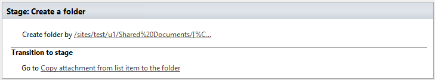
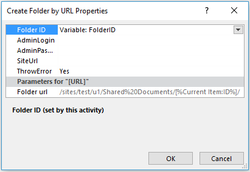
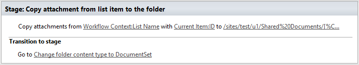
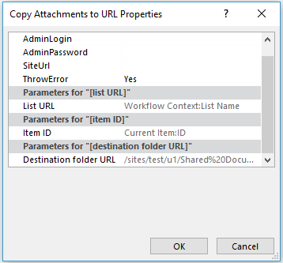
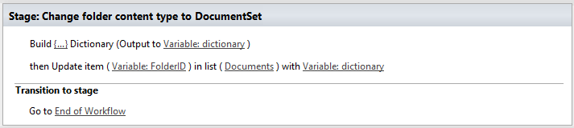
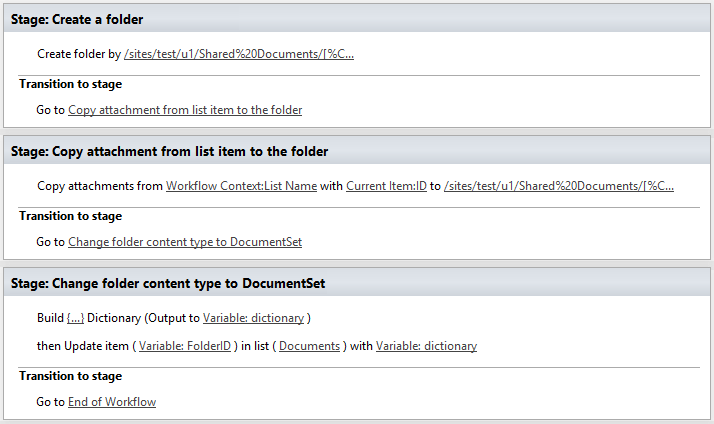

How to move list item attachments to document set
#################################################

This article explains how to move list item with attachments to SharePoint document set. This approach works in workflows for SharePoint 2013 / 2016 as well as for SharePoint Online in Office 365.

It will divide the workflow in three stages:

1. Create a folder in the document library
2. Copy attachments from current list item to the created folder
3. Change a content type of the folder to DocumentSet

Create a folder in a document library
-------------------------------------

`Workflow Actions Pack <https://plumsail.com/workflow-actions-pack/>`_ contains two workflow actions which can help us to create a folder:

- `Create Folder by URL <https://plumsail.com/docs/workflow-actions-pack/actions/Files%20and%20Folders%20processing.html#create-folder-by-url>`_
- `Create Folder in list <https://plumsail.com/docs/workflow-actions-pack/actions/Files%20and%20Folders%20processing.html#create-folder-in-list>`_

As you can guess, they are almost the same but the first one requires only one parameter, that is why I would prefer it, also it can return ID of the created item so in our case it would be very useful because we will use this ID at the last step of the workflow.

| 

| 

You may be noticed that I specified relative URL to the library and I used Current Item ID as a variable, so the workflow action will create a folder with current item ID. If you need create a nested folder just specify it, as example /sites/test/u1/Shared Documents/SomeFolder1/SomeFolder2/AdditionalFolder.

Copy attachments from current list item to the created folder
-------------------------------------------------------------

Let’s move on, now we need to copy attachments to our folder, to do this we will use `Copy Attachment to URL <https://plumsail.com/docs/workflow-actions-pack/Actions/List%20items%20processing.html#copy-attachments-to-url>`_ workflow action.

| 

| 

| 

As you can see I specified the same URL as Destination folder URL. Additionally, I want to mention that current workflow action doesn’t work cross-site, so please be careful if you need to copy attachments cross-site you need to copy it to a document library and then move it to another site or site collection.

Change a content type of the folder to DocumentSet
--------------------------------------------------

We are almost finished and all we need is to change content type of the folder to DocumentSet, indeed this is a bit tricky because we need change two properties of the list item:

- ContentTypeId – this is actually the ID of a content type
- HTML_x0020_File_x0020_Type – this option is required to change doc icon, for document set it should be **Sharepoint.DocumentSet**

| 

| 

Result of our work
------------------

Here's the full screenshot.

