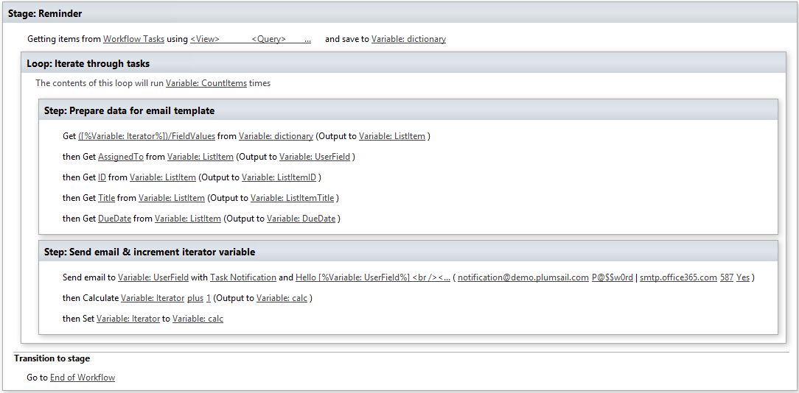
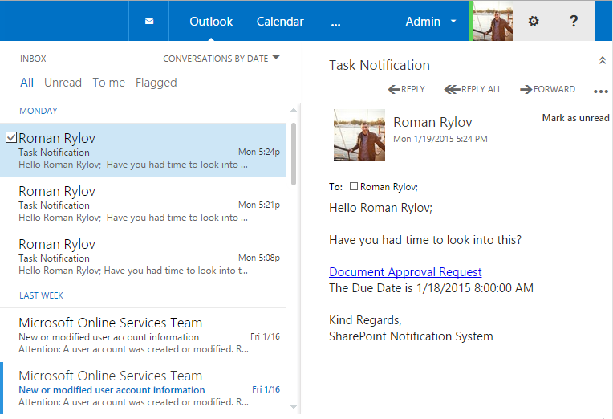
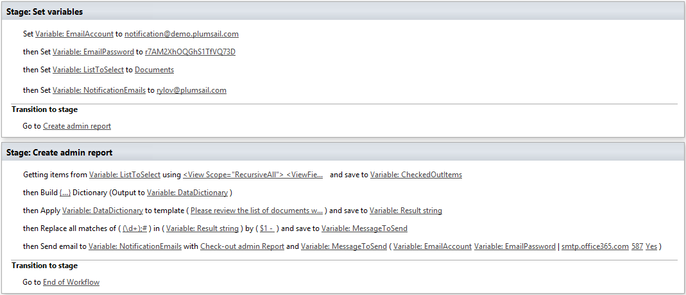
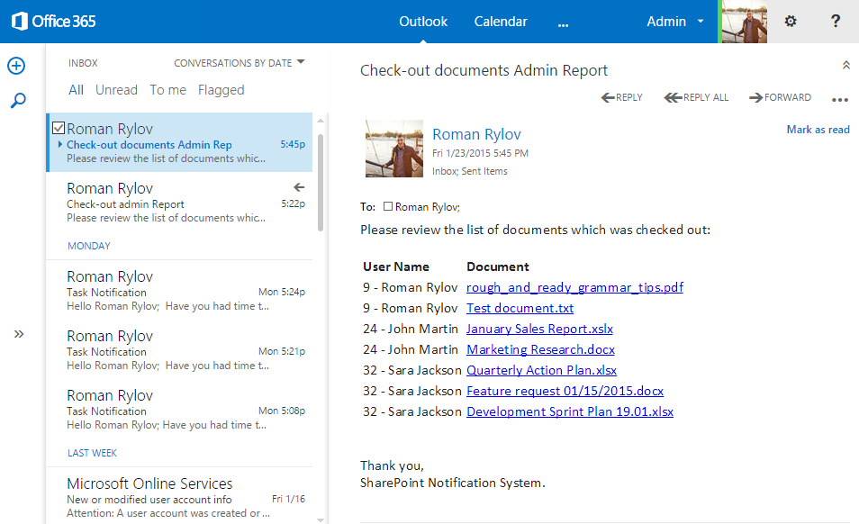

Send periodic expiration email notifications
############################################

Introduction
************
This article will cover a very common scenario of any business system it is alert notification or reporting subsystem. Usually that function is responsible to notify end users about new events, overdue tasks and sending summary reports via e-mail. I want to review a couple of simple cases. Which I hope, you can manually customize and implement in your environment. All cases I created are use SharePoint Online with installed Plumsail Workflow Actions Pack, but you can implement it in OnPremise environment as well. This approach works for SharePoint 2013 / 2016 as well as for SharePoint Online in Office 365.

Personal Item/Task/Document expiration reminders
************************************************
The first case which is going to be described has quite simple simple goal: a user wants to track status of sent Item/Task/Document. It could be application form for business trip, day off request, assigned task or something else. It depends on your business process, but core idea is the same. You have an item with specific due date and a person responsible for this item. You need to send notification message to the user when due date will come and of course you can customize the message template. Using SharePoint Designer you can create a site level workflow which will select all list items by specific query and process each item. As an example, it could generate email by template and send it.

Out of the box workflow actions don’t allow to `query list items by CAML <https://plumsail.com/docs/workflow-actions-pack/actions/List%20items%20processing.html#get-items-by-caml-query>`_ or `generate email messages by templates <https://plumsail.com/docs/workflow-actions-pack/actions/String%20Processing%20Advanced.html#render-text-template>`_ . That is why I used some workflow actions from Workflow Actions Pack to extend out of the box functionality.

Below is the configured workflow:

It was used the following CAML query to get all list items that expire in two days in `Get Items by CAML query <https://plumsail.com/docs/workflow-actions-pack/actions/List%20items%20processing.html#get-items-by-caml-query>`_ workflow action:

.. code:: xml

  <View>
    <ViewFields>
       <FieldRef Name='ID' />
       <FieldRef Name='Title' />
       <FieldRef Name='DueDate' />
       <FieldRef Name='AssignedTo' />
    </ViewFields>
    <Where>
       <And>
          <Neq>
             <FieldRef Name='Status' />
             <Value Type='Choice'>Completed</Value>
          </Neq>
          <Lt>
               <FieldRef Name='DueDate' />
               <Value Type='DateTime'><Today OffsetDays='2' /></Value>
           </Lt>
       </And>
    </Where>
  </View> 

Send email workflow action configuration (to simplify the process I designed the email template inside):

.. code:: html

  Hello [%Variable: userField%]  
   
  Have you had time to look into this?  
    
  <a href=”http://demo.plumsail.com/sites/NotificationCase/Lists/Workflow Tasks/DispForm.aspx?ID=[%Variable:ListItemID%]”>[%Variable:ListItemTitle%]</a> 
  The Due Date is [%Variable: DueDate%]
   
    
  Kind Regards,  
  SharePoint Notification System

You can see the sceenshot below as result:

Daily/Weekly/Mounthly aggregated expiration reports by email
************************************************************
The second example which shown is based on the same algorithm, but you need to get aggregated summary report instead of sending notifications to each user. To do this you can get all data and use `Render Template <https://plumsail.com/docs/workflow-actions-pack/actions/String%20Processing%20Advanced.html#render-text-template>`_ workflow action to build complete email by predefined template.

Below it was implemented the workflow for typical case when an administrator wants to get a summary report with a list of all checked out documents ordered by user.

At the figure below you can see the configured workflow, It was split on two stages to simplify configuration and copying to other document libraries.

The first step is just configuration section. Next, all list items where the field *CheckoutUser*  is not null, using the following CAML query for this:

.. code:: xml

  <View Scope="RecursiveAll">
    <ViewFields>
      <FieldRef Name="CheckoutUser"/>
      <FieldRef Name="FileRef"/>
      <FieldRef Name="FileLeafRef"/>
    </ViewFields>
    <Query>
      <Where>
        <IsNotNull>
          <FieldRef Name="CheckoutUser"/>
        </IsNotNull>
      </Where>
      <OrderBy>
        <FieldRef Name="CheckoutUser"/>
        <FieldRef Name="FileLeafRef"/>
      </OrderBy>
    </Query>
  </View>

After that data was prepared for the *Render Text Template*  workflow action. I used the following template:

.. code:: html

  Please review the list of documents which was checked out:    
  <table>
  <thead>
    <td><strong>User Name</strong></td><td><strong>Document</strong></td>
  </thead>
  <tbody>
  {{#each Documents}}
   <tr>
     <td>{{FieldValues.CheckoutUser}}</td>
     <td><a href="{{SiteUrl}}{{FieldValues.FileRef}}">{{FieldValues.FileLeafRef}}</a></td>
   </tr>
  {{/each}}
  </tbody>
  </table> 
   
  Thank you,  
  SharePoint Notification System.  

Before sending the message it was used `Regular Expression Replace </workflow-actions-pack/docs/string-processing-advanced/#RegExpReplace>`_ workflow action to replace values in the User’s field from value like *24#;John Martin*  to *24 – John Martin* .

And at the final step I sent complete email report to an administrator

