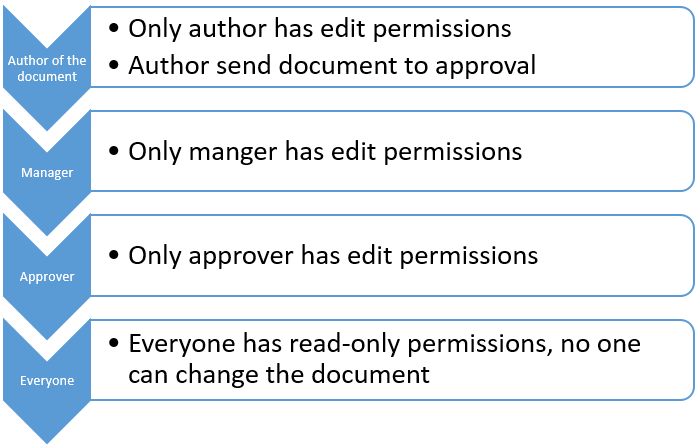
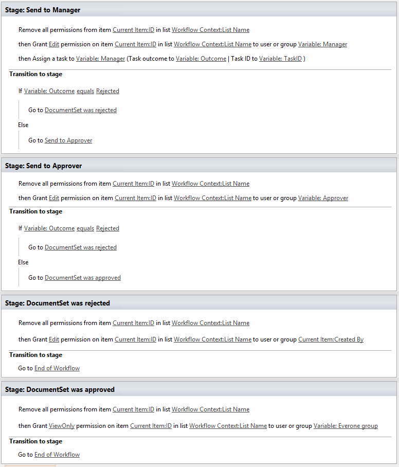

Set item level permissions (break role inheritance and assign permissions)
##########################################################################

This article will show you a simple case with approval scenario. In this example, a SharePoint developer has to implement a document approval scenario. The approach described in this article works in SharePoint 2013 / 2016 as well as in SharePoint Online in Office 365.

But there are some nuances in the case. When a user sends a document to approve, the workflow should reset permissions for everyone except a user who has approval task now.

In this case, we guarantee that no one else could change the document after the process was started.

If the document was rejected at some stage, the workflow will change permission back and allow to author to fix the issues with the document.

In case, that everything is OK, at the final stage of the approval workflow it will set up read-only permissions for all users. Please have a look at the whole workflow in the SharePoint Designer. You can use it as basic skillet of the similar workflow of course in the real-world scenario you need to add notifications and may be some more approvals or different permission levels.

At the end of the article I want to notice that to implement the case I used only two workflow actions, but `Workflow Actions Pack <https://plumsail.com/workflow-actions-pack/>`_ contains a bit more, please have a look at the list below:

`Permissions management <https://plumsail.com/docs/workflow-actions-pack/actions/Permissions%20management.html>`_

- `Add User to SharePoint Group <https://plumsail.com/docs/workflow-actions-pack/actions/Permissions%20management.html#add-user-to-sharepoint-group>`_
- `Remove User from SharePoint Group <https://plumsail.com/docs/workflow-actions-pack/actions/Permissions%20management.html#remove-user-from-sharepoint-group>`_
- `Is User Member of SharePoint Group <https://plumsail.com/docs/workflow-actions-pack/actions/Permissions%20management.html#is-user-member-of-sharepoint-group>`_
- `Get Members of SharePoint Group <https://plumsail.com/docs/workflow-actions-pack/actions/Permissions%20management.html#get-members-of-sharepoint-group>`_
- `Set Up Default Group for the Site <https://plumsail.com/docs/workflow-actions-pack/actions/Permissions%20management.html#set-up-default-group-for-the-site>`_
- `Grant Permission on Site <https://plumsail.com/docs/workflow-actions-pack/actions/Permissions%20management.html#grant-permission-on-site>`_
- `Remove Permissions from Site <https://plumsail.com/docs/workflow-actions-pack/actions/Permissions%20management.html#remove-permissions-from-site>`_
- `Grant Permission on List <https://plumsail.com/docs/workflow-actions-pack/actions/Permissions%20management.html#grant-permission-on-list>`_
- `Remove Permissions from List <https://plumsail.com/docs/workflow-actions-pack/actions/Permissions%20management.html#remove-permissions-from-list>`_
- `Grant Permission on Item <https://plumsail.com/docs/workflow-actions-pack/actions/Permissions%20management.html#grant-permission-on-item>`_
- `Remove Permissions from Item <https://plumsail.com/docs/workflow-actions-pack/actions/Permissions%20management.html#remove-permissions-from-item>`_
- `Restore Permissions Inheritance for Site <https://plumsail.com/docs/workflow-actions-pack/actions/Permissions%20management.html#restore-permissions-inheritance-for-site>`_
- `Restore Permissions inheritance for List <https://plumsail.com/docs/workflow-actions-pack/actions/Permissions%20management.html#restore-permissions-inheritance-for-list>`_
- `Restore Permissions Inheritance for Item <https://plumsail.com/docs/workflow-actions-pack/actions/Permissions%20management.html#restore-permissions-inheritance-for-item>`_
- `Remove All Permissions from Site <https://plumsail.com/docs/workflow-actions-pack/actions/Permissions%20management.html#remove-all-permissions-from-site>`_
- `Remove All Permissions from List <https://plumsail.com/docs/workflow-actions-pack/actions/Permissions%20management.html#remove-all-permissions-from-list>`_
- `Remove All Permissions from Item <https://plumsail.com/docs/workflow-actions-pack/actions/Permissions%20management.html#remove-all-permissions-from-item>`_

