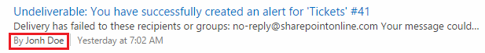
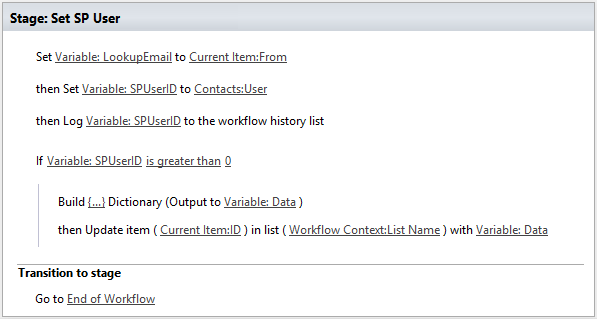
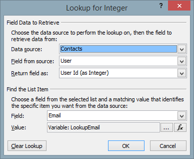
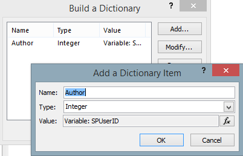

Change Author field in SharePoint list Item
###########################################

This article will describe a small addition that will help to change Created By field to correct user name as on the figure below:

The basic idea is very simple. We need to create a Contacts list, which consists from the following fields:

* Title (Text)
* Email (Text)
* User (SPUser)

The Contact list will be used to lookup SPUser account by email.In main workflow, it was added another stage that will lookup user by Email and set Author field.

 
There are two important moments:The first is setting SPUserID variable. As you can see at the screenshot below, I query ‘Contacts’ list by Email field and select ‘User Id’ value.

 
The second is updating ‘Author’ field via `Update List Item at Any Site </docs/workflow-actions-pack/actions/List%20items%20processing.html#update-list-item-at-any-site>`_ workflow action. For this we pass filled dictionary as input parameter:

 
That is all. Now we need to fill the ‘Contacts’ list and we will get correct ‘Author’ field.