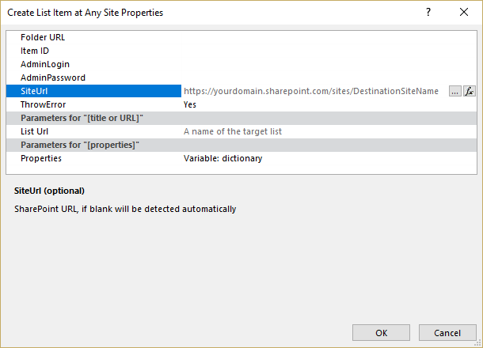

How to create or update a list item at any site
##############################################################

This short post will describe how to define an URL of a list where an item has to be created (or updated) by `Create List Item at Any Site <https://plumsail.com/docs/workflow-actions-pack/actions/List%20items%20processing.html#create-list-item-at-any-site>`_ and `Update List Item at Any Site <https://plumsail.com/docs/workflow-actions-pack/actions/List%20items%20processing.html#update-list-item-at-any-site>`_ workflow actions. 

You may have encountered *Incorrect function. (Exception from HRESULT: 0x80070001)* or *Cannot contact site at the specified URL* errors while trying to create an item in a list in a different site or subsite.

When you create or update an item in a different site, please, note that you need to specify SiteUrl and List Url parameters as shown in the screenshot below:

