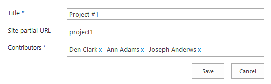
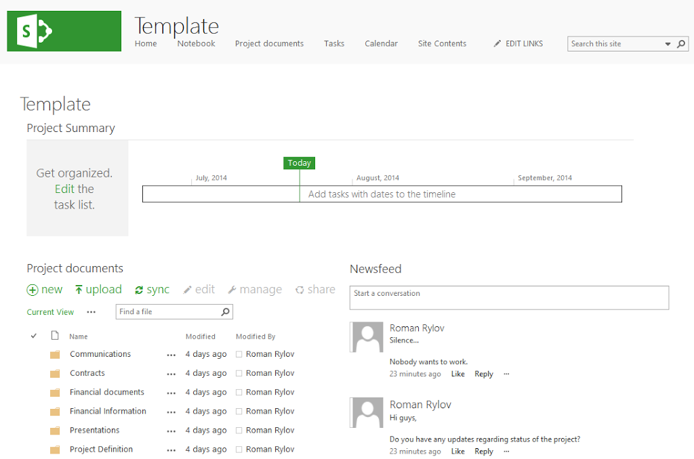
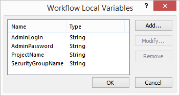
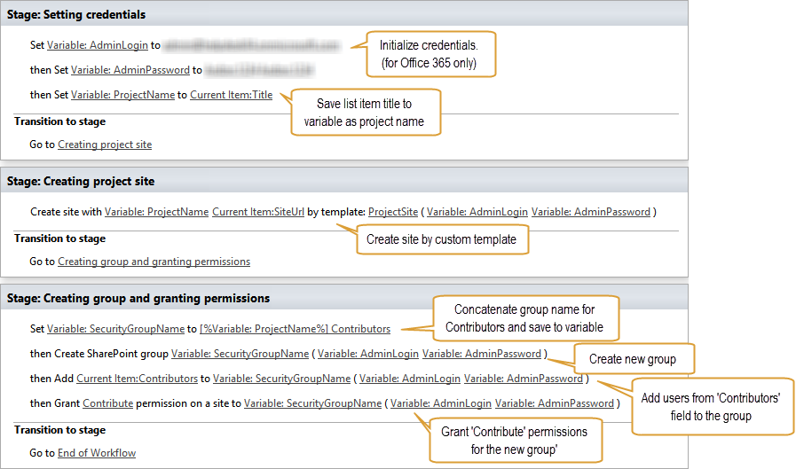
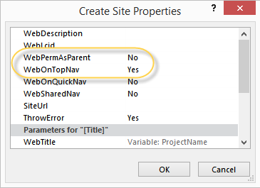
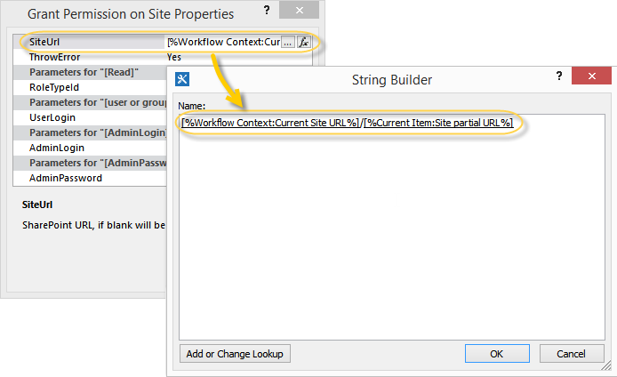

Create site by custom template and grant permissions
####################################################

This article will show how to use SharePoint 2013 workflow to create new site by custom template and then grant permissions to this site for specific users. As an example I configured workflow for SharePoint list to automatically create new sites.

This example will show simple case of project management system. When an administrator can create a new list item for a project in SharePoint list, specify project participants and URL for a new project workspace. Once it is done, the workflow has to create the project workspace (SharePoint site). It will automatically break permissions inheritance for the new site and include the site to the top navigation. Then create separate SharePoint group for each role in the project. To simplify this use case I have contributors role only, but you can add more roles and create additional groups using the workflow. For example you can create project management group or analysts group. Then you can use these groups to grant permissions to sensitive information in the project.

This example is created for SharePoint Online in Office 365, but it will also work for SharePoint 2013 on-premises.

SharePoint 2013 workflows allow to do much more than SharePoint 2010 workflows, but they don’t allow to create SharePoint sites and groups as well as grant permissions using out of the box workflow actions. In this article I will use workflow actions *‘Create Site’* , *‘Create SharePoint Group’, ‘Add User to SharePoint Group’*  and *‘Grant Permissions on Site’*  from `Workflow Actions Pack <http://plumsail.com/workflow-actions-pack/>`_ .

This article is divided to stages:

- Create SharePoint list
- Save site as template
- Configure list level workflow
   - Setting variables
   - Creating project site
   - Creating group and granting permissions

If you are interested in the workflow only you can go to the *‘Configure list level workflow’*  stage directly.

Create SharePoint list
----------------------
At this stage it was created the new SharePoint list *‘Projects’*  with following structure:

* Title – Text field. The title of a project.
* Site partial URL – Text field. The partial URL for a new project site (for example *‘project1′* can be used to create subsite with URL like this: *http://yourdomain/projects/ *project1*)
* Contributors – Person or Group field. User accounts to be included in the project contributors group

This is how the new form looks like:
 

As I mentioned above I simplified this example to keep it clear. You can add more fields to this list to work with your projects. For example you can add field *‘Management’*  and use it to create new SharePoint group for project management. I will show how to create new group below in the workflow.

Save site as template
---------------------
For demo purposes it was customized SharePoint team site to use it as a project workspace. I added some web parts to the main page and changed style of the site. You can see my project site below:
 

 
Then it was saved it as template. To save a site as template navigate to *‘Site Settings’*  and click at *‘Save site as template’* . You can read official `Microsoft documentation <http://msdn.microsoft.com/en-us/library/office/jj938033%28v=office.15%29.aspx#bkmk_SaveTemplate>`_ for more information.

The template is called *‘ProjectSite’* . I will use this template in the workflow, you will see it below in the description of the workflow.

Configure list level workflow
-----------------------------
At this stage it was created list level workflow for *‘Projects’*  list and configured it to start on list item creation. Thus, new SharePoint sites will be created automatically after creation of a list item.

You can find more information about specific parameters of workflow actions in `the documentation <http://plumsail.com/workflow-actions-pack/docs/>`_ .

It was used only four variables in the workflow:

First two variables to store credentials. They are required for Office 365 only. *‘ProjectName*  ‘ to store name of a new project and *‘SecurityGroupName’*  to store the name for a new group of project contributors.

The complete workflow is below:

As you can see it was divided the workflow to three stages *‘Setting variables’* , *‘Creating project site’*  and *‘Creating group and granting permissions’* .

Setting variables
+++++++++++++++++
At the first stage it was initialized credentials variables. Then I saved title of current list item to *‘ProjectName’*  variable (to keep workflow readable) and generated the new name for project contributors group.

This workflow creates a new SharePoint group for each project to simplify permissions management. In this example I generated group name by concatenating *‘ProjectName’*  variable and “ *Contributors”*  string. See the picture above. You can use the same\approach to generate names for other groups, for example *‘[%ProjectName%] Project management’*  or *‘[%ProjectName%] Analysts’* .

Creating project site
+++++++++++++++++++++
It was placed single workflow action *‘Create Site’*  to this stage.

In this workflow action it was used *‘ProjectName’*  variable as the title for SharePoint site.

It was used *‘Site partial URL’*  field of current list item as the partial URL for the new site. As I mentioned in the beginning of this article *‘Site partial URL’*  field is the partial URL for the new site. For example if current site has URL *‘http://yourdomain/projects’*  and you specified *‘Site partial URL’*  as *‘project1′* , then the new site will have such URL: *‘http://yourdomain/projects/ *project1*  ‘* .

It was used the name of created earlier site template *‘ProjectSite’*  as the site template name.

Additionally in the setting of workflow action it was switched *‘WebPermAsParent’*  property to *‘No’* . It means that a new site will not inherit permissions from a parent site.

Also pay attention to the property *‘WebOnTopNav*  ‘, it has *‘Yes’*  value by default. It allows to add new sites to the top navigation of the parent site automatically. Thus, you will be able to start working with project site without adding it to navigation manually.

Creating group and granting permissions
+++++++++++++++++++++++++++++++++++++++
At this stage it was used three custom workflow actions *‘Create SharePoint Group’* , *‘Add User to SharePoint Group’*  and *‘Grant Permissions on Site’* .

In the *‘Create SharePoint Group’*  workflow action it was specified only the name of group from *‘SecurityGroupName’*  variable. I initialized it earlier, see *‘Setting variables’* .

In the *‘Add User to SharePoint Group’*  workflow action it was specified group from *‘SecuritGroupName’*  variable and used *‘Contributors’*  field of current list item.

In the *‘Grant permissions on Site’*  workflow action it was specified permission level *‘Contribute’*  and specified group from *‘SecurityGroupName’*  variable.

I also opened settings of this workflow action and changed *‘SiteUrl*  ‘ property. It was concatenated partial URL from *‘Site partial URL*  ‘ field with current site URL from the workflow context. See the picture below. It allows this workflow action to change permissions for the new project site.

That is all, the workflow is configured.