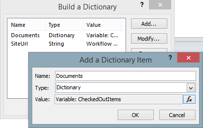

Query multiple lists across multiple sites and group results
############################################################

This article will describe the action `Get Items by CAML Query (Many Lists) <https://plumsail.com/docs/workflow-actions-pack/actions/List%20items%20processing.html#get-items-by-caml-query-many-lists>`_ . As you can see in documentation, it is an analogue of `SPSiteDataQuery <https://support.office.com/en-in/article/Display-data-from-multiple-lists-with-the-Content-Query-Web-Part-d560f477-8fc1-4258-aeb2-70aa932e07da>`_ command which is exist in Server Object Model (SSOM) but it is not available in Client (CSOM). Moreover, it has additional features like grouping and sorting, which I will cover in this article. This approach works for SharePoint 2013 / 2016 / 2019 as well as for SharePoint Online in Office 365.

Let’s imagine that we have something like Document Management System (DMS) based on SharePoint Online. Each our department has own site (HR, Sales, Finance, IT, etc…) and each department on own site has own document libraries structure specific to them. As in the last case, we want to build checked-out documents report, but now it should show data from all document libraries and from all sites.

This will show you how to query multiple lists across SharePoint sites. You can group results by specific field and then iterate through groups.

As a prof of concept I will create two workflows which send reports about checked out documents across multiple sites to individual users as well as summary report to administrator.

This is case where `Get Items by CAML Query (Many Lists) <https://plumsail.com/docs/workflow-actions-pack/actions/List%20items%20processing.html#get-items-by-caml-query-many-lists>`_ will be very useful, because it allows us to run one CAML query to many lists and as result, it will be single Dictionary object.\

.. image:: ../_static/img/query-multiple-lists-1.png
   :alt: Get Items by Query from many lists

Moreover, we can sort and group list items by one of fields. For example you group checked out documents by user. Result of query can be structured like this:

Checked out documents – Administrators’ Report
**********************************************
So, let’s back to our Document Management System based on SharePoint. To build report by checked out documents for administrator we need to query all checked out documents and create composed email for administrator, below you can see the whole workflow process:

 

The workflow is divided into two parts. First part it is configuration. It contains email account and password. Also it contains Email Template which I provide below:

.. code:: html
 
    Please review the list of documents which are checked out:   
      
    <table>
      <thead>
        <td><strong>User Name</strong></td>
        <td><strong>Document</strong></td>
      </thead>
      <tbody>
        {{#each Documents}}
        <tr>
          <td nowrap>{{CheckoutUser}}</td>
          <td><a href="{{SiteUrl}}{{FileRef}}">{{FileLeafRef}}</a></td>
        </tr>
        {{/each}}
      </tbody>
    </table> 
      
    Thank you,  
    SharePoint Notification System.

The second part of workflow contains main business logic. It is more interesting for us. To get required data I use `Get Items by CAML Query (Many Lists) <https://plumsail.com/docs/workflow-actions-pack/actions/List%20items%20processing.html#get-items-by-caml-query-many-lists>`_ . The workflow action settings contains a few settings:

* CAML Query – it is query that will be run on each list.
* BaseTemplate – base template of the lists where the query will be run, in my case it is Document Library.
* Web URLs – by default the query will be run on current site, but you can specify from where collect data. In my case I have specified web URLs of HR, Marketing and other subsites.

Below I provide a sample of CAML query which I use

.. code:: html
    
    <View Scope="RecursiveAll">
      <ViewFields>
        <FieldRef Name="CheckoutUser"/>
        <FieldRef Name="FileRef"/>
        <FieldRef Name="FileLeafRef"/>
      </ViewFields>
      <Query>
        <Where>
          <IsNotNull>
            <FieldRef Name="CheckoutUser"/>
          </IsNotNull>
        </Where>
        <OrderBy>
          <FieldRef Name="CheckoutUser"/>
          <FieldRef Name="FileLeafRef"/>
        </OrderBy>
      </Query>
    </View>

On next important step that is required for `Render Text Template <https://plumsail.com/docs/workflow-actions-pack/actions/String%20Processing%20Advanced.html#render-text-template>`_ we build DataDictionary following way:

I just created new variable and placed collection of checked out documents and site URL to separate properties of the dictionary. Now we can use this composed object as data for our HTML template.

The last step which I have to do before send email to administrator it is prettify ugly user name. To replace ‘ID;#’ to just dash I use `Regular Expression Replace <https://plumsail.com/docs/workflow-actions-pack/actions/String%20Processing%20Advanced.html#regular-expression-replace>`_ workflow action.

Checked out documents – Users’ Report
*************************************
The second workflow should send individual notifications to users, it uses the same principles as previous, but the only difference it uses loop to iterate received data. The whole workflow you can see at the figure below:

The loop iterates groups with selected users. This is required because I use ‘group by’ option in `Get Items by CAML Query (Many Lists) <https://plumsail.com/docs/workflow-actions-pack/actions/List%20items%20processing.html#get-items-by-caml-query-many-lists>`_ activity and our data looks like at the picture at the beginning of the article. Inside the loop, we receive documents which were checked out by this user and create individual email notification for the user.

Other steps are very similar to previous report and I don’t think I should explain it more. One little detail it is Build Dictionary workflow action, which is configured the following way:

   
The CAML query in this workflow is the same as in previous workflow, but the HTML template is a little different.

.. code:: html
  
    Hello {{UserName}}  
        
    Please review the list below and please check-in unused documents:  
     
    <ul>
      {{#each Documents}}
        <li><a href="{{SiteUrl}}{{FileRef}}">{{FileLeafRef}}</a></li>
      {{/each}}
    </ul>
     
     
    Thank you,  
    SharePoint Notification System.  