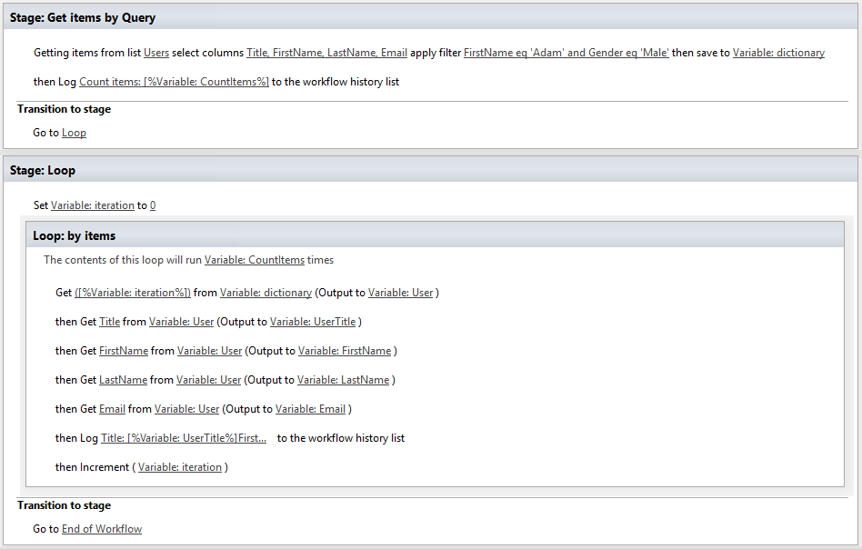
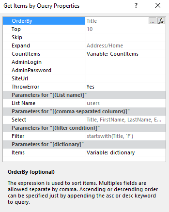

Use Get Items by Query action (REST)
####################################

This article will show you how to use `Get Items by Query <https://plumsail.com/docs/workflow-actions-pack/actions/List%20items%20processing.html#get-items-by-query>`_ workflow action. This action is much easier to use than its ancestor "Get Items by CAML query". It allows you to use simplified REST queries to get items. This approach works fo SharePoint 2013 / 2016 as well as for SharePoint Online in Office 365.

The first thing that you may be noticed, there is no more ugly CAML query. No more pain with debugging.\

We wanted to make it simple as it possible. Just write list name what you want to select, specify fields and query. And it is all.Please have a look at documentation below we support a\big amount of functions, which open a new opportunity for using the data in a workflow.

**Logical operators**

.. list-table::    
    :widths: 10 10 10

    *  -  Eq
       -  Equal
       -  Address/City eq ‘Moscow’       

    *  -  Ne
       -  Not equal
       -  Address/City ne ‘London’

    *  -  Gt
       -  Greater than
       -  Price gt 10

    *  -  Ge
       -  Greater than or equal
       -  Price ge 20

    *  -  Lt
       -  Less than
       -  Price lt 20

    *  -  Le
       -  Less than or equal
       -  Price le 100

    *  -  And
       -  Logical and
       -  Price le 200 and Price gt 10

    *  -  Or
       -  Logical or
       -  Price le 3.5 or Price gt 200

    *  -  Not
       -  Logical negotiation
       -  not endswith(Description, ‘ing’)

**Arithmetic operators**

.. list-table::    
    :widths: 10 10 10

    *  -  Eq
       -  Equal
       -  Address/City eq ‘Moscow’   

    *  -  Add
       -  Addition
       -  Price add 5 gt 10

    *  -  Sub
       -  Substraction
       -  Price sub 5 gt 10

    *  -  Mul
       -  Multiplication
       -  Price mul 2 gt 2000

    *  -  Div
       -  Division
       -  Price div 2 gt 4

    *  -  Mod
       -  Modulo
       -  Price mod 2 eq 0

**Group operators**

.. list-table::    
    :widths: 10 10 10

    *  -  ()
       -  Precedence grouping
       -  (Price sub 5) gt 10

**String functions**

.. list-table::    
    :widths: 10 10

    *  -  bool substringof(string p0, string p1)
       -  substringof(‘Plumsail’, CompanyName)\

    *  -  bool endswith(string p0, string p1)
       -  endswith(CompanyName, ‘LLC’)

    *  -  bool startswith(string p0, string p1)
       -  startswith(CompanyName, ‘Plum’)

    *  -  int length(string p0)
       -  length(Address) eq 20

    *  -  int indexof(string p0, string p1)
       -  indexof(CompanyName, ‘P’) eq 1

    *  -  string replace(string p0, string find, string replace)
       -  replace(CompanyName, ‘ ‘, ‘’) eq ‘Plumsail LLC’

    *  -  string substring(string p0, int pos)
       -  substring(CompanyName, 4) eq ‘sail LLC’

    *  -  string subsctring(string p0, int pos, int length)
       -  substring(CompanyName, 4, 4) eq ‘sail’

    *  -  string tolower(string p0)
       -  tolower(CompanyName) eq ‘plumsail llc’

    *  -  string toupper(string p0)
       -  toupper(CompanyName) eq ‘PLUMSAIL LLC’

    *  -  string trim(string p0)
       -  trim(CompanyName) eq ‘Plumsail LLC’

    *  -  string concat(string p0, string p1)
       -  concat(concat(City, ‘, ’), Country) eq ‘Berlin, Germany’

**Date function\\**

.. list-table::    
    :widths: 10 10

    *  -  int day(DateTime p0)
       -  day(BirthDate) eq 8

    *  -  int month(DateTime p0)
       -  month(BirthDate) eq 12

    *  -  int year(DateTime p0)
       -  year(BirthDate) eq 1988

    *  -  int hour(DateTime p0)
       -  hour(BirthDate) eq 0

    *  -  int minute(DateTime p0)
       -  minute(BirthDate) eq 30

    *  -  int second(DateTime p0)
       -  second(BirthDate) eq 47

**Math function**

.. list-table::    
    :widths: 10 10

    *  -  double round(double p0)
       -  double(Freight) eq 32

    *  -  double floor(double p0)
       -  floor(Freight) eq 32

    *  -  double ceiling(double p0)
       -  ceiling(Freight) eq 33

Below you can find some examples of the queries:

* StartTime ge datetime’2016-06-10′ and EndTime lt datetime’2016-06-12′
* ((ContentType eq ‘Operating Policy’) or (ContentType eq ‘Procedure’)) and (Subject eq ‘Safety’)
* substringof(‘F’,Title)

Additionally, you can customize the query via advanced properties (to open it, right click on the action and select properties)

The workflow action uses SharePoint REST API, to better understand how it works I would recommend the following articles:

`SharePoint: Adventures with the REST API Part 1 <https://platinumdogs.me/2013/03/14/sharepoint-adventures-with-the-rest-api-part-1/>`_

`Use OData query operations in SharePoint REST requests <https://msdn.microsoft.com/en-us/library/office/fp142385.aspx>`_
