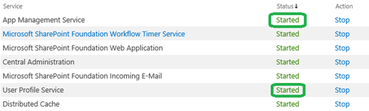
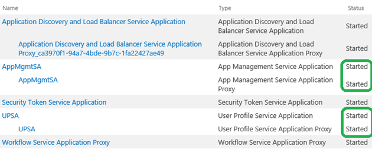
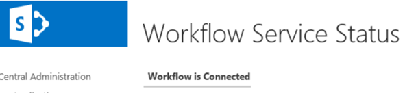
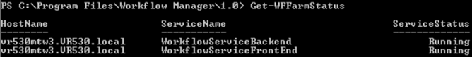
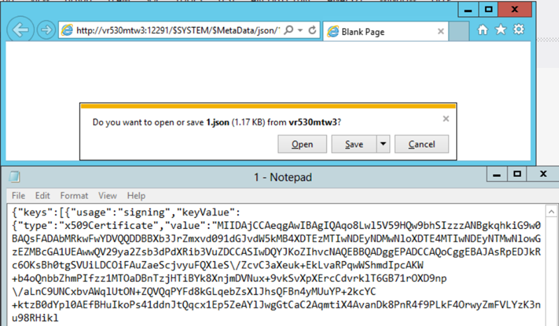

SharePoint On-Premises
======================

Check list for workflow manager server
--------------------------------------
1. Check :code:`https://[wfms]:12290` or :code:`http://[wfms]:12291` if they are responding
2. Check *WorkflowMgmtPool* is started 
3. Following services are running::

      Workflow Manager Backend
      Service Bus Message Broker
      Service Bus Gateway
      Windows Fabric Host Service (FabricHostSvc)

4. Get workflow farm information, workflow database by Start Workflow Manager PowerShell **Get-WFFarm** 
5. Check if the Workflow Manager farm running (workflow service backend and front end should be running) by Start Workflow Manager PowerShell **get-WFfarmStatus**
6. Check OAuth in accessible by :code:`http://[wfms]:12291/$SYSTEM/$Metadata/json/1` (more info `Is the Oauth Metadata information published and accessible from the SharePoint server?`_)
7. Restart the **WorkflowServiceBackend** service::

      net stop WorkflowServiceBackend
      net start WorkflowServiceBackend
 
If all is fine then probably something with Workflow Engine or Actions Pack. 

Troubleshooting workflow engine
-------------------------------

1. Look in the Workflow History list, eg :code:`http://sp2013/Lists/Workflow%20History`. Do you find any errors in there? 
2. Is the user account starting the workflow correctly synchronized in the user profile database?
3. Is the user account starting the workflow different from the Worflow Manager setup account? (`more info <http://technet.microsoft.com/en-us/library/jj658588.aspx#section7>`_)
4. Are the *User Profile Service*  and *App Management Service* started? See the green frames in the screenshot below, taken from *Central Administration* \\ *Manage Services on Server*
   

5. Are the *App Management Service Application*  and *User Profile Service Application*  started? Their proxies should be started as well. See the green frames in the screenshot below, taken from *Central Administration* \\ *Manage Services on Server*
   

Is SharePoint 2013 server connected?
------------------------------------
In *Central Admin* -> *Service Applications* -> *Workflow Service Application Proxy* : check the status. Does it read *Workflow is Connected*  as in the below screenshot?

Is the Worflow Manager farm running?
--------------------------------------------------
On a server member of the Workflow Manager farm:

1. Start *Workflow Manager PowerShell*
2. Run the *Get-WFFarmStatus* command
3. Are the statuses *Running* , as on the screenshot below?`

Is the Oauth Metadata information published and accessible from the SharePoint server?
--------------------------------------------------------------------------------------
On the SharePoint 2013 server, start Internet Explorer, and check whether theOauth metadatais accessible. The url is like ":code:`http://wfm1:12291/$SYSTEM/$Metadata/json/1`". Below an example:

