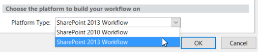
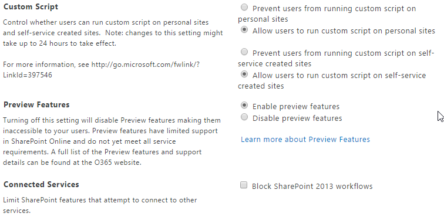

SharePoint Online
=================

Workflow Engine
---------------

1. Please open SharePoint Designer try to create a workflow and ensure that 2013 Workflow engine is available. 

\

2. Check workflow is available on for a tenant, for this open SharePoint Admin Center (:code:`https://[TenantName]-admin.sharepoint.com/_layouts/15/online/TenantSettings.aspx`)

\
